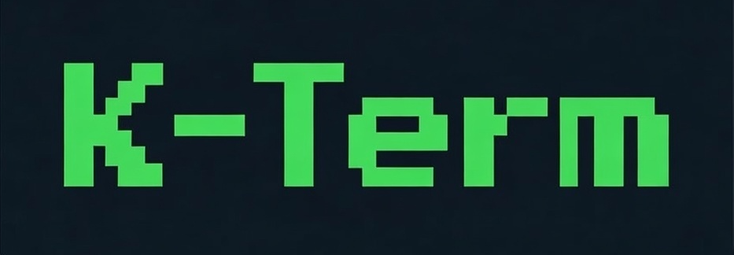
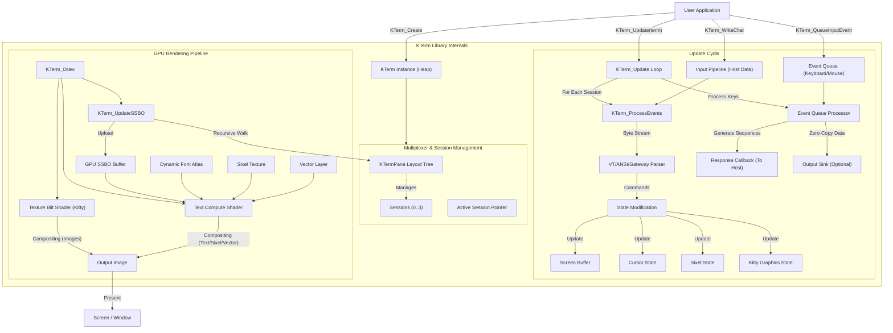

<div align="center">
  
</div>

# K-Term Emulation Library v2.3.41 (PRE-RELEASE)
(c) 2026 Jacques Morel

For a comprehensive guide, please refer to [doc/kterm.md](doc/kterm.md).

<details>
<summary>Table of Contents</summary>

1.  [Description](#description)
2.  [Key Features](#key-features)
3.  [How It Works](#how-it-works)
    1.  [3.1. Main Loop and Initialization](#31-main-loop-and-initialization)
    2.  [3.2. Input Pipeline and Character Processing](#32-input-pipeline-and-character-processing)
    3.  [3.3. Escape Sequence Parsing](#33-escape-sequence-parsing)
    4.  [3.4. Keyboard and Mouse Handling](#34-keyboard-and-mouse-handling)
    5.  [3.5. GPU Rendering Pipeline](#35-gpu-rendering-pipeline)
    6.  [3.6. Callbacks](#36-callbacks)
4.  [How to Use](#how-to-use)
    1.  [4.1. Basic Setup](#41-basic-setup)
    2.  [4.2. Sending Data to the KTerm (Simulating Host Output)](#42-sending-data-to-the-terminal-simulating-host-output)
    3.  [4.3. Receiving Responses and Key Events from the Terminal](#43-receiving-responses-and-key-events-from-the-terminal)
    4.  [4.4. Configuring KTerm Behavior](#44-configuring-terminal-behavior)
    5.  [4.5. Advanced Features](#45-advanced-features)
    6.  [4.6. Window and Title Management](#46-window-and-title-management)
    7.  [4.7. Diagnostics and Testing](#47-diagnostics-and-testing)
    8.  [4.8. Scripting API](#48-scripting-api)
5.  [Configuration Constants](#configuration-constants)
6.  [Key Data Structures](#key-data-structures)
7.  [Implementation Model](#implementation-model)
8.  [Dependencies](#dependencies)
9.  [License](#license)

</details>

## Description

**K-Term** (`kterm.h`) is a production-ready, single-header C library delivering the most comprehensive and faithful terminal emulation available today — spanning the full DEC lineage from VT52 to VT525, classic xterm behavior, and cutting-edge modern extensions.

With museum-grade legacy compliance, full Kitty graphics protocol support (animations, transparency, z-index layering, pane clipping), recursive arbitrary pane multiplexing (tmux-style tree layouts with dynamic splits and compositing), GPU-accelerated ReGIS/Tektronix/Sixel graphics, rich styling (curly/dotted/dashed underlines, colored underline/strikethrough, attribute stacking), independent blink rates, and authentic CRT effects (phosphor glow, scanlines, curvature), K-Term is unmatched for both historical accuracy and modern capability.

Designed for seamless embedding in embedded systems, development tools, IDE plugins, remote access clients, retro emulators, and GPU-accelerated applications, it leverages the **Situation** framework for cross-platform hardware-accelerated rendering and input while providing a thread-safe, lock-free architecture for massive throughput.

For a detailed compliance review, see [doc/DEC_COMPLIANCE_REVIEW.md](doc/DEC_COMPLIANCE_REVIEW.md).

**New in v2.3.41:** Expanded Input Op Queue (Rectangular Operations).
*   **Rectangular Ops:** Added `FILL_RECT`, `COPY_RECT` (DECCRA), and `SET_ATTR_RECT` (DECCARA/DECRARA) to the `KTermOpQueue`.
*   **Decoupling:** Refactored `ExecuteDECFRA`, `KTerm_CopyRectangle`, and `ExecuteDECCARA` to utilize the queue when enabled, further decoupling parsing from grid mutation.
*   **Atomic Updates:** Rectangular operations are now batched and applied atomically during the flush phase, improving thread safety and rendering consistency.

**New in v2.3.40:** Input Op Queue & JIT Text Shaping.
*   **Op Queue:** Implemented a lock-free Op Queue for input buffering (`KTermOpQueue`), decoupling the input stream from direct grid mutation and enabling atomic batch updates.
*   **JIT Text Shaping:** Introduced Just-In-Time text shaping via `KTermTextRun` and `KTerm_BuildRun`. This allows the renderer to dynamically group characters (e.g., base + combining marks) into logical runs, solving long-standing issues with combining character display while keeping the grid storage addressable and simple.
*   **Optimization:** Added dirty rect support (`session->dirty_rect`) to the flush logic, allowing `KTerm_PrepareRenderBuffer` to perform partial GPU uploads for significantly improved performance on large terminals.

**New in v2.3.39:** Hardened Initialization & Destruction.
*   **Leak Fix:** Resolved a memory leak in `KTerm_Cleanup` where the layout structure was not being properly freed in certain error paths.
*   **Safety:** Refactored `KTerm_Destroy` to safely delegate cleanup to `KTerm_Cleanup`, ensuring consistent resource release and preventing double-free scenarios by nullifying pointers after destruction.

**New in v2.3.38:** Sink Output Pattern.
*   **Sink Output Pattern:** Introduced `KTerm_SetOutputSink` to allow applications to register a direct output callback (`KTermOutputSink`), enabling zero-copy data transmission from the terminal to the host. This replaces the legacy buffered `ResponseCallback` for high-throughput use cases (e.g., matrix rain, fast build logs) while maintaining backward compatibility.
*   **Output Refactor:** The internal output logic has been unified into a single `KTerm_WriteInternal` primitive, eliminating code duplication between string and binary response paths and ensuring consistent buffer overflow protection.
*   **Flush on Transition:** Transitioning from buffered mode to sink mode automatically flushes any pending data to the new sink.

**New in v2.3.37:** Layout Engine Decoupling.
*   **Modular Layout:** The multiplexer and pane management logic has been extracted from the core `kterm.h` into a standalone `kt_layout.h` module. This architectural change decouples geometry calculation from terminal emulation logic.
*   **Extensibility:** This separation lays the groundwork for advanced windowing features like tabbed interfaces, floating windows, and custom layout managers without impacting the stability of the VT emulation core.
*   **API Update:** `KTerm_Resize`, `KTerm_SplitPane`, and `KTerm_ClosePane` now delegate operations to the layout module via a cleaner internal API.

**New in v2.3.36:** Implemented structured error reporting API.
*   **Structured API:** Introduced `KTermErrorLevel`, `KTermErrorSource`, and callback mechanisms to provide visibility into internal errors (allocation failures, parser warnings, render issues).
*   **Integration:** Critical paths (init, resize, font loading, compute init) now report specific errors instead of failing silently or logging to stderr exclusively.
*   **Stability:** Hardened `KTerm_Resize` to prevent heap corruption if buffer reallocation fails by safely capping size and reporting the error.

**New in v2.3.35:** Comprehensive hardening of parser primitives and memory safety.
*   **Parser Hardening:** Updated `Stream_ReadInt` and `Stream_ReadHex` in `kt_parser.h` to robustly detect and handle integer overflows, clamping values to safe limits.
*   **Memory Safety:** Introduced `KTerm_Malloc`, `KTerm_Calloc`, `KTerm_Realloc`, and `KTerm_Free` wrappers. `KTerm_Calloc` includes explicit integer overflow protection for size calculations.
*   **Safe Allocations:** Replaced all standard allocation calls in `kterm.h` with the new safe wrappers to prevent heap exploitation vectors.
*   **Fuzzing Support:** Added `tests/fuzz_harness.c` to facilitate fuzz testing with tools like AFL++.

**New in v2.3.34:** Basic Unicode handling (wcwidth) logic implementation with opt-in control.
*   **Unicode Width:** Implemented `mk_wcwidth` logic to correctly calculate character widths (0 for combining, 1 for half-width, 2 for full-width CJK).
*   **Opt-In Behavior:** Added `enable_wide_chars` per-session flag. By default, KTerm remains in **Fixed Width Mode** (all chars width 1) to preserve backward compatibility with legacy bitmap fonts.
*   **Gateway Control:** Added `SET;WIDE_CHARS;ON` command to enable variable-width Unicode logic at runtime.
*   **Rendering Alignment:** Updated `KTerm_ProcessNormalChar` and `KTerm_InsertCharacterAtCursor` to respect character widths when enabled, ensuring proper spacing and alignment for international text.

**New in v2.3.33:** Hardened Protected Cell logic for full DEC VT520 compliance.
*   **Protected Cells:** Updated `ICH`, `DCH`, `IL`, `DL` and scrolling operations to strictly respect `DECSCA` protected attributes. Destructive operations are blocked if they affect protected fields.
*   **Smart Editing:** Refined insertion/deletion logic to allow operations that do not shift protected content (e.g. editing after a protected prompt), ensuring usability in form applications.

**New in v2.3.32:** Parser Unification and Robustness Hardening.
*   **Parser Dispatcher:** Introduced `KTerm_DispatchSequence` to unify execution paths for OSC, DCS, APC, PM, and SOS sequences, enforcing consistent null-termination and error recovery.
*   **OSC Refactor:** Completely rewrote `KTerm_ExecuteOSCCommand` and its helpers (`ProcessKTermColorCommand`, `ProcessClipboardCommand`, etc.) to use `StreamScanner` primitives. This eliminates unsafe string functions (`atoi`, `strchr`) and ensures robust parameter parsing for complex sequences like `rgb:rr/gg/bb`.
*   **DCS Hardening:** Refactored `KTerm_ExecuteDCSCommand` to use `StreamScanner` for dispatching sub-commands (GATE, XTGETTCAP, DECUDK, Soft Fonts). Fixed a potential buffer overflow in `ProcessSoftFontDownload` by adding explicit bounds checks to the `Dscs` string parser.
*   **Safety:** Standardized bounds checking across all string-based sequence handlers (`KTerm_ProcessGenericStringChar`, `KTerm_ProcessOSCChar`, `KTerm_ProcessDCSChar`).

**v2.3.31 Update:** Complete unification of parsing logic for OSC and DCS sequences.
*   **Safe OSC Parsing:** Replaced unsafe string manipulation (e.g., `atoi`, `strchr`) in `KTerm_ExecuteOSCCommand` with safe `StreamScanner` primitives (`Stream_ReadInt`, `Stream_Expect`).
*   **Full OSC Color Support:** OSC commands 10, 11, and 12 (Foreground, Background, Cursor Color) now support setting colors via `rgb:rr/gg/bb` syntax, in addition to the existing query functionality.
*   **DCS Dispatcher Hardening:** Refactored `KTerm_ExecuteDCSCommand` to use structured token matching instead of brittle `strncmp` checks. This fixes potential ambiguity between Soft Font downloads (`2;1|`) and User Defined Keys (`0;1|`).
*   **Memory Safety:** Removed legacy usage of `strdup` in clipboard (OSC 52) and key definition parsing, eliminating potential heap fragmentation and leaks.

**v2.3.30 Update:** Major refactor of Gateway Protocol parsing and introduction of high-value primitives.
*   **Gateway Dispatcher Refactor:** The Gateway Protocol (`kt_gateway.h`) now uses a binary search dispatch table for high-level commands (`SET`, `GET`, `RESET`, `PIPE`, `INIT`) and leverages `StreamScanner` for efficient parameter parsing. This replaces the legacy linear string comparison model, improving maintainability and extensibility.
*   **New Parsing Primitives:** Added `Stream_ReadIdentifier`, `Stream_ReadBool`, `Stream_PeekChar`, and `Stream_MatchToken` to `kt_parser.h`. These primitives provide a robust foundation for parsing complex command structures and boolean flags (handling `1`/`0`, `ON`/`OFF`, `TRUE`/`FALSE`).
*   **Enhanced Safety:** The new dispatcher and primitives include strict bounds checking and robust whitespace handling, further hardening the library against malformed input.

**v2.3.29 Update:** Enhanced robustness for CSI parsing and Gateway strings.
*   **CSI Parsing Refactor:** CSI parameter parsing (`kterm.h`) now uses `StreamScanner` primitives, significantly improving robustness against malformed sequences (garbage data is safely skipped as default).
*   **Gateway Quoted Strings:** `KTermLexer` now correctly supports escaped characters (e.g., `\"`) within quoted strings. Added `KTerm_UnescapeString` utility to process escapes for rich configuration values (banners, fonts, etc.).

**v2.3.28 Update:** Refactored parsing architecture to centralize primitives and enhance safety.
*   **Centralized Parsing:** Moved parsing primitives (`StreamScanner` and helpers) to `kt_parser.h`, creating a unified foundation for safe data extraction across the library.
*   **Enhanced Primitives:** Added `Stream_ReadHex`, `Stream_ReadFloat`, and automatic whitespace skipping to the parser toolkit.
*   **Gateway Hardening:** Updated `kt_gateway.h` color parsing logic to use the new safe primitives, replacing `sscanf` to eliminate buffer overflow risks.

**v2.3.27 Update:** Major architectural refactor of the parsing engine for improved thread safety and robustness.
*   **KTermLexer:** Introduced a new, non-destructive tokenizer (`kt_parser.h`) replacing legacy `strtok`-based logic. This eliminates re-entrancy issues and improves parsing reliability for complex commands.
*   **Gateway Protocol Parsing:** Updated `kt_gateway.h` to use `KTermLexer` for parsing attributes (`SET;ATTR`), keyboard settings (`SET;KEYBOARD`), and banners. This supports robust handling of composite values (e.g., `UL=R,G,B` for RGB underlines) and quoted strings.
*   **Deprecation Notice:** Unquoted strings containing spaces (e.g., `TEXT=Hello World`) are now parsed as separate tokens. Users should update configurations to use quotes (e.g., `TEXT="Hello World"`).

**v2.3.26 Update:** Added full Sixel support to the Gateway Protocol, enabling advanced session targeting and control.
*   **Sixel Targeting:** New commands `SET;SIXEL_SESSION;id` and `RESET;SIXEL_SESSION` route Sixel graphics to specific sessions.
*   **Sixel Management:** Added `INIT;SIXEL_SESSION` for initialization and `RESET;SIXEL` for clearing Sixel state via Gateway.
*   **API Alignment:** Sixel gateway commands now conform to the functionality of other supported graphics APIs (ReGIS, Tektronix, Kitty).

**v2.3.25 Update:** Implemented comprehensive stability and performance fixes:
*   **Resize Throttling:** Prevented allocation thrashing during rapid window drags by limiting resize events (~30 FPS).
*   **Thread Safety:** Added global mutex locking to `KTerm_Resize` to prevent race conditions with the update loop.
*   **Precision Input:** Upgraded mouse tracking to use floating-point math, solving precision drift on high-DPI displays.

**v2.3.24 Update:** Hardened Gateway Protocol functions to prevent corruption and crashes. Improved string handling safety, refactored banner generation to use heap allocation, robust integer parsing, and added input validation to prevent buffer overflows and null pointer dereferences.

**v2.3.23 Update:** Added safe arbitrary screen resizing via the Gateway Protocol. New commands `SET;WIDTH;val` and `SET;HEIGHT;val` allow dynamic resizing, while `SET;SIZE;w;h` has been updated to respect safe internal limits (`KTERM_MAX_COLS` and `KTERM_MAX_ROWS`, default 2048), preventing excessive memory usage.

**v2.3.21 Update:** Refactored versioning to use pre-processor macros (`KTERM_VERSION_MAJOR`, `MINOR`, `PATCH`) in `kterm.h`. Updated the Gateway Protocol (`GET;VERSION`) to dynamically report the version defined by these macros, ensuring consistency between code and runtime reporting.

**v2.3.20 Update:** Refactored `VTFeatures` struct to use a 32-bit integer bitmask for feature flags, improving memory efficiency and standardizing feature checking logic. Moved `max_session_count` to `VTConformance`.

**v2.3.19 Update:** Implemented esoteric VT510 features: `DECRQTSR` (Request Terminal State Report), `DECRQUPSS` (Request User-Preferred Supplemental Set), `DECARR` (Auto-Repeat Rate), `DECRQDE` (Request Default Settings), and `DECST8C` (Select Tab Stops every 8 Columns). Added software keyboard repeater with configurable delay and rate.

**v2.3.18 Update:** Implemented esoteric VT510 features: `DECSNLS` (Set Number of Lines per Screen), `DECSLPP` (Set Lines Per Page), `DECXRLM` (Transmit XOFF/XON on Receive Limit), `DECRQPKU` (Request Programmed Key), and `DECSKCV` (Select Keyboard Variant).

**v2.3.17 Update:** Major refactor of Set/Reset Mode logic (`ExecuteSM`/`ExecuteRM`) for consistency. Implemented missing DEC Private Modes (64, 67, 68, 103, 104) and ANSI Mode 12 (SRM). Unified mouse tracking mode logic.

**v2.3.16 Update:** Implemented DECHDPXM (Half-Duplex Mode) as DEC Private Mode 103 and DECKBUM (Keyboard Usage Mode) as DEC Private Mode 68. Verified DECSERA (Selective Erase Rectangular Area) functionality.

**v2.3.15 Update:** Fixed critical active session context trap and improved multiplexing stability. Refactored internal architecture for explicit session context passing and header organization. Enhanced thread safety with a custom re-entrant tokenizer (`KTerm_Tokenize`) and enforced locking strategy. Updated Gateway Protocol to use the new tokenizer and improved session targeting logic.

**v2.3.14 Update:** Fully implemented **DECDLD (Down-Line Loadable) Soft Fonts**, allowing custom bitmap fonts (Sixel-based) to be loaded and rendered. Added support for multi-byte designation strings in `SCS` sequences to map soft fonts to G-sets.

**v2.3.13 Update:** Added robust graphics reset capabilities. Standard terminal resets (`RIS`, `DECSTR`) now fully clear Sixel, ReGIS, Tektronix, and Kitty graphics resources (including textures). Added `RESET;GRAPHICS`, `RESET;KITTY` etc. to the Gateway Protocol for manual control.

**v2.3.12 Update:** Expanded Gateway Protocol targeting with `INIT` command and specific session routing for ReGIS (`REGIS_SESSION`), Tektronix (`TEKTRONIX_SESSION`), and Kitty (`KITTY_SESSION`) protocols.

**v2.3.11 Update:** Implemented session targeting for the Gateway Protocol (`SET;SESSION`, `RESET;SESSION`), enabling commands to be directed to specific sessions regardless of origin.

**v2.3.10 Update:** Added support for DECDMAC (Macros), DECINVM (Invoke Macro), fixed DECDLD (Soft Fonts), and improved VT510/VT420 compliance (DECSASD, DECRQCRA, DECEKBD, DECSCPP, DECSRFR).

**v2.3.9 Update:** Achieved **Full Base** coverage of standard ANSI CSI sequences, including S7C1T/S8C1T (nF Escape Sequences), `ESC #` Line Attributes, and corrected behaviors for `ED 2` (ANSI.SYS cursor homing) and `ED 3` (xterm scrollback clear).

**v2.3.8 Update:** Added support for **Framed** (SGR 51) and **Encircled** (SGR 52) attributes, as well as **Superscript** (SGR 73) and **Subscript** (SGR 74), with full shader-based rendering for frames, ellipses, and scaling.

**v2.3.7 Update:** Updated default 256-color palette to match standard XTerm values (especially indices 0-15) and introduced `cga_colors` for accurate **ANSI.SYS** (IBM CGA) emulation. Refactored rendering logic to consistently use the active session's palette.

**v2.3.6 Update:** Fixed **DECCRA** (Copy Rectangular Area) compliance, ensuring correct default parameter handling (bottom/right to page end) and **DECOM** (Origin Mode) support for relative coordinates.

**v2.3.5 Update:** Implemented complete **DECCOLM** (Column Mode) and **DECSCPP** (Select Columns per Page) capabilities, including correct handling of **DECNCSM** (No Clear Screen on Column Change) and **Mode 40** (Allow 80/132 Cols).

**v2.3.4 Update:** Added support for **DECCARA** (Change Attributes in Rectangular Area) and **DECRARA** (Reverse Attributes in Rectangular Area), completing the VT420 rectangular operations suite.

**v2.3.3 Update:** Added **halfbrite (dim)** rendering support for both foreground and background colors, including the new private SGR 62 sequence for background dimming.

**v2.3.2 Update:** Added the **VT Pipe** feature to the Gateway Protocol.

**v2.3 Major Update:** This release consolidates the extensive stability, thread-safety, and compliance improvements.

*   **Thread Safety & Architecture:**
    *   **Robust Locking:** Implemented Phase 3 Coarse-Grained Locking with `pthread` mutexes for `KTerm` and `KTermSession`, fixing race conditions in `KTerm_Resize` and `KTerm_Update`.
    *   **Lock-Free Input:** Converted the input pipeline to a lock-free Single-Producer Single-Consumer (SPSC) queue using C11 atomics (Phase 2), supporting high-throughput injection.
    *   **Session Isolation:** Decoupled background session processing from the global `active_session` state and refactored internal update logic for thread safety.
    *   **Memory Safety:** Added robust OOM checks during initialization and resizing.
    *   **Optimization:** Refactored character attributes to use bit flags (`uint32_t`), reducing memory footprint per cell.

*   **DEC Compliance & Emulation:**
    *   **Printing:** Implemented DEC Print Form Feed (DECPFF) and Printer Extent (DECPEX) modes.
    *   **Geometry:** Implemented Allow 80/132 Column Mode (Mode 40), DECCOLM (Mode 3) resizing, Left/Right Margins (DECLRMM), and No Clear on Switch (DECNCSM).
    *   **Sixel:** Added Sixel Display Mode (DECSDM) and Sixel Cursor Mode (Private Mode 8452).
    *   **Input/Editing:** Implemented Backarrow Key Mode (DECBKM), Extended Edit Mode (DECEDM), DEC Locator Enable (DECELR), and Numeric Keypad Mode (DECNKM).
    *   **Legacy:** Added ANSI/VT52 Mode Switching (DECANM) and IBM DOS ANSI Mode (ANSI.SYS emulation).
    *   **State:** Implemented Alt Screen Cursor Save Mode (Mode 1041) and fixed Tab Stop logic with dynamic allocation.

*   **Visuals, Graphics & Typography:**
    *   **Rich Styling:** Added support for Curly, Dotted, and Dashed underlines (SGR 4:x), plus extended colors for Underline and Strikethrough (SGR 58).
    *   **Attribute Stack:** Implemented `XTPUSHSGR`/`XTPOPSGR` to push/pop attributes.
    *   **Fonts:** Added `KTermFontMetric` for precise per-font ink bounds, OSC 50 font loading, and automatic glyph centering.
    *   **Blink:** Implemented independent Fast, Slow, and Background blink flavors.
    *   **Vector Graphics:** Fixed aspect ratio scaling for ReGIS vectors.

*   **Multiplexer & Session Management:**
    *   **Pane Management:** Implemented correct pane closure logic (`KTerm_ClosePane`) with tree pruning, and added `Ctrl+B x` keybinding.
    *   **Split Screen:** Corrected initialization visibility for split panes.
    *   **Performance:** Optimized resize operations to only copy populated history rows.

*   **Gateway Protocol & API:**
    *   **Modular Architecture:** The Gateway Protocol logic has been extracted to a separate `kt_gateway.h` module (Phase 1-3 completion). This reduces core complexity and allows the feature to be fully disabled via `KTERM_DISABLE_GATEWAY` for minimal builds.
    *   **Banners:** Added `PIPE;BANNER` command to generate ASCII-art banners with gradients, alignment, and font selection.
    *   **Configuration:** Added `SET;ATTR` (runtime attributes), `SET;GRID` (debug grid), `SET;CONCEAL`, `SET;OUTPUT`, and `GET;OUTPUT`.
    *   **Controls:** Added `SET`/`RESET` commands for global attributes and blink rates.
    *   **API:** Introduced `auto_process` mode for manual input handling and `KTerm_SetResponseEnabled`.

**v2.2.0 Major Update:** This release marks a significant milestone, delivering the complete **Multiplexer & Graphics Update**, consolidating all features developed throughout the v2.1.x cycle.
*   **Multiplexer & Compositor:**
    *   **Recursive Pane Layout:** Full support for arbitrary split-screen layouts using a recursive `KTermPane` tree structure.
    *   **Dynamic Resizing:** Robust resizing logic with `SessionResizeCallback` integration.
    *   **Compositor Engine:** Optimized recursive rendering pipeline with persistent scratch buffers and transparency support for background layering.
    *   **Session Management:** Support for up to 4 independent sessions (VT525 standard) with `Ctrl+B` keybindings for splitting (`%`, `"`), and navigation (`o`, `n`).
*   **Kitty Graphics Protocol:**
    *   **Full Implementation:** Complete support for the protocol, including chunked transmission (`m=1`), placement (`a=p`), and deletion (`a=d`).
    *   **Animation:** Automatic animation of multi-frame images (`a=f`) with frame delay handling.
    *   **Z-Index & Composition:** Proper layering with `z<0` (behind text) and `z>=0` (above text) support, including correct transparency handling.
    *   **Integration:** Features scrolling images, clipping to split panes, and intelligent default placement.
*   **Graphics & Rendering Improvements:**
    *   **ReGIS Resolution Independence:** The graphics engine now supports the ReGIS `S` (Screen) command with `E` (Erase) and `A` (Addressing) options for flexible logical coordinate systems.
    *   **Sixel Improvements:** Added HLS color support.
    *   **Correctness:** Improved string terminator logic for OSC/DCS/APC sequences and accurate CP437 mapping for the default font.
*   **Production Ready:** This release consolidates all Phase 1-4 features into a stable, high-performance terminal emulation solution.

**v2.1.0 Major Update:** This release focuses on **Architecture Decoupling** and **Visual Accuracy**, consolidating features that were incrementally released during the v2.0.x cycle.
*   **Architectural Decoupling:** The library has been significantly refactored to separate concerns, enabling easier porting.
    *   **Input Decoupling:** Input handling is now isolated in `kt_io_sit.h` with a hardened `KTermEvent` system, allowing the core logic to be window-system agnostic.
    *   **Render Decoupling:** Rendering logic now relies on the `kt_render_sit.h` abstraction layer, removing direct dependencies on the Situation library from the core header.
*   **Museum-Grade Visuals:** The default font has been updated to an authentic DEC VT220 8x10 font with precise G0/G1 charset mapping and Special Graphics character support for pixel-perfect historical accuracy.
*   **Enhanced Flexibility:** Support for flexible window resizing and restored printer controller functionality.

The library implements a complete set of historical and modern terminal standards, ensuring compatibility with **VT52, VT100, VT220, VT320, VT340, VT420, VT510, VT520, VT525, and xterm**.

Beyond standard text emulation, `kterm.h` features a **GPU-accelerated rendering pipeline** using Compute Shaders, enabling advanced visual capabilities such as:
*   **Vector Graphics:** Full support for Tektronix 4010/4014 and ReGIS (Remote Graphics Instruction Set).
*   **Raster Graphics:** Sixel bitmap graphics.
*   **Modern Visuals:** True Color (24-bit) support, dynamic Unicode glyph caching, and retro CRT effects.
*   **Multi-Session Management:** Simultaneous support for independent sessions (up to 4, depending on VT level) with split-screen compositing.

The library processes a stream of input characters (typically from a host application or PTY) and updates an internal screen buffer. This buffer, representing the terminal display, is then rendered to the screen via the GPU. It handles a wide range of escape sequences to control cursor movement, text attributes, colors, screen clearing, scrolling, and various terminal modes.

## Key Features

-   **Compute Shader Rendering:** High-performance SSBO-based text rendering pipeline.
-   **Multi-Session Support:** Independent terminal sessions (up to 4) with split-screen compositing and dynamic pane layouts (tmux-style).
-   **Gateway Protocol:** Runtime introspection and configuration via `DCS GATE` sequences (hardened in v2.3.24).
-   **Vector Graphics Engine:** GPU-accelerated Tektronix 4010/4014 and ReGIS graphics support with "storage tube" phosphor glow simulation.
-   **Sixel Graphics:** Full implementation including HLS color support.
-   **Kitty Graphics Protocol:** Complete support for animations, transparency, z-index layering, and pane clipping.
-   **Soft Fonts:** DECDLD (Down-Line Loadable) font support for custom typefaces.
-   **Rectangular Operations:** Full VT420 suite (DECCRA, DECFRA, DECERA, DECSERA, DECCARA, DECRARA).
-   **VT Compliance:** VT52, VT100, VT102, VT220, VT320, VT340, VT420, VT510, VT520, VT525, and xterm compatibility.
-   **True Color:** 24-bit True Color (RGB) support for text and styling.
-   **Internationalization:** ISO 2022, NRCS (National Replacement Character Sets), and UTF-8 with overlong encoding protection.
-   **Typography:** Accurate double-width/double-height lines, curly/dotted/dashed underlines, strikethrough, and colored attributes.
-   **Input Handling:** Software keyboard repeater, bracketed paste, and User-Defined Keys (DECUDK).
-   **Esoteric Features:** DECRQTSR, DECRQUPSS, DECARR, DECRQDE, DECST8C, DECXRLM, DECSNLS.
-   **Retro CRT Effects:** Configurable screen curvature, scanlines, and visual bell.
-   **Safety:** Hardened against buffer overflows and integer exploits using `StreamScanner` and safe parsing primitives.
-   **Diagnostics:** Built-in test suite and verbose debug logging.

## How It Works

The library operates around a central `Terminal` structure (`KTerm`) that manages global resources (GPU buffers, textures) and a set of `KTermSession` structures, each maintaining independent state for distinct terminal sessions. The API is instance-based (`KTerm*`), supporting multiple terminal instances within a single application.



### 3.1. Main Loop and Initialization

-   `KTerm_Create()`: Allocates and initializes a new `Terminal` instance. It sets up memory for `KTermSession`s and configures GPU resources via the **Situation** backend (Compute Shaders, SSBOs, Textures). It initializes the dynamic glyph cache and default session states.
-   `KTerm_Update(term)`: The main heartbeat. It iterates through active sessions, processing the **Input Pipeline** (host data) and **Event Queue** (local input). It manages timers (cursor blink, visual bell) and flushes the response buffer to the host.
-   `KTerm_Draw(term)`: Executes the rendering pipeline. It updates the SSBO with the current frame's cell data and dispatches Compute Shaders to render text, graphics, and effects.

### 3.2. Input Pipeline (Host to Terminal)

-   Data from the host (PTY or application) is written to a session-specific input buffer using `KTerm_WriteChar(term, ...)` or `KTerm_WriteCharToSession(term, ...)`.
-   `KTerm_ProcessEvents(term)` consumes bytes from this buffer.
-   `KTerm_ProcessChar()` acts as the primary state machine dispatcher, routing characters based on the current parsing state (Normal, Escape, CSI, OSC, DCS, Gateway, Sixel, ReGIS, etc.).

### 3.3. Escape Sequence Parsing

-   The library implements a robust state machine compatible with VT500-series standards.
-   **CSI sequences** (e.g., `CSI H`) are parsed by accumulating parameters into `escape_params`.
-   **DCS sequences** (Device Control Strings) trigger specialized parsers for Sixel, ReGIS, Soft Fonts, and the **Gateway Protocol**.
-   **OSC sequences** handle window title changes and palette manipulation.

### 3.4. Keyboard and Mouse Handling (Local to Host)

-   **Decoupled Architecture:** KTerm does not poll hardware directly. The application pushes events using `KTerm_QueueInputEvent(term, event)`.
-   **Situation Adapter:** For applications using the Situation framework, `kt_io_sit.h` provides `KTermSit_ProcessInput(term)`, which automatically captures keyboard/mouse state, translates it to `KTermEvent`s, and queues them.
-   **Translation:** Events are translated into standard VT escape sequences (e.g., `ESC [ A` for Up Arrow) based on current modes (DECCKM, Keypad Mode). These sequences are sent to the host via the `ResponseCallback`.

### 3.5. GPU Rendering Pipeline

-   **SSBO Upload (`KTerm_PrepareRenderBuffer`)**: The CPU gathers visible rows from the active session(s). In split-screen mode, it composites rows from the layout tree into a single GPU-accessible buffer (`KTermBuffer`).
-   **Compute Shaders (`shaders/terminal.comp`)**:
    -   **KTerm Shader:** Renders the text grid, sampling the **Dynamic Font Atlas** and mixing in Sixel/Vector layers. Applies attributes (bold, underline, blink) and CRT effects.
    -   **Vector Shader:** Renders Tektronix and ReGIS vector graphics using a "storage tube" accumulation technique.
    -   **Sixel Shader:** Renders Sixel strips to a dedicated texture.
-   **Dynamic Atlas:** Uses `stb_truetype` to rasterize Unicode glyphs on-the-fly into a texture atlas.

### 3.6. Callbacks

-   `ResponseCallback`: Sends data back to the "host" application (e.g., keystrokes, mouse reports, DA responses).
-   `TitleCallback`: Invoked when window/icon title changes (OSC 0/1/2).
-   `BellCallback`: Called on BEL (0x07).
-   `GatewayCallback`: Hook for handling custom or unhandled Gateway Protocol commands.

## How to Use

This library is designed as a single-header library.

### 4.1. Basic Setup

-   In one of your C files, define implementations. If using the Situation framework, also include the IO adapter:
    ```c
    #define KTERM_IMPLEMENTATION
    #include "kterm.h"

    // Optional: Input adapter for Situation
    #define KTERM_IO_SIT_IMPLEMENTATION
    #include "kt_io_sit.h"
    ```
-   In other files, just `#include "kterm.h"` (and `kt_io_sit.h` if needed).
-   Initialize Situation: `InitWindow(...)`.
-   Initialize the terminal:
    ```c
    KTermConfig config = {
        .width = 132,
        .height = 50,
        .response_callback = MyResponseCallback
    };
    KTerm* term = KTerm_Create(config);

    // Optional: Set a direct output sink for high-throughput zero-copy output
    // KTerm_SetOutputSink(term, MySinkCallback, my_context_ptr);
    ```
-   Set target FPS for Situation: `SetTargetFPS(60)`.
-   Optionally, set terminal performance: `KTerm_SetPipelineTargetFPS(term, 60)`, `KTerm_SetPipelineTimeBudget(term, 0.5)`.
-   In your main application loop:
    ```c
    // Process host inputs and terminal updates
    KTermSit_ProcessInput(term); // Translates Situation key/mouse events (kt_io_sit.h)
    KTerm_Update(term);          // Processes pipeline, timers, and callbacks

    // Render the terminal
    BeginDrawing();
        ClearBackground(BLACK); // Or your desired background color
        KTerm_Draw(term);
    EndDrawing();
    ```
-   On exit: `KTerm_Destroy(term)` and `CloseWindow()`.

### 4.2. Sending Data to the KTerm (Simulating Host Output)

-   `KTerm_WriteChar(term, unsigned char ch)`: Send a single byte.
-   `KTerm_WriteString(term, const char* str)`: Send a null-terminated string.
-   `KTerm_WriteFormat(term, const char* format, ...)`: Send a printf-style formatted string.

These functions add data to an internal buffer, which `KTerm_Update(term)` processes.

### 4.3. Receiving Responses and Key Events from the Terminal

-   `KTerm_SetResponseCallback(term, ResponseCallback callback)`: Register a function like `void my_response_handler(KTerm* term, const char* response, int length)` to receive data
    that the terminal emulator needs to send back (e.g., status reports, DA). This uses an internal ring buffer.
-   `KTerm_SetOutputSink(term, KTermOutputSink sink, void* ctx)`: Register a direct sink callback `void my_sink(void* ctx, const char* data, size_t len)`. This bypasses the internal buffer for zero-copy output, ideal for high-throughput scenarios. Setting a sink automatically flushes any data remaining in the legacy buffer.
-   `KTerm_GetKey(term, VTKeyEvent* event)`: Retrieve a fully processed `VTKeyEvent` from the keyboard buffer. The `event->sequence` field contains the string
    to be sent to the host or processed by a local application.
    > **Note:** Applications can call `KTerm_GetKey` before `KTerm_Update` to intercept and consume input events locally (e.g., for local editing or hotkeys) before they are sent to the terminal pipeline.

### 4.4. Configuring KTerm Behavior

Configuration can be applied via the C API (during setup) or the **Gateway Protocol** (runtime).

#### Programmatic Control (C API)
-   **VT Compliance Level:**
    -   `KTerm_SetLevel(term, session, VTLevel level)` (e.g., `VT_LEVEL_XTERM`, `VT_LEVEL_525`).
    -   Controls available feature sets, DA responses, and emulation quirks.
-   **Terminal Modes:**
    -   `KTerm_SetMode(term, const char* mode, bool enable)`: Manually toggle DEC/ANSI modes (e.g., "application_cursor", "origin_mode").
    -   Most modes are typically controlled by the host via `CSI ? h/l` sequences.
-   **Visuals:**
    -   `KTerm_SetCursorShape(term, CursorShape shape)`: Block, Underline, Bar (Steady/Blink).
    -   `KTerm_SetCursorColor(term, ExtendedColor color)`.
-   **Mouse Tracking:**
    -   `KTerm_SetMouseTracking(term, MouseTrackingMode mode)` (e.g., `MOUSE_TRACKING_SGR`).
    -   Also settable via `CSI ? Pn h/l` (e.g., `CSI ? 1000 h`, `CSI ? 1006 h`).

#### Runtime Control (Gateway Protocol)
The **Gateway Protocol** enables configuration via `DCS` sequences sent to the terminal.
**Sequence Format:** `DCS GATE KTERM;<ID>;<COMMAND>;<PARAMS> ST`

**Examples:**
-   **Resize:** `SET;SIZE;132;43` or `SET;WIDTH;80`
-   **Keyboard:** `SET;KEYBOARD;REPEAT_RATE=30;DELAY=250`
-   **Debugging:** `SET;DEBUG;ON` (Enables verbose logging)
-   **Styling:** `SET;ATTR;BOLD=1;FG=1` (Forces attributes)
-   **Reset:** `RESET;GRAPHICS` (Clears Sixel/ReGIS/Kitty state)
-   **Query:** `GET;VERSION` (Returns `DCS ... REPORT;VERSION=... ST`)

### 4.5. Advanced Features

-   **Graphics Protocols:**
    -   **Sixel:** Bitmap graphics (DEC standard). Send via `DCS q ... ST`.
    -   **ReGIS:** Vector graphics (DEC standard). Send via `DCS p ... ST`. Supports command sets P, V, C, T, W, S, L, @.
    -   **Kitty:** Modern graphics protocol for high-performance images and animations. Send via `APC G ... ST`.
    -   **Tektronix:** Storage tube emulation (4010/4014).
-   **Soft Fonts (DECDLD):**
    -   Load custom bitmap fonts into the terminal for specific character sets via `DCS`.
-   **Multiplexer & Sessions:**
    -   Built-in split-screen (tmux-like) capability.
    -   Control via C API (`KTerm_SplitPane`, `KTerm_ClosePane`) or user keybindings (Ctrl+B %, Ctrl+B ").
    -   Gateway Target: `DCS GATE KTERM;0;SET;SESSION;1 ST` switches context for subsequent commands.
-   **Banners & Text Effects:**
    -   Generate ASCII/ANSI art banners via Gateway:
        `DCS GATE KTERM;0;PIPE;BANNER;TEXT=Hello;FONT=Block ST`
-   **Programmable Keys (DECUDK):**
    -   Host-programmable function keys (F1-F20) via `DCS | ... ST`.
-   **Rectangular Operations:**
    -   Manipulate rectangular screen areas (Copy, Fill, Erase, Selective Erase) via VT420 sequences (DECCRA, etc.).

### 4.6. Window and Title Management

-   `KTerm_SetWindowTitle(term, const char* title)`, `KTerm_SetIconTitle(term, const char* title)`.
-   `KTerm_GetWindowTitle(term)`, `KTerm_GetIconTitle(term)`.
-   `KTerm_SetTitleCallback(term, TitleCallback callback)`: Register `void my_title_handler(KTerm* term, const char* title, bool is_icon)` to be notified of title changes (e.g., from OSC sequences `ESC ]0;...ST`).

### 4.7. Diagnostics and Testing

-   `KTerm_EnableDebug(term, bool enable)`: Toggles verbose logging of unsupported/unknown sequences.
-   `KTerm_GetStatus(term)`: Returns `KTermStatus` with pipeline buffer usage, key buffer usage, and overflow flags.
-   `KTerm_RunTest(term, const char* test_name)`: Executes built-in test sequences to verify terminal functionality.
    -   Available tests: `"cursor"`, `"colors"`, `"charset"`, `"mouse"`, `"modes"`, `"all"`.
-   `KTerm_ShowInfo(term)`: Prints current terminal state (dimensions, active modes, conformance level) to the terminal screen.

### 4.8. Scripting API

-   A set of `Script_` functions provide simple wrappers for common operations:
    `KTerm_Script_PutChar(term, ...)`, `KTerm_Script_Print(term, ...)`, `KTerm_KTerm_Script_Printf(term, ...)`, `KTerm_Script_Cls(term)`, `KTerm_Script_SetColor(term, ...)`.

## Configuration Constants & Macros

The library uses several compile-time constants defined at the beginning of this
file (e.g., `DEFAULT_TERM_WIDTH`, `DEFAULT_TERM_HEIGHT`, `DEFAULT_CHAR_WIDTH`, `DEFAULT_CHAR_HEIGHT`, `DEFAULT_WINDOW_SCALE`,
`KTERM_OUTPUT_PIPELINE_SIZE`) to set default terminal dimensions, font size, rendering scale,
and buffer sizes. These can be modified before compilation.

### Feature Toggles
You can define the following macros to enable/disable specific subsystems:

*   `KTERM_DISABLE_GATEWAY`: Disables the Gateway Protocol (runtime introspection/configuration). Reduces code size and removes the overhead of parsing `DCS GATE` sequences.
*   `KTERM_ENABLE_MT_ASSERTS`: Enables runtime checks to ensure main-thread-only functions are called correctly (Debug only).

## Key Data Structures

-   `Terminal`: The main struct encapsulating the entire terminal state. The API is instance-based, meaning all functions take a `KTerm*` pointer.
-   `EnhancedTermChar`: Represents a single character cell on the screen, including its Unicode codepoint, foreground/background `ExtendedColor`, and text attributes
    (bold, italic, underline, etc.).
-   `VTParseState`: Enum tracking the current state of the escape sequence parser.
-   `VTLevel`: Enum defining the VT compatibility level (e.g., VT100, VT220, VT420, XTERM).
-   `ExtendedColor`: Struct for representing colors, supporting both standard ANSI palette indices and 24-bit RGB true color values.
-   `VTKeyboard`: Struct managing keyboard input state, modifier keys, application modes (cursor keys, keypad), and a buffer for processed `VTKeyEvent`s.
-   `DECModes`, `ANSIModes`: Structs containing boolean flags for various DEC private and ANSI standard modes.
-   `EnhancedCursor`: Struct detailing cursor properties like position, visibility, shape (`CursorShape`), and blink status.
-   `CharsetState`: Manages the G0-G3 character sets and the active GL/GR mappings.
-   `MouseTrackingMode`: Enum for the various mouse reporting protocols.
-   `SixelGraphics`, `SoftFont`, `BracketedPaste`, `ProgrammableKeys`: Structs for managing state related to these advanced features.

## Implementation Model

This is a single-header library. To include the implementation, define `KTERM_IMPLEMENTATION` in exactly one C source file before including this header:
```c
#define KTERM_IMPLEMENTATION
#include "kterm.h"
```
Other source files can simply include "kterm.h" for declarations.

## Dependencies

-   **Backend Framework:** **Situation** (version 2.3.x or later) is required for windowing, input, and GPU context creation.
-   **Helper Headers:** The library is distributed as a set of headers:
    -   `kterm.h`: Main API.
    -   `kt_gateway.h`: Gateway Protocol implementation.
    -   `kt_render_sit.h`: Rendering abstraction layer for Situation.
    -   `kt_io_sit.h`: Input adapter for Situation.
    -   `font_data.h`: Built-in bitmap fonts.
    -   `stb_truetype.h`: Font rasterization (bundled/vendored).
-   **Standard Libraries:** C11 standard library (`stdio.h`, `stdlib.h`, `string.h`, `stdbool.h`, `ctype.h`, `stdarg.h`, `math.h`, `time.h`).
-   **Runtime Resources:** The `shaders/` directory containing `terminal.comp`, `vector.comp`, and `sixel.comp` must be present in the application's working directory (or the path configured via `KTERM_TERMINAL_SHADER_PATH` etc.).

## License

MIT License
