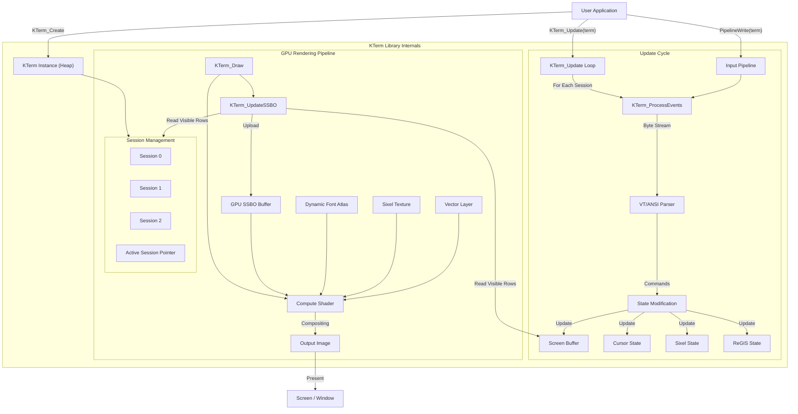

<div align="center">
  
</div>

# K-Term Emulation Library v2.2.6
(c) 2026 Jacques Morel

<details>
<summary>Table of Contents</summary>

1.  [Description](#description)
2.  [Key Features](#key-features)
3.  [How It Works](#how-it-works)
    1.  [3.1. Main Loop and Initialization](#31-main-loop-and-initialization)
    2.  [3.2. Input Pipeline and Character Processing](#32-input-pipeline-and-character-processing)
    3.  [3.3. Escape Sequence Parsing](#33-escape-sequence-parsing)
    4.  [3.4. Keyboard and Mouse Handling](#34-keyboard-and-mouse-handling)
    5.  [3.5. GPU Rendering Pipeline](#35-gpu-rendering-pipeline)
    6.  [3.6. Callbacks](#36-callbacks)
4.  [How to Use](#how-to-use)
    1.  [4.1. Basic Setup](#41-basic-setup)
    2.  [4.2. Sending Data to the KTerm (Simulating Host Output)](#42-sending-data-to-the-terminal-simulating-host-output)
    3.  [4.3. Receiving Responses and Key Events from the Terminal](#43-receiving-responses-and-key-events-from-the-terminal)
    4.  [4.4. Configuring KTerm Behavior](#44-configuring-terminal-behavior)
    5.  [4.5. Advanced Features](#45-advanced-features)
    6.  [4.6. Window and Title Management](#46-window-and-title-management)
    7.  [4.7. Diagnostics and Testing](#47-diagnostics-and-testing)
    8.  [4.8. Scripting API](#48-scripting-api)
5.  [Configuration Constants](#configuration-constants)
6.  [Key Data Structures](#key-data-structures)
7.  [Implementation Model](#implementation-model)
8.  [Dependencies](#dependencies)
9.  [License](#license)

</details>

## Description

**kterm.h** is a high-performance, single-header C library that provides comprehensive terminal emulation for applications requiring a robust text-based user interface. It is designed to be easily integrated into embedded systems, development tools, and remote access clients, leveraging the **Situation** library for hardware-accelerated rendering and input management.

**v2.2.6 Update:** This release expands the **Gateway Protocol** and enhances animation control.
*   **Gateway Expansion:** Added `SET` and `RESET` commands for the `KTERM` class to control cell attributes and blink rates programmatically.
*   **Attribute Control:** Applications can now set attributes (Bold, Italic, Colors, etc.) via `DCS GATE;KTERM;0;SET;ATTR;... ST`.
*   **Blink Rate Control:** Independent control over Fast, Slow, and Background blink oscillators via `DCS GATE;KTERM;0;SET;BLINK;... ST`.
*   **Architectural Refinement:** Decoupled background blink oscillator from slow blink for fully independent visual effects.

**v2.2.5 Update:** This release introduces **Independent Blink Flavors**, offering precise control over terminal aesthetics.
*   **Visuals:** Implemented independent blink flavors (Fast/Slow/Background) via SGR 5, 6, and 105.
*   **Emulation:** Added `KTERM_ATTR_BLINK_BG` and `KTERM_ATTR_BLINK_SLOW` attributes to support distinct visual behaviors.
*   **SGR 5:** Slow Blink (Standard ECMA-48). Foreground only.
*   **SGR 6:** Rapid Blink (Standard ECMA-48). Foreground only.
*   **SGR 66:** Triggers Background Blink only (Standard-compliant private use).

**v2.2.4 Update:** This release focuses on **Bit Flag Attribute Refactoring**.
*   **Optimization:** Refactored `EnhancedTermChar` and `KTermSession` to use bit flags (`uint32_t`) for character attributes instead of multiple booleans.
*   **Performance:** Reduced memory footprint per cell and simplified GPU data transfer logic.
*   **Refactor:** Updated SGR (Select Graphic Rendition), rendering, and state management logic to use the new bitmask system.

**v2.2.3 Update:** This release focuses on **Tab Stop Architecture & Compliance**.
*   **Architecture:** The fixed-size tab stop array has been replaced with a dynamic allocation strategy, enabling correct tab behavior on terminals with arbitrary widths (beyond the previous 256-column limit).
*   **Compliance:** Fixed logic for `NextTabStop` to correctly jump to the right margin when tabs are cleared (TBC), removing non-compliant fallback behaviors.
*   **Initialization:** Improved session initialization to strictly respect the configured terminal dimensions.

**v2.2.2 Update:** This update introduces **IBM DOS ANSI Mode** (ANSI.SYS emulation), featuring authentic **CGA Color Palette** enforcement, automatic IBM font switching, and specific compatibility for DOS-era applications.

**v2.2.1 Update:** This update introduces the **Gateway Protocol** for runtime configuration and expands the **Dynamic Font System** with automatic glyph centering, perfect for retro fonts like IBM VGA.

**v2.2.0 Major Update:** This release marks a significant milestone, delivering the complete **Multiplexer & Graphics Update**, consolidating all features developed throughout the v2.1.x cycle.
*   **Multiplexer & Compositor:**
    *   **Recursive Pane Layout:** Full support for arbitrary split-screen layouts using a recursive `KTermPane` tree structure.
    *   **Dynamic Resizing:** Robust resizing logic with `SessionResizeCallback` integration.
    *   **Compositor Engine:** Optimized recursive rendering pipeline with persistent scratch buffers and transparency support for background layering.
    *   **Session Management:** Support for up to 4 independent sessions (VT525 standard) with `Ctrl+B` keybindings for splitting (`%`, `"`), and navigation (`o`, `n`).
*   **Kitty Graphics Protocol:**
    *   **Full Implementation:** Complete support for the protocol, including chunked transmission (`m=1`), placement (`a=p`), and deletion (`a=d`).
    *   **Animation:** Automatic animation of multi-frame images (`a=f`) with frame delay handling.
    *   **Z-Index & Composition:** Proper layering with `z<0` (behind text) and `z>=0` (above text) support, including correct transparency handling.
    *   **Integration:** Features scrolling images, clipping to split panes, and intelligent default placement.
*   **Graphics & Rendering Improvements:**
    *   **ReGIS Resolution Independence:** The graphics engine now supports the ReGIS `S` (Screen) command with `E` (Erase) and `A` (Addressing) options for flexible logical coordinate systems.
    *   **Sixel Improvements:** Added HLS color support.
    *   **Correctness:** Improved string terminator logic for OSC/DCS/APC sequences and accurate CP437 mapping for the default font.
*   **Production Ready:** This release consolidates all Phase 1-4 features into a stable, high-performance terminal emulation solution.

**v2.1.0 Major Update:** This release focuses on **Architecture Decoupling** and **Visual Accuracy**, consolidating features that were incrementally released during the v2.0.x cycle.
*   **Architectural Decoupling:** The library has been significantly refactored to separate concerns, enabling easier porting.
    *   **Input Decoupling:** Input handling is now isolated in `kterm_io_sit.h` with a hardened `KTermEvent` system, allowing the core logic to be window-system agnostic.
    *   **Render Decoupling:** Rendering logic now relies on the `kterm_render_sit.h` abstraction layer, removing direct dependencies on the Situation library from the core header.
*   **Museum-Grade Visuals:** The default font has been updated to an authentic DEC VT220 8x10 font with precise G0/G1 charset mapping and Special Graphics character support for pixel-perfect historical accuracy.
*   **Enhanced Flexibility:** Support for flexible window resizing and restored printer controller functionality.

The library implements a complete set of historical and modern terminal standards, ensuring compatibility with **VT52, VT100, VT220, VT320, VT340, VT420, VT510, VT520, VT525, and xterm**.

Beyond standard text emulation, `kterm.h` features a **GPU-accelerated rendering pipeline** using Compute Shaders, enabling advanced visual capabilities such as:
*   **Vector Graphics:** Full support for Tektronix 4010/4014 and ReGIS (Remote Graphics Instruction Set).
*   **Raster Graphics:** Sixel bitmap graphics.
*   **Modern Visuals:** True Color (24-bit) support, dynamic Unicode glyph caching, and retro CRT effects.
*   **Multi-Session Management:** Simultaneous support for independent sessions (up to 4, depending on VT level) with split-screen compositing.

The library processes a stream of input characters (typically from a host application or PTY) and updates an internal screen buffer. This buffer, representing the terminal display, is then rendered to the screen via the GPU. It handles a wide range of escape sequences to control cursor movement, text attributes, colors, screen clearing, scrolling, and various terminal modes.

## Key Features

-   **Compute Shader Rendering:** High-performance SSBO-based text rendering pipeline.
-   **Multi-Session Support:** Independent terminal sessions (up to 4, dictated by protocol level) with split-screen compositing (DECSASD, DECSSDT).
-   **Vector Graphics Engine:** GPU-accelerated Tektronix 4010/4014 and ReGIS graphics support with "storage tube" phosphor glow simulation.
-   **ReGIS Graphics:** Full implementation of Remote Graphics Instruction Set (commands P, V, C, T, W, S, L, @) including macrographs and custom alphabets.
-   VT52, VT100, VT102, VT220, VT320, VT340, VT420, VT510, VT520, VT525, and xterm compatibility levels.
-   256-color and 24-bit True Color (RGB) support for text.
-   **Internationalization:** Full ISO 2022 & NRCS (National Replacement Character Sets) support with Locking Shifts (LS0-LS3).
-   **Strict Unicode Decoder:** Robust UTF-8 parsing with overlong encoding protection and visual error feedback.
-   **Museum-Grade Typography:** Default rendering now uses the 8x10 aspect ratio of the original DEC VT220, with accurate Special Graphics character mapping.
-   **Dynamic Glyph Cache:** On-demand glyph rasterization for full Unicode support (replacing fixed CP437 texture) with fallback rendering.
-   Advanced cursor styling (block, underline, bar) with blink options.
-   Comprehensive mouse tracking modes (X10, VT200, Button Event, Any Event, SGR).
-   **Scrollback:** Large ring buffer implementation for infinite scrollback history.
-   Alternate screen buffer implementation.
-   Scrolling regions and margins (including VT420 left/right margins).
-   Bracketed paste mode (CSI ? 2004 h/l).
-   Sixel graphics parsing and rendering.
-   Soft font downloading (DECDLD).
-   User-Defined Keys (DECUDK).
-   Window title and icon name control via OSC sequences.
-   Rich set of text attributes (bold, faint, italic, underline, blink, reverse, etc.).
-   Input pipeline with performance management options.
-   Callback system for responses to host, title changes, and bell.
-   Diagnostic and testing utilities.
-   **Multi-Session Support:** Up to 4 independent terminal sessions with split-screen compositing.
-   **Retro CRT Effects:** Configurable screen curvature and scanlines.
-   **Safety:** Hardened against buffer overflows and integer exploits using `StreamScanner` and safe parsing primitives.

## How It Works

The library operates around a central `Terminal` structure that manages global resources (GPU buffers, textures) and a set of `KTermSession` structures, each maintaining independent state for distinct terminal sessions. The API is instance-based (`KTerm*`), supporting multiple terminal instances within a single application.



### 3.1. Main Loop and Initialization

-   `KTerm_Create()`: Allocates and initializes a new `Terminal` instance. It sets up memory for `KTermSession`s and configures GPU resources (Compute Shaders, SSBOs, Textures). It initializes the dynamic glyph cache and default session states (VT level, charsets, colors).
-   `KTerm_Update(term)`: The main heartbeat of the library. It iterates through all active sessions (up to 3), calling `KTerm_ProcessEvents()` for each to handle incoming data. It also updates global timers (cursor blink, visual bell) and manages the response queue to the host.
-   `KTerm_Draw(term)`: Executes the rendering pipeline. It triggers the `KTerm_UpdateSSBO()` upload function and dispatches Compute Shaders to render the text, Sixel graphics, and Vector overlays to the final output image.

### 3.2. Input Pipeline and Character Processing

-   Data from the host (PTY or application) is written to a session-specific input buffer using `KTerm_WriteChar(term, ...)` or `KTerm_WriteCharToSession(term, ...)`.
-   `KTerm_ProcessEvents(term)` consumes bytes from this buffer.
-   `KTerm_ProcessChar()` acts as the primary state machine dispatcher. It routes characters based on the current parsing state (Normal, Escape, CSI, OSC, DCS, Sixel, ReGIS, etc.).
-   **Session Isolation:** Each session maintains its own `input_pipeline`, `parse_state`, and screen buffers, ensuring complete isolation between multiple shells or applications.

### 3.3. Escape Sequence Parsing

-   The library implements a robust state machine compatible with VT500-series standards.
-   **CSI sequences** (e.g., `CSI H`) are parsed by accumulating parameters into `escape_params` and dispatching to functions like `KTerm_ExecuteCSICommand()`.
-   **DCS sequences** (Device Control Strings) trigger specialized parsers for features like Sixel (`KTerm_ProcessSixelChar`), ReGIS (`ProcessReGISChar`), or Soft Fonts (`KTerm_LoadSoftFont`).
-   **OSC sequences** (Operating System Commands) handle window title changes and palette manipulation.

### 3.4. Keyboard and Mouse Handling

-   `KTerm_UpdateKeyboard()` maps raw input events from the **Situation** library to standard VT escape sequences. It respects `DECCKM` (Cursor Keys Mode) and keypad modes.
-   `KTerm_UpdateMouse()` tracks mouse position and button states relative to the active session's viewport (handling split-screen coordinate mapping). It generates reports for X10, VT200, SGR, and URXVT protocols.

### 3.5. GPU Rendering Pipeline

-   **SSBO Upload (`KTerm_UpdateSSBO`)**: The CPU gathers the visible rows from the active session(s). In split-screen mode, it composites rows from the top and bottom sessions into a single GPU-accessible buffer (`KTermBuffer`).
-   **Compute Shaders**:
    -   **KTerm Shader:** Renders the text grid. It samples the **Dynamic Font Atlas**, applies text attributes (bold, underline, blink, etc.), and mixes in the Sixel layer. It also applies post-processing effects like CRT curvature and scanlines.
    -   **Vector Shader:** Renders Tektronix and ReGIS vector graphics. It uses a "storage tube" accumulation technique, allowing vectors to persist and glow.
    -   **Sixel Shader:** Renders Sixel strips to a dedicated texture, which is then overlaid by the main terminal shader.
-   **Dynamic Atlas:** The library maintains a texture atlas that is populated on-the-fly with Unicode glyphs using `stb_truetype`.

### 3.6. Callbacks

-   `ResponseCallback`: The terminal uses this to send data back to the "host" application (e.g., answers to Device Status Report `DSR`, Device Attributes `DA`
    requests, or some mouse reports). Data is queued via `KTerm_QueueResponse()` and flushed during `KTerm_Update()`.
-   `TitleCallback`: Invoked when an OSC sequence changes the window or icon title, allowing the parent GUI application to update the actual OS window.
-   `BellCallback`: Called when a BEL (0x07) control character is processed. If not set, a visual bell effect might be triggered.

## How to Use

This library is designed as a single-header library.

### 4.1. Basic Setup

-   In one of your C files, define `KTERM_IMPLEMENTATION` before including "kterm.h":
    ```c
    #define KTERM_IMPLEMENTATION
    #include "kterm.h"
    ```
-   In other files, just `#include "kterm.h"`.
-   Initialize Situation: `InitWindow(...)`.
-   Initialize the terminal:
    ```c
    KTermConfig config = {
        .width = 132,
        .height = 50,
        .response_callback = MyResponseCallback
    };
    KTerm* term = KTerm_Create(config);
    ```
-   Set target FPS for Situation: `SetTargetFPS(60)`.
-   Optionally, set terminal performance: `KTerm_SetPipelineTargetFPS(term, 60)`, `KTerm_SetPipelineTimeBudget(term, 0.5)`.
-   In your main application loop:
    ```c
    // Process host inputs and terminal updates
    KTerm_UpdateKeyboard(term); // Translates Situation key events to VT sequences
    KTerm_UpdateMouse(term);      // Translates Situation mouse events to VT sequences
    KTerm_Update(term);   // Processes pipeline, timers, and callbacks

    // Render the terminal
    BeginDrawing();
        ClearBackground(BLACK); // Or your desired background color
        KTerm_Draw(term);
    EndDrawing();
    ```
-   On exit: `KTerm_Destroy(term)` and `CloseWindow()`.

### 4.2. Sending Data to the KTerm (Simulating Host Output)

-   `KTerm_WriteChar(term, unsigned char ch)`: Send a single byte.
-   `KTerm_WriteString(term, const char* str)`: Send a null-terminated string.
-   `KTerm_WriteFormat(term, const char* format, ...)`: Send a printf-style formatted string.

These functions add data to an internal buffer, which `KTerm_Update(term)` processes.

### 4.3. Receiving Responses and Key Events from the Terminal

-   `KTerm_SetResponseCallback(term, ResponseCallback callback)`: Register a function like `void my_response_handler(KTerm* term, const char* response, int length)` to receive data
    that the terminal emulator needs to send back (e.g., status reports, DA).
-   `KTerm_GetKey(term, VTKeyEvent* event)`: Retrieve a fully processed `VTKeyEvent` from the keyboard buffer. The `event->sequence` field contains the string
    to be sent to the host or processed by a local application.
    > **Note:** Applications can call `KTerm_GetKey` before `KTerm_Update` to intercept and consume input events locally (e.g., for local editing or hotkeys) before they are sent to the terminal pipeline.

### 4.4. Configuring KTerm Behavior

-   **VT Compliance Level:**
    -   `KTerm_SetLevel(term, VTLevel level)` (e.g., `VT_LEVEL_XTERM`, `VT_LEVEL_420`).
    -   `KTerm_GetLevel(term)`.
-   **KTerm Modes (DEC/ANSI):**
    -   `KTerm_SetMode(term, const char* mode_name, bool enable)` (e.g., "application_cursor"). Most modes are set/reset via standard VT escape sequences (e.g., `CSI ? 1 h/l`
        for DECCKM, `CSI ? 25 h/l` for cursor visibility).
-   **Cursor Customization:**
    -   `KTerm_SetCursorShape(term, CursorShape shape)` (e.g., `CURSOR_BLOCK_BLINK`).
    -   `KTerm_SetCursorColor(term, ExtendedColor color)`.
    -   Also settable via DECSCUSR sequence (`CSI Ps SP q`).
-   **Mouse Tracking:**
    -   `KTerm_SetMouseTracking(term, MouseTrackingMode mode)` (e.g., `MOUSE_TRACKING_SGR`).
    -   Enable/disable features like focus reporting: `KTerm_EnableMouseFeature(term, "focus", true)`.
    -   Also settable via `CSI ? Pn h/l` (e.g., `CSI ? 1000 h`, `CSI ? 1006 h`).
-   **Character Sets:**
    -   `KTerm_SelectCharacterSet(term, int gset, CharacterSet charset)` (designates G0-G3).
    -   `KTerm_SetCharacterSet(term, CharacterSet charset)` (sets current GL, usually G0).
    -   Also settable via ESC sequences (`ESC ( C`, `ESC ) C`, etc.).
-   **Tab Stops:**
    -   `KTerm_SetTabStop(term, int column)`, `KTerm_ClearTabStop(term, int column)`, `KTerm_ClearAllTabStops(term)`.
    -   `NextTabStop(term, int current_col)`, `PreviousTabStop(term, int current_col)`.

### 4.5. Advanced Features

-   **Sixel Graphics:** Enabled if VT level is VT320+ or XTERM. Sixel data is sent via DCS: `ESC P Pa;Pb;Ph;Pv q <sixel_data> ST`.
-   **Soft Fonts (DECDLD):** Enabled if VT level is VT220+. Loaded via DCS. `KTerm_LoadSoftFont(term, ...)`, `KTerm_SelectSoftFont(term, ...)`.
-   **Programmable Keys (DECUDK):** Enabled if VT level is VT320+. `KTerm_DefineFunctionKey(term, int fkey_num, const char* seq)` for F1-F24.
-   **Bracketed Paste:**
    -   `KTerm_EnableBracketedPaste(term, bool enable)`. Controlled by `CSI ? 2004 h/l`. `IsBracketedPasteActive(term)`, `ProcessPasteData(term, ...)`.
-   **Session Management:**
    -   `KTerm_SetActiveSession(term, index)`: Switch between session 0, 1, or 2.
    -   `KTerm_SetSplitScreen(term, true, row, top, bot)`: Enable split-screen viewing.

### 4.6. Window and Title Management

-   `KTerm_SetWindowTitle(term, const char* title)`, `KTerm_SetIconTitle(term, const char* title)`.
-   `KTerm_GetWindowTitle(term)`, `KTerm_GetIconTitle(term)`.
-   `KTerm_SetTitleCallback(term, TitleCallback callback)`: Register `void my_title_handler(KTerm* term, const char* title, bool is_icon)` to be notified of title changes (e.g., from OSC sequences `ESC ]0;...ST`).

### 4.7. Diagnostics and Testing

-   `KTerm_EnableDebug(term, bool enable)`: Toggles verbose logging of unsupported/unknown sequences.
-   `KTerm_GetStatus(term)`: Returns `KTermStatus` with buffer usage, etc.
-   `KTerm_RunTest(term, const char* test_name)`: Executes predefined test sequences ("cursor", "all").
-   `KTerm_ShowInfo(term)`: Prints current terminal state to the terminal screen.

### 4.8. Scripting API

-   A set of `Script_` functions provide simple wrappers for common operations:
    `KTerm_Script_PutChar(term, ...)`, `KTerm_Script_Print(term, ...)`, `KTerm_KTerm_Script_Printf(term, ...)`, `KTerm_Script_Cls(term)`, `KTerm_Script_SetColor(term, ...)`.

## Configuration Constants

The library uses several compile-time constants defined at the beginning of this
file (e.g., `DEFAULT_TERM_WIDTH`, `DEFAULT_TERM_HEIGHT`, `DEFAULT_CHAR_WIDTH`, `DEFAULT_CHAR_HEIGHT`, `DEFAULT_WINDOW_SCALE`,
`OUTPUT_BUFFER_SIZE`) to set default terminal dimensions, font size, rendering scale,
and buffer sizes. These can be modified before compilation.

## Key Data Structures

-   `Terminal`: The main struct encapsulating the entire terminal state. The API is instance-based, meaning all functions take a `KTerm*` pointer.
-   `EnhancedTermChar`: Represents a single character cell on the screen, including its Unicode codepoint, foreground/background `ExtendedColor`, and text attributes
    (bold, italic, underline, etc.).
-   `VTParseState`: Enum tracking the current state of the escape sequence parser.
-   `VTLevel`: Enum defining the VT compatibility level (e.g., VT100, VT220, VT420, XTERM).
-   `ExtendedColor`: Struct for representing colors, supporting both standard ANSI palette indices and 24-bit RGB true color values.
-   `VTKeyboard`: Struct managing keyboard input state, modifier keys, application modes (cursor keys, keypad), and a buffer for processed `VTKeyEvent`s.
-   `DECModes`, `ANSIModes`: Structs containing boolean flags for various DEC private and ANSI standard modes.
-   `EnhancedCursor`: Struct detailing cursor properties like position, visibility, shape (`CursorShape`), and blink status.
-   `CharsetState`: Manages the G0-G3 character sets and the active GL/GR mappings.
-   `MouseTrackingMode`: Enum for the various mouse reporting protocols.
-   `SixelGraphics`, `SoftFont`, `BracketedPaste`, `ProgrammableKeys`: Structs for managing state related to these advanced features.

## Implementation Model

This is a single-header library. To include the implementation, define `KTERM_IMPLEMENTATION` in exactly one C source file before including this header:
```c
#define KTERM_IMPLEMENTATION
#include "kterm.h"
```
Other source files can simply include "kterm.h" for declarations.

## Dependencies

-   Situation (version 2.3.x or later): Used for window creation, graphics rendering, input handling (keyboard/mouse), and font texture management.
-   Standard C11 libraries: `stdio.h`, `stdlib.h`, `string.h`, `stdbool.h`, `ctype.h`, `stdarg.h`, `math.h`, `time.h`.
-   **Runtime Resources**: The `shaders/` directory containing `terminal.comp`, `vector.comp`, and `sixel.comp` must be present in the application's working directory (or the path configured via `KTERM_TERMINAL_SHADER_PATH` etc.).

## License

MIT License
