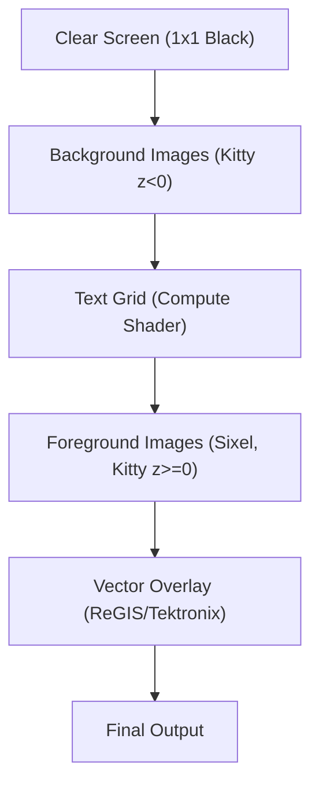
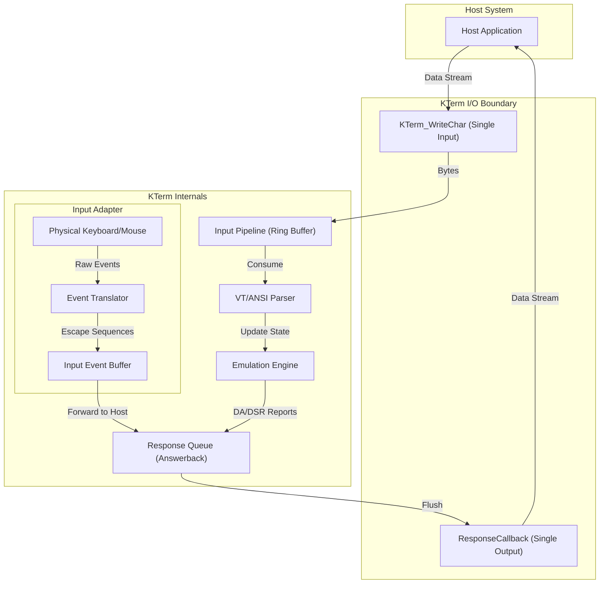
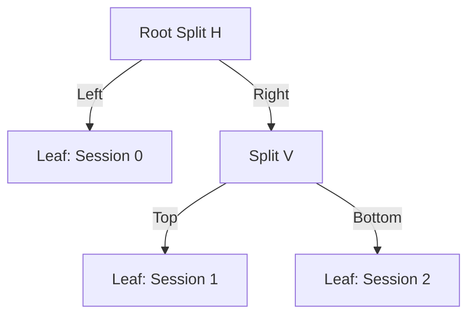

# kterm.h - Technical Reference Manual v2.2.24

**(c) 2026 Jacques Morel**

This document provides an exhaustive technical reference for `kterm.h`, an enhanced single-header terminal emulation library for C. It is intended for developers integrating the library into their applications and those who need a deep understanding of its capabilities, supported protocols, and internal architecture.

Table of Contents

*   [1. Overview](#1-overview)
    *   [1.1. Description](#11-description)
    *   [1.2. Key Features](#12-key-features)
    *   [1.3. Architectural Deep Dive](#13-architectural-deep-dive)
        *   [1.3.1. Core Philosophy and The `KTerm` Struct](#131-core-philosophy-and-the-kterm-struct)
        *   [1.3.2. The Input Pipeline](#132-the-input-pipeline)
        *   [1.3.3. The Processing Loop and State Machine](#133-the-processing-loop-and-state-machine)
        *   [1.3.4. The Screen Buffer](#134-the-screen-buffer)
        *   [1.3.5. The Rendering Engine](#135-the-rendering-engine)
        *   [1.3.6. The Output Pipeline (Response System)](#136-the-output-pipeline-response-system)
        *   [1.3.7. Session Management](#137-session-management)

*   [2. Compliance and Emulation Levels](#2-compliance-and-emulation-levels)
    *   [2.1. Setting the Compliance Level](#21-setting-the-compliance-level)
    *   [2.2. Feature Breakdown by `VTLevel`](#22-feature-breakdown-by-vtlevel)
        *   [2.2.1. `VT_LEVEL_52`](#221-vt_level_52)
        *   [2.2.2. `VT_LEVEL_100`](#222-vt_level_100)
        *   [2.2.3. `VT_LEVEL_220`](#223-vt_level_220)
        *   [2.2.4. `VT_LEVEL_320`](#224-vt_level_320)
        *   [2.2.5. `VT_LEVEL_420`](#225-vt_level_420)
        *   [2.2.6. `VT_LEVEL_520`](#226-vt_level_520)
        *   [2.2.7. `VT_LEVEL_XTERM` (Default)](#227-vt_level_xterm-default)

*   [3. Control and Escape Sequences](#3-control-and-escape-sequences)
    *   [3.1. C0 Control Codes](#31-c0-control-codes)
    *   [3.2. C1 Control Codes (7-bit and 8-bit)](#32-c1-control-codes-7-bit-and-8-bit)
    *   [3.3. CSI - Control Sequence Introducer (`ESC [`)](#33-csi---control-sequence-introducer-esc-)
        *   [3.3.1. CSI Command Reference](#331-csi-command-reference)
        *   [3.3.2. SGR (Select Graphic Rendition) Parameters](#332-sgr-select-graphic-rendition-parameters)
        *   [3.3.3. Mode Setting Parameters](#333-mode-setting-parameters)
    *   [3.3.4. Multi-Session & Split Screen](#334-multi-session-and-split-screen)
    *   [3.4. OSC - Operating System Command (`ESC ]`)](#34-osc---operating-system-command-esc--)
    *   [3.5. DCS - Device Control String (`ESC P`)](#35-dcs---device-control-string-esc-p)
    *   [3.6. Other Escape Sequences](#36-other-escape-sequences)
    *   [3.7. VT52 Mode Sequences](#37-vt52-mode-sequences)

*   [4. Key Features In-Depth](#4-key-features-in-depth)
    *   [4.1. Color Support](#41-color-support)
    *   [4.2. Mouse Tracking](#42-mouse-tracking)
    *   [4.3. Character Sets](#43-character-sets)
    *   [4.4. Screen and Buffer Management](#44-screen-and-buffer-management)
    *   [4.5. Sixel Graphics](#45-sixel-graphics)
    *   [4.6. Bracketed Paste Mode](#46-bracketed-paste-mode)
    *   [4.7. Session Management](#47-session-management)
    *   [4.8. I/O Architecture Principle](#48-io-architecture-principle)
    *   [4.9. Retro Visual Effects](#49-retro-visual-effects)
    *   [4.10. ReGIS Graphics](#410-regis-graphics)
    *   [4.11. Gateway Protocol](#411-gateway-protocol)
    *   [4.12. Kitty Graphics Protocol](#412-kitty-graphics-protocol)
    *   [4.13. IBM PC / DOS Compatibility Mode](#413-ibm-pc--dos-compatibility-mode)
    *   [4.14. Dynamic Font Switching & Glyph Centering](#414-dynamic-font-switching--glyph-centering)
    *   [4.15. Printer Controller Mode](#415-printer-controller-mode)
    *   [4.16. Rich Text Attributes (Extended SGR)](#416-rich-text-attributes-extended-sgr)
    *   [4.17. Tektronix 4010/4014 Emulation](#417-tektronix-40104014-emulation)
    *   [4.18. BiDirectional Text Support (BiDi)](#418-bidirectional-text-support-bidi)
    *   [4.19. DEC Locator Support](#419-dec-locator-support)

*   [5. API Reference](#5-api-reference)
    *   [5.1. Lifecycle Functions](#51-lifecycle-functions)
    *   [5.2. Host Input (Pipeline) Management](#52-host-input-pipeline-management)
    *   [5.3. Keyboard and Mouse Output](#53-keyboard-and-mouse-output)
    *   [5.4. Configuration and Mode Setting](#54-configuration-and-mode-setting)
    *   [5.5. Callbacks](#55-callbacks)
    *   [5.6. Diagnostics and Testing](#56-diagnostics-and-testing)
    *   [5.7. Advanced Control](#57-advanced-control)
    *   [5.8. Session Management](#58-session-management)

*   [6. Internal Operations and Data Flow](#6-internal-operations-and-data-flow)
    *   [6.1. Stage 1: Ingestion](#61-stage-1-ingestion)
    *   [6.2. Stage 2: Consumption and Parsing](#62-stage-2-consumption-and-parsing)
    *   [6.3. Stage 3: Character Processing and Screen Buffer Update](#63-stage-3-character-processing-and-screen-buffer-update)
    *   [6.4. Stage 4: Rendering](#64-stage-4-rendering)
    *   [6.5. Stage 5: Keyboard Input Processing](#65-stage-5-keyboard-input-processing)

*   [7. Data Structures Reference](#7-data-structures-reference)
    *   [7.1. Enums](#71-enums)
        *   [7.1.1. `VTLevel`](#711-vtlevel)
        *   [7.1.2. `VTParseState`](#712-vtparsestate)
        *   [7.1.3. `MouseTrackingMode`](#713-mousetrackingmode)
        *   [7.1.4. `CursorShape`](#714-cursorshape)
        *   [7.1.5. `CharacterSet`](#715-characterset)
    *   [7.2. Core Structs](#72-core-structs)
        *   [7.2.1. `KTerm`](#721-kterm)
        *   [7.2.2. `KTermSession`](#722-ktermsession)
        *   [7.2.3. `KTermPane`](#723-ktermpane)
        *   [7.2.4. `EnhancedTermChar`](#724-enhancedtermchar)
        *   [7.2.5. `ExtendedColor`](#725-extendedcolor)
        *   [7.2.6. `EnhancedCursor`](#726-enhancedcursor)
        *   [7.2.7. `DECModes` and `ANSIModes`](#727-decmodes-and-ansimodes)
        *   [7.2.8. `VTKeyEvent`](#728-vtkeyevent)
        *   [7.2.9. `CharsetState`](#729-charsetstate)
        *   [7.2.10. `KittyGraphics` and `KittyImageBuffer`](#7210-kittygraphics-and-kittyimagebuffer)

*   [8. Configuration Constants](#8-configuration-constants)

*   [9. License](#9-license)

---

## 1. Overview

### 1.1. Description

`kterm.h` is a comprehensive, single-header C library for terminal emulation. It is designed for integration into applications requiring a text-based user interface, such as embedded systems, remote access clients, or development tools. The library uses [Situation](https://www.Situation.com/) for rendering, windowing, and input handling, providing a complete solution out of the box.

The library emulates a wide range of historical and modern terminal standards, from the DEC VT52 to contemporary xterm extensions. It processes a stream of bytes, interprets control codes and escape sequences, and maintains an internal model of the terminal screen, which is then rendered to the display.

### 1.2. Key Features

-   **Broad Compatibility:** Emulates VT52, VT100, VT220, VT320, VT420, VT520, and xterm.
-   **Advanced Color Support:**
    -   16-color ANSI (standard and bright).
    -   256-color indexed palette.
    -   24-bit RGB True Color.
-   **Modern UI Features:**
    -   Advanced mouse tracking (X10, VT200, SGR, and more).
    -   Bracketed paste mode (`CSI ? 2004 h/l`).
    -   **Sixel Graphics Rendering:** Full support for Sixel graphics (`DCS P q ... ST`), enabling bitmap images directly in the terminal.
    -   **User-Defined Keys (DECUDK):** The terminal supports defining custom sequences for keys (VT320+).
    -   Customizable cursor styles (block, underline, bar, with blink).
-   **Multiplexer & Session Management (v2.2):**
    -   **Tree-Based Layout:** Manage up to 4 independent terminal sessions arranged in arbitrary recursive split layouts (Horizontal/Vertical).
    -   **Session Switching:** Focus control routes user input to specific panes while background sessions continue to update.
    -   **Input Interceptor:** Integrated keybindings (Default: `Ctrl+B`) for managing splits (`%`, `"`), navigation (`o`, `n`), and focus without leaving the keyboard.
    -   **Dynamic Resizing:** Panes can be resized dynamically, triggering reflow in the contained sessions.
-   **Rich Graphics:**
    -   **Kitty Graphics Protocol:** Full implementation of the Kitty graphics protocol for displaying high-resolution images, animations, and transparency directly in the terminal.
    -   **Sixel Graphics:** Full support for Sixel graphics (`DCS P q ... ST`) including scrolling modes and cursor placement.
    -   **ReGIS Graphics:** Resolution-independent vector graphics.
    -   **Tektronix 4010/4014:** Vector graphics emulation mode.
-   **Rich Text Styling:**
    -   **Underline Styles:** Support for Curly, Dotted, and Dashed underlines via SGR 4:x.
    -   **Attribute Stack:** Push/Pop SGR state (`CSI # {` / `CSI # }`) for robust styling in nested TUI contexts.
-   **Visual Effects:**
    -   **CRT Simulation:** Configurable curvature and scanline effects for a retro aesthetic.
-   **Comprehensive KTerm Emulation:**
    -   Alternate screen buffer.
    -   Scrolling regions and margins (including vertical and horizontal).
    -   Character sets (ASCII, DEC Special Graphics, NRCS).
    -   Soft fonts (DECDLD).
    -   User-Defined Keys (DECUDK).
    -   **Dynamic Font Switching:** Change terminal fonts at runtime via `OSC 50` or the Gateway Protocol.
    -   Window title and icon name control via OSC sequences.
    -   Rich set of text attributes (bold, faint, italic, underline, blink, reverse, etc.).
-   **Performance and Diagnostics:**
    -   Tunable input pipeline for performance management.
    -   Callback system for host responses, title changes, and bell.
    -   Debugging utilities for logging unsupported sequences.
-   **Device Support:**
    -   **Printer Controller:** Full support for Media Copy (`MC`) and Printer Controller modes, including Print Extent and Form Feed control.
    -   **DEC Locator:** Support for DEC Locator mouse input reporting (rectangular coordinates).

### 1.3. Architectural Deep Dive

This section provides a more detailed examination of the library's internal components and data flow, expanding on the brief overview. Understanding this architecture is key to extending the library or diagnosing complex emulation issues.

#### 1.3.1. Core Philosophy and The `KTerm` Struct

The library's design is centered on a single, comprehensive data structure: the `KTerm` struct. This monolithic struct, defined in `kterm.h`, encapsulates the entire state of the emulated device.

In **v2.2**, `KTerm` acts as a hypervisor/multiplexer. Instead of managing a single state, it holds:
-   An array of `KTermSession` structs (up to `MAX_SESSIONS`), each representing a virtual terminal with its own screen buffer, cursor, and parser state.
-   A `KTermPane` tree (`layout_root`), defining how these sessions are tiled on the screen.
-   Global resources like the GPU pipeline, font texture, and shared input/output buffers.

The API remains **instance-based** (`KTerm*`), allowing multiple independent multiplexer instances to coexist.

#### 1.3.2. The Input Pipeline

The terminal is a consumer of sequential character data. The entry point for all incoming data from a host application (e.g., a shell, a remote server) is the input pipeline.

-   **Mechanism:** A fixed-size circular buffer (`input_pipeline`) of `unsigned char`.
-   **Ingestion:** Host applications use `KTerm_WriteChar(term, ...)`, `KTerm_WriteString(term, ...)` to append data to this buffer. These functions are intended for use from the main application thread.
-   **Flow Control:** The pipeline has a fixed size (`16384` bytes). If the host writes data faster than the terminal can process it, an overflow flag (`pipeline_overflow`) is set. This allows the host application to detect the overflow and potentially pause data transmission.

#### 1.3.3. The Processing Loop and State Machine

The heart of the emulation is the main processing loop within `KTerm_Update(term)`, which drives a sophisticated state machine.

-   **Consumption:** `KTerm_Update(term)` calls `KTerm_ProcessEvents(term)`, which consumes a tunable number of characters from the input pipeline each frame. This prevents the emulation from freezing the application when large amounts of data are received. The number of characters processed can be adjusted for performance (`VTperformance` struct).
-   **Parsing:** Each character is fed into `KTerm_ProcessChar()`, which acts as a dispatcher based on the current `VTParseState`.
    -   `VT_PARSE_NORMAL`: In the default state, printable characters are sent to the screen, and control characters (like `ESC` or C0 codes) change the parser's state.
    -   `VT_PARSE_ESCAPE`: After an `ESC` (`0x1B`) is received, the parser enters this state, waiting for the next character to determine the type of sequence (e.g., `[` for CSI, `]` for OSC).
    -   `PARSE_CSI`, `PARSE_OSC`, `PARSE_DCS`, etc.: In these states, the parser accumulates parameters and intermediate bytes into `escape_buffer` until a final character (terminator) is received.
    -   **Execution:** Once a sequence is complete, a corresponding `Execute...()` function is called (e.g., `KTerm_ExecuteCSICommand`, `KTerm_ExecuteOSCCommand`). `KTerm_ExecuteCSICommand` uses a highly efficient computed-goto dispatch table to jump directly to the handler for the specific command (`ExecuteCUU`, `ExecuteED`, etc.), minimizing lookup overhead.

#### 1.3.4. The Screen Buffer

The visual state of the terminal is stored in one of two screen buffers, both of which are 2D arrays of `EnhancedTermChar`.

   **`EnhancedTermChar`:** This crucial struct represents a single character cell on the screen. It goes far beyond a simple `char`, storing:
    -   The Unicode codepoint (`ch`).
    -   Foreground and background colors (`ExtendedColor`), which can be an indexed palette color or a 24-bit RGB color.
    -   A comprehensive set of boolean flags for attributes like `bold`, `italic`, `underline`, `blink`, `reverse`, `strikethrough`, `conceal`, and more.
    -   Flags for DEC special modes like double-width or double-height characters (currently unsupported).
-   **Primary vs. Alternate Buffer:** The terminal maintains `screen` and `alt_screen`. Applications like `vim` or `less` switch to the alternate buffer (`CSI ?1049 h`) to create a temporary full-screen interface. When they exit, they switch back (`CSI ?1049 l`), restoring the original screen content and scrollback.

#### 1.3.5. The Rendering Engine (The Compositor)

The v2.2 rendering engine has evolved into a **Compositor**. The `KTerm_Draw()` function orchestrates a multi-pass GPU pipeline:

1.  **Layout Traversal:** It iterates through the `layout_root` tree to calculate the absolute screen viewport for each visible leaf pane.
2.  **SSBO Update:** `KTerm_UpdateSSBO()` uploads content from each visible session into a global `GPUCell` staging buffer, respecting pane boundaries.
3.  **Compute Dispatch (Text):** The core `terminal.comp` shader renders the text grid for the entire screen in one pass.
4.  **Overlay Pass (Graphics):** A new `texture_blit.comp` pipeline is dispatched to draw media elements:
    -   **Sixel Graphics:** Rendered from a dedicated texture.
    -   **Kitty Graphics:** Images are composited with full Alpha Blending and Z-Index support (background images behind text, foreground images on top).
    -   **ReGIS/Vectors:** Vector graphics are drawn as an overlay layer.
5.  **Presentation:** The final composited image is presented to the screen.

#### 1.3.6. The Output Pipeline (Response System)

The terminal needs to send data back to the host in response to certain queries or events. This is handled by the output pipeline, or response system.

-   **Mechanism:** When the terminal needs to send a response (e.g., a cursor position report `CSI {row};{col} R`), it doesn't send it immediately. Instead, it queues the response string into an `answerback_buffer`.
-   **Events:** The following events generate responses:
    -   **User Input:** Keystrokes (`KTerm_UpdateKeyboard(term)`) and mouse events (`KTerm_UpdateMouse(term)`) are translated into the appropriate VT sequences and queued.
    -   **Status Reports:** Commands like `DSR` (Device Status Report) or `DA` (Device Attributes) queue their predefined response strings.
-   **Callback:** The `KTerm_Update(term)` function checks if there is data in the response buffer. If so, it invokes the `ResponseCallback` function pointer, passing the buffered data to the host application. It is the host application's responsibility to set this callback and handle the data (e.g., by sending it over a serial or network connection).

#### 1.3.7. Session Management (Multiplexer)

Version 2.2 transforms the library into a tiling multiplexer.

-   **Sessions:** Independent `KTermSession` contexts (up to 4) maintain their own state (screen, history, cursor).
-   **Layout Tree:** The screen is divided into non-overlapping rectangles using a recursive `KTermPane` tree structure. Splits can be Horizontal or Vertical.
-   **Input Routing:** User input (Keyboard/Mouse) is routed exclusively to the session in the `focused_pane`.
-   **Background Processing:** All sessions, visible or not, continue to process data from their input pipelines and update their internal buffers.
-   **Reflow:** When a pane is resized, the session within it automatically reflows its text buffer to fit the new dimensions, preserving history.

---

## 2. Compliance and Emulation Levels

The library's behavior can be tailored to match historical and modern terminal standards by setting a compliance level. This is managed through a "logic grid" that explicitly defines which features are available at each level. This approach ensures that emulation is accurate, predictable, and easy to maintain.

### 2.1. The `VTFeatures` Logic Grid

At the core of the compliance system is the `VTFeatures` struct, a collection of boolean flags, where each flag represents a specific terminal capability (e.g., `sixel_graphics`, `true_color`, `mouse_tracking`).

The `KTerm_SetLevel()` function works by looking up the requested level in a static `vt_feature_grid` array. This array acts as the logic grid, containing a pre-defined `VTFeatures` configuration for every supported `VTLevel`. When a level is set, the corresponding feature set is copied into the active `terminal.conformance.features` struct, instantly enabling or disabling dozens of features to match the target standard. This also updates the device attribute strings that the terminal reports to the host. Additionally, setting the level automatically updates the **Answerback** string (e.g., "ANSI.SYS" for `VT_LEVEL_ANSI_SYS`, "kterm xterm" for `VT_LEVEL_XTERM`).

### 2.2. Feature Breakdown by `VTLevel`

This section details the key features enabled at each `VTLevel`. The `VTLevel` enum now uses semantic numbering (e.g., `VT_LEVEL_100 = 100`) to avoid breaking changes. The logic grid ensures that higher levels inherit features from lower ones.

| Level | Key Features Added |
| :--- | :--- |
| **`VT_LEVEL_52`** | Basic cursor movement (`ESC A/B/C/D`), direct cursor addressing, simple erase commands, alternate keypad mode. Emulates the DEC VT52. |
| **`VT_LEVEL_100`** | Introduces ANSI CSI sequences, SGR attributes (bold, underline, reverse), scrolling regions (`DECSTBM`), and DEC Special Graphics. |
| **`VT_LEVEL_102`** | Functionally identical to VT100 in this library. |
| **`VT_LEVEL_132`** | Functionally identical to VT102 in this library. |
| **`VT_LEVEL_220`** | 8-bit controls, soft fonts (`DECDLD`), User-Defined Keys (`DECUDK`). |
| **`VT_LEVEL_340`** | Sixel graphics (`DCS Pq...ST`). |
| **`VT_LEVEL_420`** | Rectangular area operations (`DECCRA`, `DECFRA`), selective erase (`DECSERA`), ANSI Text Locator (`DECSLE`, `DECRQLP`). |
| **`VT_LEVEL_510`** | Windowing support queries and PC-style function keys. |
| **`VT_LEVEL_520`** | 98% Compliance with VT520 extensions. Includes multi-session management, enhanced printer controls, and advanced status reporting. |
| **`VT_LEVEL_525`** | Color extensions to the VT520 standard. |
| **`VT_LEVEL_XTERM`** | Superset of all VT features plus: **Kitty Graphics**, 256-color and True Color, advanced mouse tracking (`SGR`), window manipulation (OSC titles), bracketed paste, focus reporting. (95% xterm compliance). |
| **`VT_LEVEL_K95`**| Placeholder for k95 protocol features. |
| **`VT_LEVEL_TT`**| Placeholder for tt protocol features. |
| **`VT_LEVEL_PUTTY`**| Placeholder for PuTTY-specific features. |

---

## 3. Control and Escape Sequences

The terminal's behavior is controlled by a stream of characters, including printable text and non-printable control sequences.

### 3.1. C0 Control Codes

These are single-byte codes in the range `0x00-0x1F`.

| Code | Hex | Name | Description                                                  |
| :--- | :-- | :--- | :----------------------------------------------------------- |
| `NUL`| 0x00| Null | Ignored.                                                     |
| `ENQ`| 0x05| Enquiry| Triggers the answerback message.                             |
| `BEL`| 0x07| Bell | Triggers the bell callback or a visual bell flash.           |
| `BS` | 0x08| Backspace| Moves the cursor one position to the left.                 |
| `HT` | 0x09| Horizontal Tab| Moves the cursor to the next tab stop.                |
| `LF` | 0x0A| Line Feed| Moves cursor down one line. Also performs a carriage return if LNM is set. |
| `VT` | 0x0B| Vertical Tab| Same as Line Feed.                                     |
| `FF` | 0x0C| Form Feed| Same as Line Feed.                                     |
| `CR` | 0x0D| Carriage Return| Moves cursor to the beginning of the current line.    |
| `SO` | 0x0E| Shift Out| Invokes the G1 character set into GL.                    |
| `SI` | 0x0F| Shift In | Invokes the G0 character set into GL.                    |
| `CAN`| 0x18| Cancel | Cancels the current escape sequence.                       |
| `SUB`| 0x1A| Substitute| Same as Cancel.                                        |
| `ESC`| 0x1B| Escape | Begins an escape sequence.                                 |
| `DEL`| 0x7F| Delete | Ignored.                                                     |

### 3.2. C1 Control Codes (7-bit and 8-bit)

In a 7-bit environment, C1 codes (`0x80-0x9F`) are represented by `ESC` followed by a character in the range `0x40-0x5F`. The library primarily uses the 7-bit form.

| Sequence | Name | Description                                           |
| :------- | :--- | :---------------------------------------------------- |
| `ESC D`  | IND  | Index: Moves cursor down one line.                    |
| `ESC E`  | NEL  | Next Line: Moves cursor to start of next line.        |
| `ESC H`  | HTS  | Horizontal Tabulation Set: Sets a tab stop at the current cursor column. |
| `ESC M`  | RI   | Reverse Index: Moves cursor up one line.              |
| `ESC N`  | SS2  | Single Shift 2: Uses G2 charset for the next character only. |
| `ESC O`  | SS3  | Single Shift 3: Uses G3 charset for the next character only. |
| `ESC P`  | DCS  | Device Control String: Begins a device-specific command. |
| `ESC Z`  | DECID| DEPRECATED - Return Device Attributes. Use `CSI c`.   |
| `ESC [`  | CSI  | Control Sequence Introducer: Begins a CSI sequence.   |
| `ESC \`  | ST   | String Terminator: Ends DCS, OSC, APC, PM strings.    |
| `ESC ]`  | OSC  | Operating System Command: Begins an OS-level command (e.g., set title). |
| `ESC ^`  | PM   | Privacy Message: Begins a privacy message string.     |
| `ESC _`  | APC  | Application Program Command: Begins an application command string. |
| `ESC #`  | -    | DEC Line Attributes: Followed by a digit (3, 4, 5, 6, 8). |
| `ESC %`  | -    | Select Character Set (ISO 2022): Followed by `@` (Default) or `G` (UTF-8). |
| `ESC n`  | LS2  | Lock Shift 2: Invokes G2 into GL. |
| `ESC o`  | LS3  | Lock Shift 3: Invokes G3 into GL. |
| `ESC \|` | LS3R | Lock Shift 3 Right: Invokes G3 into GR. |
| `ESC }`  | LS2R | Lock Shift 2 Right: Invokes G2 into GR. |
| `ESC ~`  | LS1R | Lock Shift 1 Right: Invokes G1 into GR. |

### 3.3. CSI - Control Sequence Introducer (`ESC [`)

CSI sequences are the most common type of control sequence. They follow the format `CSI [private] [params] [intermediate] final`.

-   **Private Marker (`?`)**: A `?` after the `[` indicates a DEC Private Mode sequence.
-   **Parameters (`Pn`)**: A series of semicolon-separated numbers (e.g., `1;5`). Default is 1 or 0 depending on context.
-   **Intermediate Bytes**: Characters in the range `0x20-0x2F` (e.g., ` ` (space), `$`, `"`).
-   **Final Byte**: A character in the range `0x40-0x7E`.

#### 3.3.1. CSI Command Reference

This section provides a comprehensive list of all supported CSI sequences, categorized by function. `Pn`, `Pm`, `Ps`, `Pt`, `Pb`, `Pl`, `Pr` represent numeric parameters.

| Command | Final Byte | Name | Description |
| :--- | :--- | :--- | :--- |
| **Cursor Movement** | | | |
| `CSI Pn A` | `A` | CUU | **Cursor Up.** Moves cursor up by `Pn` lines. Default `Pn=1`. |
| `CSI Pn B` | `B` | CUD | **Cursor Down.** Moves cursor down by `Pn` lines. Default `Pn=1`. |
| `CSI Pn C` | `C` | CUF | **Cursor Forward.** Moves cursor right by `Pn` columns. Default `Pn=1`. |
| `CSI Pn D` | `D` | CUB | **Cursor Back.** Moves cursor left by `Pn` columns. Default `Pn=1`. |
| `CSI Pn E` | `E` | CNL | **Cursor Next Line.** Moves cursor to the start of the line `Pn` lines down. Default `Pn=1`. |
| `CSI Pn F` | `F` | CPL | **Cursor Previous Line.** Moves cursor to the start of the line `Pn` lines up. Default `Pn=1`. |
| `CSI Pn G` | `G` | CHA | **Cursor Horizontal Absolute.** Moves cursor to column `Pn`. Default `Pn=1`. |
| `CSI Pn ` ` | `\`` | HPA | **Horizontal Position Absolute.** Same as CHA. |
| `CSI Pn a` | `a` | HPR | **Horizontal Position Relative.** Moves cursor right by `Pn` columns. |
| `CSI Pn;Pm H` | `H` | CUP | **Cursor Position.** Moves cursor to row `Pn`, column `Pm`. Defaults `Pn=1`, `Pm=1`. |
| `CSI Pn;Pm f` | `f` | HVP | **Horizontal and Vertical Position.** Same as CUP. |
| `CSI Pn d` | `d` | VPA | **Vertical Position Absolute.** Moves cursor to row `Pn`. Default `Pn=1`. |
| `CSI Pn e` | `e` | VPR | **Vertical Position Relative.** Moves cursor down `Pn` lines. |
| `CSI s` | `s` | ANSISYSSC | **Save Cursor Position (ANSI.SYS).** For DEC-style save, see `ESC 7`. |
| `CSI u` | `u` | ANSISYSRC | **Restore Cursor Position (ANSI.SYS).** For DEC-style restore, see `ESC 8`. |
| **Erasing & Editing** | | | |
| `CSI Ps J` | `J` | ED | **Erase In Display.** `Ps=0`: from cursor to end. `Ps=1`: from start to cursor. `Ps=2`: entire screen. `Ps=3`: entire screen and scrollback (xterm). |
| `CSI Ps K` | `K` | EL | **Erase In Line.** `Ps=0`: from cursor to end. `Ps=1`: from start to cursor. `Ps=2`: entire line. |
| `CSI Pn L` | `L` | IL | **Insert Lines.** Inserts `Pn` blank lines at the cursor. Default `Pn=1`. |
| `CSI Pn M` | `M` | DL | **Delete Lines.** Deletes `Pn` lines at the cursor. Default `Pn=1`. |
| `CSI Pn P` | `P` | DCH | **Delete Characters.** Deletes `Pn` characters at the cursor. Default `Pn=1`. |
| `CSI Pn X` | `X` | ECH | **Erase Characters.** Erases `Pn` characters from the cursor without deleting them. Default `Pn=1`. |
| `CSI Pn @` | `@` | ICH | **Insert Characters.** Inserts `Pn` blank spaces at the cursor. Default `Pn=1`. |
| `CSI Pn b` | `b` | REP | **Repeat Preceding Character.** Repeats the previous graphic character `Pn` times. |
| **Scrolling** | | | |
| `CSI Pn S` | `S` | SU | **Scroll Up.** Scrolls the active region up by `Pn` lines. Default `Pn=1`. |
| `CSI Pn T` | `T` | SD | **Scroll Down.** Scrolls the active region down by `Pn` lines. Default `Pn=1`. |
| `CSI Pt;Pb r` | `r` | DECSTBM | **Set Top And Bottom Margins.** Defines the scrollable area from row `Pt` to `Pb`. |
| `CSI ? Pl;Pr s`| `s` | DECSLRM | **Set Left And Right Margins.** Defines horizontal margins (VT420+). |
| **Tabulation** | | | |
| `CSI Pn I` | `I` | CHT | **Cursor Horizontal Tab.** Moves cursor forward `Pn` tab stops. Default `Pn=1`. |
| `CSI Pn Z` | `Z` | CBT | **Cursor Backward Tab.** Moves cursor backward `Pn` tab stops. Default `Pn=1`. |
| `CSI Ps g` | `g` | TBC | **Tabulation Clear.** `Ps=0`: clear stop at current column. `Ps=3`: clear all stops. |
| **Rectangular Area Operations (VT420+)** | | | |
| `CSI Pts;Pls;Pbs;Prs;Pps;Ptd;Pld;Ppd $ v` | `v` | DECCRA | **Copy Rectangular Area.** Copies a rectangular area. |
| `CSI Pts;Ptd;Pcs * y` | `y` | DECRQCRA | **Request Rectangular Area Checksum.** Requests a checksum. Gated by `DECECR`. |
| `CSI Pt ; Pc z` | `z` | DECECR | **Enable Checksum Report.** `Pc=1` enables, `0` disables DECRQCRA responses. |
| `CSI Pt;Pl;Pb;Pr $ x` | `x` | DECERA | **Erase Rectangular Area.** Erases a rectangular area. |
| `CSI Pch;Pt;Pl;Pb;Pr $ x` | `x` | DECFRA | **Fill Rectangular Area.** Fills a rectangular area with a character. |
| `CSI Ps;Pt;Pl;Pb;Pr $ {` | `{` | DECSERA | **Selective Erase Rectangular Area.** Selectively erases a rectangular area. |
| `CSI # {` | `{` | XTPUSHSGR | **Push SGR.** Saves current text attributes to the stack. |
| `CSI # }` | `}` | XTPOPSGR | **Pop SGR.** Restores text attributes from the stack. |
| **Text Attributes (SGR)** | | | |
| `CSI Pm m` | `m` | SGR | **Select Graphic Rendition.** Sets text attributes. See SGR table below for `Pm` values. |
| **Modes** | | | |
| `CSI Pm h` | `h` | SM | **Set Mode.** Enables an ANSI or DEC private mode. See Mode table below. |
| `CSI Pm l` | `l` | RM | **Reset Mode.** Disables an ANSI or DEC private mode. See Mode table below. |
| **Device & Status Reporting**| | | |
| `CSI Ps c` | `c` | DA | **Device Attributes.** `Ps=0` (or omitted) for Primary DA. `>c` for Secondary DA. `=c` for Tertiary DA. |
| `CSI Ps n` | `n` | DSR | **Device Status Report.** `Ps=5`: Status OK (`CSI 0 n`). `Ps=6`: Cursor Position Report (`CSI r;c R`). |
| `CSI ? Ps n` | `n` | DSR (DEC)| **DEC-Specific DSR.** E.g., `?15n` (printer), `?26n` (keyboard), `?63n` (checksum). |
| `CSI Ps x` | `x` | DECREQTPARM | **Request KTerm Parameters.** Reports terminal settings. |
| `CSI $ u` | `u` | DECRQPSR | **Request Presentation State Report.** E.g., Sixel or ReGIS state. |
| `CSI Ps $ t` | `t` | DECRQTSR | **Request Terminal State Report.** Requests VT420 terminal state report. |
| **Miscellaneous** | | | |
| `CSI Pi i` | `i` | MC | **Media Copy.** `Pi=0`: Print screen. `Pi=4`: Disable auto-print. `Pi=5`: Enable auto-print. |
| `CSI ? Pi i`| `i` | MC (DEC) | **DEC Media Copy.** `?4i`: Disable printer controller. `?5i`: Enable printer controller. `?1i`: Print cursor line. |
| `CSI Ps q` | `q` | DECLL | **Load LEDs.** `Ps` is a bitmask for keyboard LEDs (VT220+). |
| `CSI Ps SP q`| `q` | DECSCUSR | **Set Cursor Style.** `Ps` selects cursor shape (block, underline, bar) and blink. |
| `CSI ! p` | `p` | DECSTR | **Soft KTerm Reset.** Resets many modes to their default values. |
| `CSI " p` | `p` | DECSCL | **Select Conformance Level.** Sets the terminal's strict VT emulation level. |
| `CSI $ q` | `q` | DECRQM | **Request Mode (DEC).** An alias for `DECRQM` using `$` instead of `y`. |
| `CSI $ u` | `u` | DECRQPSR | **Request Presentation State Report.** E.g., Sixel or ReGIS state. |
| `CSI ? Ps y`| `y` | DECTST | **Invoke Confidence Test.** Performs a self-test (e.g., screen fill). |
| `CSI ? Ps ; Pv $ z` | `z` | DECVERP | **Verify Parity.** (currently unsupported) |
| `CSI ? Psl {` | `{` | DECSLE | **Select Locator Events.** Selects the types of locator events to be reported. |
| `CSI Plc \|` | `\|` | DECRQLP | **Request Locator Position.** Requests the current position of the locator. |

#### 3.3.4. Multi-Session & Split Screen
These commands control the VT520-style multi-session and split screen features. **Note:** In v2.2+, legacy VT520 session commands are mapped to the tiling layout engine (focus change instead of full session switch).

| Command | Name | Description |
| :--- | :--- | :--- |
| `CSI Ps ! ~` | `DECSN` | **Select Session Number.** Switches the active session to `Ps`. `Ps` is 1-based (1-3). |
| `CSI ? Ps n` | `DECRSN` | **Report Session Number.** If `Ps=12`, reports the active session as `CSI ? 12 ; {session} n`. |
| `CSI ? 21 n` | `DECRS` | **Report Session Status.** Reports availability of sessions via a DCS string. |
| `CSI Ps $ }` | `DECSASD`| **Select Active Status Display.** `Ps=0`: Main display. `Ps=1`: Status line. |
| `CSI Ps $ ~` | `DECSSDT`| **Select Split Definition Type.** `Ps=0`: No split. `Ps=1`: Horizontal split (50/50). |

#### 3.3.2. SGR (Select Graphic Rendition) Parameters
The `CSI Pm m` command sets display attributes based on the numeric parameter `Pm`. Multiple parameters can be combined in a single sequence, separated by semicolons (e.g., `CSI 1;31m`).

| Code | Effect                       | Reset Code |
| :--- | :--------------------------- | :--------- |
| 0    | Reset all attributes         | -          |
| 1    | Bold / Bright                | 22         |
| 2    | Faint / Dim                  | 22         |
| 3    | Italic                       | 23         |
| 4    | Underline (See 4.16.1)       | 24         |
| 5    | Blink (Slow)                 | 25         |
| 7    | Reverse Video                | 27         |
| 8    | Conceal / Hide               | 28         |
| 9    | Strikethrough                | 29         |
| 21   | Double Underline             | 24         |
| 30-37| Set Foreground (ANSI Colors 0-7) | 39         |
| 40-47| Set Background (ANSI Colors 0-7) | 49         |
| 90-97| Set Bright Foreground (8-15) | 39         |
| 100-107| Set Bright Background (8-15)| 49         |
| 38;5;Pn | Set 256-color Foreground     | 39         |
| 48;5;Pn | Set 256-color Background     | 49         |
| 38;2;Pr;Pg;Pb | Set True Color Foreground | 39         |
| 48;2;Pr;Pg;Pb | Set True Color Background | 49         |
| 58   | Set Underline Color          | 59         |
| 59   | Reset Underline Color        | -          |
| 66   | Background Blink (Private Use)| 25         |

#### 3.3.3. Mode Setting Parameters
The `CSI Pm h` (Set Mode) and `CSI Pm l` (Reset Mode) commands control various terminal behaviors. Sequences starting with `?` are DEC Private Modes.

| Mode (`Pm`) | Name | Description |
| :--- | :--- | :--- |
| **ANSI Modes** | | |
| 4 | `IRM`| **Insert/Replace Mode.** When set (`h`), new characters shift existing text right. When reset (`l`), they overwrite existing text. |
| 20 | `LNM`| **Linefeed/New Line Mode.** When set (`h`), `LF` is treated as `CRLF`. |
| **DEC Private Modes (`?`)** | | |
| 1 | `DECCKM`| **Application Cursor Keys.** `h` enables, `l` disables. When enabled, cursor keys send `ESC O` sequences. |
| 2 | `DECANM`| **ANSI/VT52 Mode.** `l` switches to VT52 mode (legacy). `h` returns to ANSI mode. Use `ESC <` to exit VT52 mode. |
| 3 | `DECCOLM`| **132 Column Mode.** `h` switches to 132 columns, `l` to 80. Clears screen unless `DECNCSM` (Mode 95) is enabled. |
| 4 | `DECSCLM`| **Scrolling Mode.** `h` enables smooth scroll, `l` enables jump scroll. |
| 5 | `DECSCNM`| **Reverse Video Screen.** `h` swaps default foreground/background, `l` returns to normal. |
| 6 | `DECOM`| **Origin Mode.** `h` makes cursor movements relative to the scrolling region, `l` makes them relative to the window. |
| 7 | `DECAWM`| **Auto-Wrap Mode.** `h` enables auto-wrap, `l` disables it. |
| 8 | `DECARM`| **Auto-Repeat Mode.** `h` enables key auto-repeat, `l` disables it. |
| 9 | `-`| **X10 Mouse Reporting.** `h` enables basic X10 mouse reporting, `l` disables all mouse tracking. |
| 10 | `DECAKM`| **ANSI Keypad Mode.** Alias to Mode 66 (DECNKM). |
| 12 | `-`| **Blinking Cursor.** `h` enables cursor blink, `l` disables it. |
| 18 | `DECPFF`| **Print Form Feed.** `h` appends FF to print operations. `l` disables. |
| 19 | `DECPEX`| **Print Extent.** `h` prints full screen, `l` prints scrolling region only. |
| 25 | `DECTCEM`| **Text Cursor Enable Mode.** `h` shows the cursor, `l` hides it. |
| 38 | `DECTEK`| **Tektronix Mode.** `h` enters Tektronix 4010/4014 emulation mode. |
| 40 | `-`| **Allow 80/132 Column Switching.** `h` allows `DECCOLM` to work. |
| 41 | `DECELR`| **Locator Enable.** `h` enables DEC Locator (Mouse) reporting. |
| 42 | `DECNRCM`| **National Replacement Charsets.** `h` enables NRCS support. |
| 45 | `DECEDM`| **Extended Edit Mode.** `h` enables extended editing features. |
| 47 | `-`| **Alternate Screen Buffer.** `h` switches to alternate buffer, `l` restores (compatibility). |
| 66 | `DECNKM`| **Numeric Keypad Mode.** `h` Application Keypad, `l` Numeric Keypad. |
| 67 | `DECBKM`| **Backarrow Key Mode.** `h` sends BS, `l` sends DEL. |
| 69 | `DECLRMM`| **Left Right Margin Mode.** `h` enables use of `DECSLRM` (set left/right margins). `l` disables. |
| 80 | `DECSDM`| **Sixel Display Mode.** `h` disables scrolling (images discard), `l` enables scrolling. |
| 95 | `DECNCSM`| **No Clear Screen on Column Change.** `h` prevents screen clear during `DECCOLM` switch. |
| 1000 | `-`| **VT200 Mouse Tracking.** `h` enables reporting of button press/release. `l` disables. |
| 1001 | `-`| **VT200 Highlight Mouse Tracking.** `h` enables reporting on mouse drag. `l` disables. |
| 1002 | `-`| **Button-Event Mouse Tracking.** `h` enables reporting of press, release, and drag. `l` disables. |
| 1003 | `-`| **Any-Event Mouse Tracking.** `h` enables reporting all mouse motion. `l` disables. |
| 1004 | `-`| **Focus In/Out Reporting.** `h` enables reporting window focus events. `l` disables. |
| 1005 | `-`| **UTF-8 Mouse Mode.** (Not implemented). |
| 1006 | `-`| **SGR Extended Mouse Reporting.** `h` enables the modern SGR mouse protocol. `l` disables it. |
| 1015 | `-`| **URXVT Mouse Mode.** `h` enables an alternative extended mouse protocol. `l` disables. |
| 1016 | `-`| **Pixel Position Mouse Mode.** `h` enables reporting mouse position in pixels. `l` disables. |
| 1041 | `-`| **Alt Screen Cursor Save.** `h` saves cursor pos when switching to alt screen. |
| 1047 | `-`| **Alternate Screen Buffer.** `h` switches to alternate buffer (xterm). |
| 1048 | `-`| **Save/Restore Cursor.** `h` saves, `l` restores cursor position (xterm). |
| 1049 | `-`| **Alternate Screen With Save.** Combines `?1047` and `?1048` (xterm). `h` saves cursor and switches to alternate buffer, `l` restores. |
| 1070 | `-`| **Private Colors.** `h` uses private color palette for Sixel/ReGIS. |
| 2004 | `-`| **Bracketed Paste Mode.** `h` enables, `l` disables. Wraps pasted text with control sequences. |
| 8246 | `BDSM`| **Bi-Directional Support Mode.** `h` enables internal BiDi reordering. |
| 8452 | `-`| **Sixel Cursor Mode.** `h` places cursor at end of graphic. `l` moves to next line. |

### 3.4. OSC - Operating System Command (`ESC ]`)

OSC sequences are used for interacting with the host operating system or terminal window manager. The format is `ESC ] Ps ; Pt BEL` or `ESC ] Ps ; Pt ST`, where `Ps` is the command parameter and `Pt` is the command string.

| `Ps` | Command | `Pt` (Parameters) | Description |
| :--- | :--- | :--- | :--- |
| 0 | Set Icon and Window Title | `string` | Sets both the window and icon titles to the given string. |
| 1 | Set Icon Title | `string` | Sets the icon title. |
| 2 | Set Window Title | `string` | Sets the main window title. |
| 4 | Set/Query Color Palette | `c;spec` | `c` is the color index (0-255). `spec` can be `?` to query, or `rgb:RR/GG/BB` to set. |
| 10 | Set/Query Foreground Color | `?` or `color`| Sets the default text color. `?` queries the current color. |
| 11 | Set/Query Background Color | `?` or `color`| Sets the default background color. `?` queries the current color. |
| 12 | Set/Query Cursor Color | `?` or `color`| Sets the text cursor color. `?` queries the current color. |
| 50 | Set Font | `font_spec` | Sets the terminal font to `font_spec`. This triggers the dynamic loading of the specified font file (e.g., a TTF) if it exists in the configured paths or internal registry. Queries (`?`) are currently ignored. |
| 52 | Clipboard Operations | `c;data` | `c` specifies the clipboard (`c` for clipboard, `p` for primary). `data` is the base64-encoded string to set, or `?` to query. (Query is a no-op). |
| 104| Reset Color Palette | `c1;c2;...` | Resets the specified color indices to their default values. If no parameters are given, resets the entire palette. |
| 110| Reset Foreground Color | (none) | Resets the default foreground color to the initial default. |
| 111| Reset Background Color | (none) | Resets the default background color to the initial default. |
| 112| Reset Cursor Color | (none) | Resets the cursor color to its initial default. |

### 3.5. DCS - Device Control String (`ESC P`)

DCS sequences are for device-specific commands, often with complex data payloads. They are terminated by `ST` (`ESC \`).

| Introduction | Name | Description |
| :--- | :--- | :--- |
| `DCS 1;1\|... ST` | `DECUDK` | **Program User-Defined Keys.** The payload `...` is a list of `key/hex_string` pairs separated by semicolons, where `key` is the keycode and `hex_string` is the hexadecimal representation of the string it should send. Requires VT320+ mode. When a key with a user-defined sequence is pressed, the terminal's keyboard handler (`KTerm_UpdateKeyboard`) will prioritize this sequence, sending it to the host instead of the key's default behavior. |
| `DCS 0;1\|... ST` | `DECUDK` | **Clear User-Defined Keys.** |
| `DCS 2;1\|... ST` | `DECDLD` | **Download Soft Font.** (Partially Implemented). Downloads custom character glyphs into the terminal's memory. Requires VT220+ mode. |
| `DCS $q... ST` | `DECRQSS` | **Request Status String.** The payload `...` is a name representing the setting to be queried (e.g., `m` for SGR, `r` for scrolling region). The terminal responds with another DCS sequence. |
| `DCS +q... ST` | `XTGETTCAP` | **Request Termcap/Terminfo String.** An xterm feature to query termcap capabilities like `Co` (colors) or `lines`. |
| `DCS Pq... ST`| `SIXEL` | **Sixel Graphics.** The payload contains Sixel image data to be rendered on the screen. The parser correctly handles raster attributes, color selection, repeats, and positioning. Requires VT320+ mode. |
| `DCS GATE... ST`| `GATEWAY` | **Gateway Protocol.** Allows the host to communicate with the embedding application. Format: `DCS GATE <Class>;<ID>;<Command>[;<Params>] ST`. |

### 3.6. Other Escape Sequences

This table covers common non-CSI escape sequences.

| Sequence | Name | Description |
| :--- | :--- | :--- |
| `ESC c` | `RIS` | **Hard Reset.** Resets the terminal to its initial power-on state. |
| `ESC =` | `DECKPAM` | **Keypad Application Mode.** Sets the numeric keypad to send application-specific sequences. |
| `ESC >` | `DECKPNM` | **Keypad Numeric Mode.** Sets the numeric keypad to send numeric characters. |
| `ESC (` C | `SCS` | **Select G0 Character Set.** Designates character set `C` (e.g., `B` for ASCII, `0` for DEC Special Graphics) to the G0 slot. |
| `ESC )` C | `SCS` | **Select G1 Character Set.** Designates a character set to the G1 slot. |
| `ESC *` C | `SCS` | **Select G2 Character Set.** Designates a character set to the G2 slot. |
| `ESC +` C | `SCS` | **Select G3 Character Set.** Designates a character set to the G3 slot. |

### 3.7. VT52 Mode Sequences

When the terminal is in VT52 mode (`KTerm_SetLevel(VT_LEVEL_52)` or by sending `ESC <`), it uses a different, simpler set of non-ANSI commands.

| Command | Description |
| :--- | :--- |
| `ESC A` | **Cursor Up.** Moves cursor up one line. |
| `ESC B` | **Cursor Down.** Moves cursor down one line. |
| `ESC C` | **Cursor Right.** Moves cursor right one column. |
| `ESC D` | **Cursor Left.** Moves cursor left one column. |
| `ESC H` | **Cursor Home.** Moves cursor to row 0, column 0. |
| `ESC Y r c`| **Direct Cursor Address.** Moves the cursor to the specified row and column. `r` and `c` are single characters with a value of `32 + coordinate`. |
| `ESC I` | **Reverse Line Feed.** Moves the cursor up one line, scrolling the screen down if at the top margin. |
| `ESC J` | **Erase to End of Screen.** Clears from the cursor to the end of the display. |
| `ESC K` | **Erase to End of Line.** Clears from the cursor to the end of the current line. |
| `ESC Z` | **Identify.** The terminal responds with its VT52 identifier: `ESC / Z`. |
| `ESC =` | **Enter Alternate Keypad Mode.** The numeric keypad sends application sequences. |
| `ESC >` | **Exit Alternate Keypad Mode.** The numeric keypad sends numeric characters. |
| `ESC <` | **Enter ANSI Mode.** Switches the terminal back to its configured VT100+ emulation level. |
| `ESC F` | **Enter Graphics Mode.** Selects the DEC Special Graphics character set. |
| `ESC G` | **Exit Graphics Mode.** Selects the default US ASCII character set. |

---

## 4. Key Features In-Depth

### 4.1. Color Support

The library supports three color modes, selected via SGR sequences:

1.  **ANSI 16-color:** SGR codes `30-37`, `40-47`, `90-97`, `100-107`. The exact appearance is determined by the `ansi_colors` array.
2.  **256-color:** `CSI 38;5;Pn m` (foreground) and `CSI 48;5;Pn m` (background). The 256-color palette is a standard xterm palette.
3.  **True Color (24-bit):** `CSI 38;2;R;G;B m` (foreground) and `CSI 48;2;R;G;B m` (background).

### 4.2. Mouse Tracking

Mouse tracking must be enabled by the host application sending the appropriate CSI sequence. When enabled, mouse events are translated into byte sequences and sent to the host via the `ResponseCallback`.

-   **Modes:**
    -   `X10`: Basic button press reporting.
    -   `VT200`: Reports on both button press and release.
    -   `Button-Event`: Reports press, release, and motion while a button is held.
    -   `Any-Event`: Reports all mouse events, including motion.
    -   `SGR`: A modern, more robust protocol that supports higher-resolution coordinates and more modifier keys.
-   **Enabling:** Use `CSI ?{mode} h` (e.g., `CSI ?1003 h` for Any-Event tracking).
-   **Focus Reporting:** `CSI ?1004 h` enables reporting of window focus gain/loss events (`CSI I` and `CSI O`).

### 4.3. Character Sets

The terminal supports multiple character sets (G0-G3) and can map them to the active GL (left) and GR (right) slots.

-   **`ESC ( C`**: Designates character set `C` to G0.
-   **`ESC ) C`**: Designates character set `C` to G1.
-   **`SO` (`^N`) / `SI` (`^O`)**: Switch between G0 and G1 for the active GL set.
-   **Supported Sets (`C`):**
    -   `B`: US ASCII (Default)
    -   `A`: UK National
    -   `0`: DEC Special Graphics & Line Drawing
    -   `<`: DEC Multinational Character Set (MCS)

### 4.4. Screen and Buffer Management

-   **Alternate Screen Buffer:** Enabled with `CSI ?1049 h`. This saves the current screen state, clears the screen, and switches to a new buffer. `CSI ?1049 l` restores the original screen. This is commonly used by full-screen applications like `vim` or `less`.
-   **Scrolling Region:** `CSI Pt;Pb r` confines scrolling operations to the lines between `Pt` and `Pb`.
-   **Margins:** `CSI ? Pl;Pr s` confines the cursor to the columns between `Pl` and `Pr`. Requires Mode 69 (`DECLRMM`).

### 4.5. Sixel Graphics

Sixel is a bitmap graphics format designed for terminals, allowing for the display of raster images directly in the character grid. The library provides robust support for parsing and rendering Sixel data, enabling applications to display complex images and figures.

-   **Sequence:** The Sixel data stream is initiated with a Device Control String (DCS) sequence, typically of the form `DCS P1;P2;P3 q <sixel_data> ST`. The parameters `P1`, `P2`, and `P3` control aspects like the background color policy and horizontal grid size. The sequence is terminated by the String Terminator (`ST`).
-   **Enabling:** VT340+ recommended, available from `VT_LEVEL_320` in this library (including `VT_LEVEL_XTERM`).
-   **Functionality:** The internal Sixel parser (`KTerm_ProcessSixelChar`) processes the data stream character by character. It correctly interprets:
    -   **Raster Attributes (`"`)**: To define image geometry.
    -   **Color Introducers (`#`)**: To select from the active 256-color palette. Note: Mode `?1070` can be used to enable a private palette for Sixel/ReGIS.
    -   **Repeat Introducers (`!`)**: To efficiently encode runs of identical sixel data.
    -   **Carriage Return (`$`) and New Line (`-`)**: For positioning the sixel "cursor".
    -   **Sixel Data Characters (`?`-`~`)**: Each character encodes a 6-pixel vertical strip.
-   **Scrolling:** Controlled by `DECSDM` (Mode 80). If enabled (`?80h`), images that exceed the bottom margin are discarded (no scroll). If disabled (`?80l`), the screen scrolls to accommodate the image.
-   **Cursor Placement:** Controlled by Mode 8452. If enabled, the cursor is placed at the end of the graphic. If disabled (default), it moves to the next line.
-   **Rendering:** The parsed Sixel data is written into a pixel buffer (`terminal.sixel.data`). This buffer is uploaded to a GPU texture (`sixel_texture`) and composited over the text grid by the compute shader.
-   **Termination:** The Sixel parser correctly handles the `ST` (`ESC \`) sequence to terminate the Sixel data stream and return to the normal parsing state.

### 4.6. Bracketed Paste Mode

-   **Sequence:** `CSI ?2004 h`
-   **Functionality:** When enabled, pasted text is bracketed by `CSI 200~` and `CSI 201~`. This allows the host application to distinguish between typed and pasted text, preventing accidental execution of commands within the pasted content.

### 4.7. Session Management

v2.2 implements a true tiling multiplexer, moving beyond simple split-screen.

-   **Independent State:** Each session maintains its own screen buffer (with scrollback), cursor, modes, input pipeline, and parser state.
-   **Panes:** Sessions are displayed in "Panes". The screen is divided into non-overlapping rectangles using a recursive `KTermPane` tree structure. Splits can be Horizontal or Vertical.
    -   **API:** `KTerm_SplitPane(target, type, ratio)` allows dynamic subdivision of the screen.
-   **Focus:** Input is directed to the `focused_pane`.
    -   **API:** `KTerm_SetActiveSession(index)` or modifying `term->focused_pane` changes focus.
    -   **Cursor:** Only the focused pane renders the active hardware cursor. Other panes may show a hollow "inactive" cursor.
-   **Reflow:** When a pane is resized, the session within it automatically reflows its text buffer to fit the new dimensions, preserving as much scrollback history as possible (trimming excess from the top).
-   **Background Processing:** All sessions, visible or not, continue to process data from their input pipelines, update timers, and manage state in the background.
-   **Keybindings:** The multiplexer features an input interceptor (Prefix: `Ctrl+B`):
    -   `%`: Split vertically (Left/Right).
    -   `"`: Split horizontally (Top/Bottom).
    -   `o` / `n`: Cycle focus to the next pane.
    -   `x`: Close current pane (Planned).
-   **VT520 Compatibility:** The multiplexer still honors legacy VT520 commands like `DECSN` (Select Session) and `DECSSDT` (Split Definition) by mapping them to the new layout engine.

### 4.8. I/O Architecture Principle

The terminal operates on a strict **Single I/O Path** principle to ensure security and predictability.

1.  **Single Input Path:** The emulation engine is fed exclusively through the `Input Pipeline` via `KTerm_WriteChar`. Even local echo is typically handled by the host echoing characters back into this pipeline.
2.  **Single Output Path:** All communication to the host—whether it is user input (keystrokes) or device reports (DA/DSR)—is aggregated into the `Response Queue` and delivered via the single `ResponseCallback`.
3.  **Input Transformation:** Physical hardware events are intercepted by the Adapter, immediately transformed into standard Escape Sequences, and routed to the Output Path. They do not directly manipulate the emulation state.

### 4.9. Retro Visual Effects

To mimic the look of classic CRT terminals, the rendering engine includes configurable visual effects:

-   **Curvature:** `terminal.visual_effects.curvature` controls the barrel distortion of the screen.
-   **Scanlines:** `terminal.visual_effects.scanline_intensity` adds horizontal scanline darkening patterns.
-   These are applied in the Compute Shader (`TERMINAL_COMPUTE_SHADER_SRC`) during the final composition step.

### 4.10. ReGIS Graphics

ReGIS (Remote Graphics Instruction Set) is a vector graphics protocol used by DEC terminals. `kterm.h` provides a complete implementation of ReGIS, allowing host applications to draw complex shapes, lines, and text using a specialized command language.

-   **Sequence:** ReGIS commands are encapsulated in a DCS sequence: `DCS p ... ST` (or `ESC P p ... ESC \`).
-   **Supported Commands:**
    -   `P`: **Position**. Moves the graphics cursor.
    -   `V`: **Vector**. Draws lines.
    -   `C`: **Curve**. Draws circles, arcs, and interpolated B-splines.
    -   `T`: **Text**. Draws text strings with configurable size and rotation.
    -   `W`: **Write Control**. Sets writing modes (overlay, replace, erase, complement/XOR) and foreground color.
    -   `S`: **Screen Control**. Clears the screen.
    -   `L`: **Load Alphabet**. Defines custom character patterns for ReGIS text.
    -   `@`: **Macrographs**. Defines and executes macros (sequences of ReGIS commands).
    -   `F`: **Polygon Fill**. Fills arbitrary shapes.
-   **Architecture:** ReGIS rendering is handled by a dedicated "Vector Engine" compute shader. Vector instructions are accumulated into a buffer and rendered as an overlay on top of the text layer.
-   **Enabling:** Enabled for `VT_LEVEL_340`, `VT_LEVEL_525`, and `VT_LEVEL_XTERM`.

### 4.11. Gateway Protocol

The Gateway Protocol is a custom mechanism allowing the host system (e.g., a shell script or backend service) to send structured commands to the application embedding `kterm.h`. This is useful for integrating the terminal with external UI elements, resource managers, or custom hardware.

-   **Sequence:** `DCS GATE <Class> ; <ID> ; <Command> [ ; <Params> ] ST`
-   **Mechanism:** When the terminal parses this sequence, it invokes the user-registered `GatewayCallback`.
-   **Parsing:** The payload is tokenized by semicolons.
    -   `Class`: Category of the command (e.g., "UI", "AUDIO", "MAT").
    -   `ID`: Target object identifier.
    -   `Command`: The action to perform (e.g., "PLAY", "SET").
    -   `Params`: Optional parameters for the command.
-   **Example:** `\033PGATE;AUDIO;BGM;PLAY;TRACK1\033\` might tell a game engine to play a music track.

**Internal Commands (KTERM Class):**
The class ID `KTERM` is reserved for internal configuration.

| Command | Params | Description |
| :--- | :--- | :--- |
| `SET;LEVEL` | `<Level>` | Sets VT emulation level (e.g., `100`, `525`, `1000` for XTERM, `1003` for ANSI.SYS). |
| `SET;DEBUG` | `1`/`0` | Enables or disables debug logging. |
| `SET;FONT` | `<Name>` | Switches the terminal font (e.g., `DEC`, `IBM`). |
| `SET;SIZE` | `<Cols>;<Rows>` | Resizes the terminal grid. |
| `SET;ATTR` | `KEY=VAL;...` | Sets active attributes. Keys: `BOLD`, `DIM`, `ITALIC`, `UNDERLINE`, `BLINK`, `REVERSE`, `HIDDEN`, `STRIKE`, `FG`, `BG`, `UL`, `ST`. Values: `1`=On, `0`=Off. For `FG`/`BG`/`UL`/`ST`, value can be ANSI color index (0-255) or `R,G,B`. |
| `SET;BLINK` | `FAST=slot;SLOW=slot;BG=slot` | Sets oscillator slots (0-255) for Fast, Slow, and Background blink. See Oscillator Period Table. |
| `SET;OUTPUT` | `ON`/`OFF` | Enables or disables the transmission of response data (e.g., status reports, keystrokes) to the host. Useful for silencing the terminal. |
| `SET;GRID` | `ON`/`OFF`;`R=val`;`G=val`;... | Controls the Debug Grid overlay. Use `ON`/`OFF` to enable/disable. Set color with `R`, `G`, `B`, `A` keys (Values 0-255). Default is White (255,255,255,255). |
| `SET;CONCEAL`| `<Value>` | Sets the character code (0-255 or unicode) to display when the **Conceal** (Hidden) attribute is active. Default is `0` (hide text). Setting a value > 0 (e.g., `42` for `*`) renders that character instead. |
| `PIPE;BANNER`| `[Params]` | Injects a large ASCII-art banner into the input pipeline. Supports two formats: 1. **Legacy:** `<Mode>;<Text>` where `<Mode>` is `FIXED` or `KERNED`. 2. **Extended:** Key-Value pairs separated by semicolons. - `TEXT=...`: The content to render. - `FONT=...`: Font name (e.g., `VCR`, `IBM`). Uses default if omitted. - `ALIGN=...`: Alignment (`LEFT`, `CENTER`, `RIGHT`). - `GRADIENT=Start|End`: Applies RGB gradient (e.g., `#FF0000|#0000FF`). - `MODE=...`: Spacing mode (`FIXED` or `KERNED`). |
| `RESET;ATTR` | - | Resets all text attributes and colors to default. |
| `RESET;BLINK`| - | Resets blink oscillators to defaults (Fast=Slot 30, Slow/BG=Slot 35). |
| `GET;LEVEL` | - | Responds with `DCS GATE;KTERM;0;REPORT;LEVEL=<Level> ST`. |
| `GET;VERSION` | - | Responds with `DCS GATE;KTERM;0;REPORT;VERSION=<Ver> ST`. |
| `GET;OUTPUT` | - | Responds with `DCS GATE;KTERM;0;REPORT;OUTPUT=<1|0> ST`. |
| `GET;FONTS` | - | Responds with a comma-separated list of available fonts. |
| `GET;UNDERLINE_COLOR` | - | Responds with `...;REPORT;UNDERLINE_COLOR=<R,G,B|Index|DEFAULT> ST`. |
| `GET;STRIKE_COLOR` | - | Responds with `...;REPORT;STRIKE_COLOR=<R,G,B|Index|DEFAULT> ST`. |

#### Oscillator Period Table (Slots 0-63)

This table lists the calculated periods and frequencies for the first 64 oscillator slots.
Slots 64-255 are fixed at a period of 1.0 seconds.

| Slot | Period (s) | Period (ms) | Frequency (Hz) |
| :--- | :--- | :--- | :--- |
| 0 | 0.016667 | 16.667 | 60.000 |
| 1 | 0.016944 | 16.944 | 59.016 |
| 2 | 0.017273 | 17.273 | 57.894 |
| 3 | 0.017662 | 17.662 | 56.620 |
| 4 | 0.018122 | 18.122 | 55.183 |
| 5 | 0.018666 | 18.666 | 53.575 |
| 6 | 0.019309 | 19.309 | 51.789 |
| 7 | 0.020070 | 20.070 | 49.825 |
| 8 | 0.020971 | 20.971 | 47.686 |
| 9 | 0.022036 | 22.036 | 45.381 |
| 10 | 0.023296 | 23.296 | 42.927 |
| 11 | 0.024786 | 24.786 | 40.345 |
| 12 | 0.026549 | 26.549 | 37.666 |
| 13 | 0.028635 | 28.635 | 34.922 |
| 14 | 0.031102 | 31.102 | 32.152 |
| 15 | 0.034021 | 34.021 | 29.394 |
| 16 | 0.037473 | 37.473 | 26.686 |
| 17 | 0.041557 | 41.557 | 24.063 |
| 18 | 0.046389 | 46.389 | 21.557 |
| 19 | 0.052104 | 52.104 | 19.192 |
| 20 | 0.058865 | 58.865 | 16.988 |
| 21 | 0.066862 | 66.862 | 14.956 |
| 22 | 0.076323 | 76.323 | 13.102 |
| 23 | 0.087514 | 87.514 | 11.427 |
| 24 | 0.100752 | 100.752 | 9.925 |
| 25 | 0.116413 | 116.413 | 8.590 |
| 26 | 0.134938 | 134.938 | 7.411 |
| 27 | 0.156852 | 156.852 | 6.375 |
| 28 | 0.182776 | 182.776 | 5.471 |
| 29 | 0.213442 | 213.442 | 4.685 |
| 30 | 0.249717 | 249.717 | 4.005 |
| 31 | 0.292630 | 292.630 | 3.417 |
| 32 | 0.343392 | 343.392 | 2.912 |
| 33 | 0.403441 | 403.441 | 2.479 |
| 34 | 0.474475 | 474.475 | 2.108 |
| 35 | 0.558505 | 558.505 | 1.790 |
| 36 | 0.657906 | 657.906 | 1.520 |
| 37 | 0.775492 | 775.492 | 1.290 |
| 38 | 0.914590 | 914.590 | 1.093 |
| 39 | 1.079134 | 1079.134 | 0.927 |
| 40 | 1.273779 | 1273.779 | 0.785 |
| 41 | 1.504033 | 1504.033 | 0.665 |
| 42 | 1.776410 | 1776.410 | 0.563 |
| 43 | 2.098616 | 2098.616 | 0.477 |
| 44 | 2.479765 | 2479.765 | 0.403 |
| 45 | 2.930642 | 2930.642 | 0.341 |
| 46 | 3.464003 | 3464.003 | 0.289 |
| 47 | 4.094937 | 4094.937 | 0.244 |
| 48 | 4.841294 | 4841.294 | 0.207 |
| 49 | 5.724189 | 5724.189 | 0.175 |
| 50 | 6.768602 | 6768.602 | 0.148 |
| 51 | 8.004079 | 8004.079 | 0.125 |
| 52 | 9.465574 | 9465.574 | 0.106 |
| 53 | 11.194436 | 11194.436 | 0.089 |
| 54 | 13.239576 | 13239.576 | 0.076 |
| 55 | 15.658854 | 15658.854 | 0.064 |
| 56 | 18.520714 | 18520.714 | 0.054 |
| 57 | 21.906124 | 21906.124 | 0.046 |
| 58 | 25.910861 | 25910.861 | 0.039 |
| 59 | 30.648224 | 30648.224 | 0.033 |
| 60 | 36.252242 | 36252.242 | 0.028 |
| 61 | 42.881458 | 42881.458 | 0.023 |
| 62 | 50.723424 | 50723.424 | 0.020 |
| 63 | 60.000000 | 60000.000 | 0.017 |

### 4.12. Kitty Graphics Protocol

v2.2 adds full support for the Kitty Graphics Protocol, a modern standard for displaying high-performance raster graphics in the terminal.

-   **Mechanism:** Uses APC sequences: `ESC _ G [key=value;...] <payload> ST`.
-   **Features Supported:**
    -   **Transmission:** `a=t` (Transmit), `a=T` (Transmit & Display), `a=q` (Query), `a=p` (Place). Supports direct (RGB/RGBA) and Base64-encoded payloads.
    -   **Chunking:** Handles chunked transmission (`m=1`) for large images.
    -   **Placement:** Detailed control over `x`, `y` position (relative to cell or window) and `z-index`.
    -   **Z-Ordering:**
        -   `z < 0`: Drawn in the background (behind text). Transparency in the text layer (default background color) allows these to show through.
        -   `z >= 0`: Drawn in the foreground (over text).
    -   **Animation:** Fully supports multi-frame animations (`a=f`) with configurable frame delays (`z` parameter).
    -   **Composition:** Images are composited using a dedicated `texture_blit.comp` compute shader, ensuring correct alpha blending and clipping to the specific split-pane they belong to.
    -   **Memory Safety:** Enforces strict VRAM limits (default 64MB) per session to prevent denial-of-service attacks via graphics spam.
    -   **Delete/Clear:** Supports `a=d` (Delete) command with various actions (e.g., `d=a` for all, `d=i` by ID, `d=p` by placement).

### 4.13. IBM PC / DOS Compatibility Mode

**v2.2.2** introduces a dedicated emulation mode for running legacy DOS applications (e.g., via DOSEMU or remote connection). This mode is activated by setting the compliance level to `VT_LEVEL_ANSI_SYS` (1003).

*   **ANSI.SYS Emulation:** Implements the behavior of the standard MS-DOS `ANSI.SYS` driver.
    *   **Cursor Save/Restore:** Maps standard ANSI `CSI s` and `CSI u` to Save/Restore Cursor (overriding typical DEC usage).
    *   **Line Wrap:** Enforces "Standard Mode 7" (Line Wrap) by default.
    *   **Device Attributes:** Suppresses DA responses to prevents confusion in non-VT aware apps.
*   **Visual Authenticity:**
    *   **CGA Palette:** Enforces the authentic 16-color IBM CGA palette (e.g., Brown `0xAA5500` instead of Yellow).
    *   **IBM Font:** Automatically switches the terminal font to the internal "IBM" raster font (Code Page 437) for correct box-drawing characters.

### 4.14. Dynamic Font Switching & Glyph Centering

**v2.2.1** introduces a dynamic font management system allowing runtime switching between internal fonts.

*   **Mechanism:**
    *   **API:** `KTerm_SetFont(term, "Name")`.
    *   **Gateway Protocol:** `SET;FONT;Name`.
    *   **OSC 50:** `ESC ] 50 ; Name ST`.
*   **Centering:** The renderer automatically calculates centering offsets. If a font's glyph data (e.g., 8x8) is smaller than the terminal cell size (e.g., 9x16), the glyph is perfectly centered within the cell.
*   **Supported Fonts:** Includes "DEC" (VT220 8x10), "IBM" (VGA 9x16), and any TrueType font loaded via `KTerm_LoadFont`.

### 4.15. Printer Controller Mode

The library supports the DEC Printer Controller Mode (or Media Copy), allowing the host to send data directly to an attached printer (or callback function) without displaying it on the screen.

*   **Enable:** `CSI 5 i` (Auto Print) or `CSI ? 5 i` (Printer Controller).
*   **Disable:** `CSI 4 i` or `CSI ? 4 i`.
*   **Print Form Feed (Mode 18):** When `DECPFF` (`CSI ? 18 h`) is enabled, a Form Feed character (0x0C) is appended to the data stream after a screen print operation.
*   **Print Extent (Mode 19):** Controls the scope of the `Print Screen` (`CSI i`) command.
    *   `DECPEX` Enabled (`CSI ? 19 h`): Prints the full screen.
    *   `DECPEX` Disabled (`CSI ? 19 l`): Prints only the scrolling region.
*   **Callback:** Data is routed to the user-registered `PrinterCallback`.

### 4.16. Rich Text Attributes (Extended SGR)

KTerm supports extended SGR attributes for advanced text styling, including multiple underline styles and colors.

*   **Underline Styles (SGR 4:x):**
    *   `4:1`: Single Underline
    *   `4:2`: Double Underline
    *   `4:3`: Curly Underline (Wave)
    *   `4:4`: Dotted Underline
    *   `4:5`: Dashed Underline
*   **Attribute Colors (SGR 58/59):**
    *   `58;5;Pn`: Set Underline Color (Indexed)
    *   `58;2;R;G;B`: Set Underline Color (TrueColor)
    *   `59`: Reset Underline Color to Default (Foreground)
*   **Strikethrough Color:** Accessible via the Gateway Protocol or API.

### 4.17. Tektronix 4010/4014 Emulation

KTerm includes full emulation of the Tektronix 4010 and 4014 vector graphics terminals.

*   **Entry:** `CSI ? 38 h` (DECTEK) switches the terminal into Tektronix mode.
*   **Exit:** `ESC \x03` (ETX) or similar mode reset sequences return to ANSI/VT mode.
*   **Features:**
    *   **Alpha Mode:** Text rendering.
    *   **Graph Mode:** Vector drawing logic using High/Low X/Y byte encoding.
    *   **GIN Mode:** Graphic Input (Crosshair cursor) reporting.
    *   **Vector Layer:** Renders to the same vector overlay used by ReGIS, ensuring consistent visual blending.

### 4.18. BiDirectional Text Support (BiDi)

KTerm implements basic BiDirectional text support via the `BDSM` (Bi-Directional Support Mode) private mode `8246`.

*   **Mechanism:** When enabled (`CSI ? 8246 h`), the terminal performs an internal "visual reordering" of text on a per-row basis before rendering.
*   **Capabilities:**
    *   Detects RTL characters (e.g., Hebrew, Arabic).
    *   Reverses RTL runs for correct display.
    *   Mirrors characters like parenthesis `()` and brackets `[]` within reversed runs.
*   **Limitation:** This is a simplified internal implementation (`BiDiReorderRow`) and does not currently use the full `fribidi` library for complex shaping or implicit paragraph direction handling.

### 4.19. DEC Locator Support

The DEC Locator (Mouse) input model provides an alternative to standard xterm mouse tracking, reporting rectangular coordinates and specific events.

*   **Enable:** `CSI ? 41 h` (`DECELR` - Enable Locator Reporting).
*   **Events:** Controlled by `DECSLE` (`CSI ? Ps {`). Can report button down, button up, or only on request.
*   **Request:** `DECRQLP` (`CSI Ps |`) allows the host to query the current locator position instantly.
*   **Status:** `CSI ? 53 n` reports locator availability.

---

## 5. API Reference

This section provides a comprehensive reference for the public API of `kterm.h`.

### 5.1. Lifecycle Functions

These functions manage the initialization and destruction of the terminal instance.

-   `KTerm* KTerm_Create(KTermConfig config);`
    Allocates and initializes a new `KTerm` instance. `config` allows setting initial dimensions and callbacks.

-   `void KTerm_Destroy(KTerm* term);`
    Frees all resources allocated by the terminal instance. This includes the font texture, memory for programmable keys, and any other dynamically allocated buffers.

-   `void KTerm_Init(KTerm* term);`
    Initializes a pre-allocated `Terminal` struct to a default state. Called internally by `KTerm_Create`.

-   `void KTerm_Cleanup(KTerm* term);`
    Frees internal resources of a terminal instance. Called by `KTerm_Destroy`.

-   `void KTerm_Update(KTerm* term);`
    This is the main "tick" function for the terminal. It should be called once per frame. It drives all ongoing processes:
    -   Processes a batch of characters from the input pipeline.
    -   Updates internal timers for cursor and text blinking.
    -   Polls Situation for keyboard and mouse input and translates them into VT events.
    -   Invokes the `ResponseCallback` if any data is queued to be sent to the host.

-   `void KTerm_Draw(KTerm* term);`
    Renders the current state of the terminal to the screen. It iterates over the screen buffer, drawing each character with its correct attributes. It also handles drawing the cursor, Sixel graphics, and visual bell. Must be called within a Situation `BeginDrawing()` / `EndDrawing()` block.

### 5.2. Host Input (Pipeline) Management

These functions are used by the host application to feed data *into* the terminal for emulation.

-   `bool KTerm_WriteChar(KTerm* term, unsigned char ch);`
    Writes a single character to the input pipeline. Returns `false` if the pipeline is full.

-   `bool KTerm_WriteString(KTerm* term, const char* str);`
    Writes a null-terminated string to the input pipeline.

-   `bool KTerm_WriteFormat(KTerm* term, const char* format, ...);`
    Writes a printf-style formatted string to the input pipeline.

-   `void KTerm_ProcessEvents(KTerm* term);`
    Manually processes a batch of characters from the pipeline. This is called automatically by `KTerm_Update(term)` but can be called manually for finer control.

-   `void KTerm_ClearEvents(KTerm* term);`
    Discards all data currently in the input pipeline.

-   `int KTerm_GetPendingEventCount(KTerm* term);`
    Returns the number of bytes currently waiting in the input pipeline.

-   `bool KTerm_IsEventOverflow(KTerm* term);`
    Returns `true` if the pipeline has overflowed since the last `KTerm_ClearEvents(term)` call.

### 5.3. Keyboard and Mouse Output

These functions are used to get user input events *from* the terminal, ready to be sent to the host.

-   `bool KTerm_GetKey(KTerm* term, VTKeyEvent* event);`
    Retrieves the next processed keyboard event from the output queue. `KTerm_UpdateKeyboard(term)` (called by `KTerm_Update(term)`) is responsible for polling the keyboard and populating this queue. This function is the primary way for the host application to receive user keyboard input. Returns `true` if an event was retrieved.

-   `void KTerm_UpdateKeyboard(KTerm* term);`
    Polls the keyboard, processes modifier keys and terminal modes (e.g., Application Cursor Keys), and places `VTKeyEvent`s into the output queue. Called automatically by `KTerm_Update(term)`.

-   `void KTerm_UpdateMouse(KTerm* term);`
    Polls the mouse position and button states, translates them into the appropriate VT mouse protocol sequence, and queues the result for the `ResponseCallback`. Called automatically by `KTerm_Update(term)`.

### 5.4. Configuration and Mode Setting

Functions for configuring the terminal's behavior at runtime.

-   `void KTerm_SetLevel(KTerm* term, VTLevel level);`
    Sets the terminal's emulation compatibility level (e.g., `VT_LEVEL_220`, `VT_LEVEL_XTERM`). This is a critical function that changes which features and escape sequences are active.

-   `VTLevel KTerm_GetLevel(KTerm* term);`
    Returns the current `VTLevel`.

-   `void KTerm_SetMode(KTerm* term, const char* mode, bool enable);`
    A generic function to enable or disable specific terminal modes by name, such as `"application_cursor"`, `"auto_wrap"`, `"origin"`, or `"insert"`.

-   `void KTerm_SetCursorShape(KTerm* term, CursorShape shape);`
    Sets the visual style of the cursor (e.g., `CURSOR_BLOCK_BLINK`, `CURSOR_UNDERLINE`).

-   `void KTerm_SetCursorColor(KTerm* term, ExtendedColor color);`
    Sets the color of the cursor.

-   `void KTerm_SetMouseTracking(KTerm* term, MouseTrackingMode mode);`
    Explicitly enables a specific mouse tracking protocol (e.g., `MOUSE_TRACKING_SGR`). This is usually controlled by the host application via escape sequences, but can be set manually.

-   `void KTerm_EnableBracketedPaste(KTerm* term, bool enable);`
    Manually enables or disables bracketed paste mode.

-   `void KTerm_DefineFunctionKey(KTerm* term, int key_num, const char* sequence);`
    Programs a function key (F1-F24) to send a custom string sequence when pressed.

### 5.5. Callbacks

These functions allow the host application to receive data and notifications from the terminal.

-   `void KTerm_SetResponseCallback(KTerm* term, ResponseCallback callback);`
    Sets the callback function that receives all data the terminal sends back to the host. This includes keyboard input, mouse events, and status reports.
    `typedef void (*ResponseCallback)(KTerm* term, const char* response, int length);`

-   `void KTerm_SetTitleCallback(KTerm* term, TitleCallback callback);`
    Sets the callback function that is invoked whenever the window or icon title is changed by the host via an OSC sequence.
    `typedef void (*TitleCallback)(KTerm* term, const char* title, bool is_icon);`

-   `void KTerm_SetBellCallback(KTerm* term, BellCallback callback);`
    Sets the callback function for the audible bell (`BEL`, `0x07`). If `NULL`, a visual bell is used instead.
    `typedef void (*BellCallback)(KTerm* term);`

### 5.6. Diagnostics and Testing

Utilities for inspecting the terminal's state and verifying its functionality.

-   `void KTerm_EnableDebug(KTerm* term, bool enable);`
    Enables or disables verbose logging of unsupported sequences and other diagnostic information.

-   `KTermStatus KTerm_GetStatus(KTerm* term);`
    Returns a `KTermStatus` struct containing information about buffer usage and performance metrics.

-   `void KTerm_ShowDiagnostics(KTerm* term);`
    A convenience function that prints buffer usage information directly to the terminal screen.

-   `void KTerm_RunTest(KTerm* term, const char* test_name);`
    Runs built-in test sequences to verify functionality. Valid test names include `"cursor"`, `"colors"`, `"charset"`, `"modes"`, `"mouse"`, and `"all"`.

-   `void KTerm_ShowInfo(KTerm* term);`
    A convenience function that prints a summary of the current terminal state (VT level, modes, etc.) directly to the screen.

### 5.7. Advanced Control

These functions provide finer-grained control over specific terminal features.

-   `void KTerm_SelectCharacterSet(KTerm* term, int gset, CharacterSet charset);`
    Designates a `CharacterSet` (e.g., `CHARSET_DEC_SPECIAL`) to one of the four character set "slots" (G0-G3).

-   `void KTerm_SetTabStop(KTerm* term, int column);`, `void KTerm_ClearTabStop(KTerm* term, int column);`, `void KTerm_ClearAllTabStops(KTerm* term);`
    Functions for manually managing horizontal tab stops.

-   `void KTerm_LoadSoftFont(KTerm* term, const unsigned char* font_data, int char_start, int char_count);`
    Loads custom character glyph data into the terminal's soft font memory (DECDLD).

-   `void KTerm_SelectSoftFont(KTerm* term, bool enable);`
    Enables or disables the use of the loaded soft font.

### 5.8. Session Management

-   `void KTerm_InitSession(KTerm* term, int index);`
    Initializes or resets a specific session slot (0-2). Automatically called by `KTerm_Init`.

-   `void KTerm_SetActiveSession(KTerm* term, int index);`
    Switches the active session to the specified index. All subsequent input/output operations will target this session.

-   `void KTerm_SetSplitScreen(KTerm* term, bool active, int row, int top_idx, int bot_idx);`
    Enables or disables split-screen mode. `row` is the 0-indexed terminal row where the split occurs. `top_idx` and `bot_idx` specify which sessions are displayed in the top and bottom viewports respectively.

-   `void KTerm_WriteCharToSession(KTerm* term, int session_index, unsigned char ch);`
    Writes a character directly to a specific session's input pipeline, regardless of which session is currently active. Useful for background processing.

-   `void KTerm_SetSessionResizeCallback(KTerm* term, SessionResizeCallback callback);`
    Sets a callback invoked when a specific session's dimensions change due to a layout reflow.
    `typedef void (*SessionResizeCallback)(KTerm* term, int session_index, int cols, int rows);`

-   `KTermPane* KTerm_SplitPane(KTerm* term, KTermPane* target_pane, KTermPaneType split_type, float ratio);`
    Splits the target pane into two child panes. `split_type` determines the direction (`PANE_SPLIT_VERTICAL` or `PANE_SPLIT_HORIZONTAL`). `ratio` (0.0 - 1.0) determines the size of the first child. Returns the new leaf pane.

-   `void KTerm_ClosePane(KTerm* term, KTermPane* pane);`
    Closes the specified pane and merges its space back into the parent. (Planned).

-   `void KTerm_ResizePane(KTerm* term, KTermPane* pane, int width, int height);`
    Resizes a specific pane. (Planned).

---

## 6. Internal Operations and Data Flow

This chapter provides a deeper, narrative look into the internal mechanics of the library, tracing the journey of a single character from its arrival in the input pipeline to its final rendering on the screen.

### 6.1. Stage 1: Ingestion

1.  **Entry Point:** A host application calls `KTerm_WriteString("ESC[31mHello")`.
2.  **Buffering:** Each character of the string (`E`, `S`, `C`, `[`, `3`, `1`, `m`, `H`, `e`, `l`, `l`, `o`) is sequentially written into the `input_pipeline`, a large circular byte buffer. The `pipeline_head` index advances with each write.

### 6.2. Stage 2: Consumption and Parsing

1.  **The Tick:** The main `KTerm_Update()` function is called. It determines it has a processing budget to handle, for example, 200 characters.
2.  **Dequeuing:** `KTerm_ProcessEvents()` begins consuming characters from the `pipeline_tail`.
3.  **The State Machine in Action:** `KTerm_ProcessChar()` is called for each character:
    -   **`E`, `S`, `C`:** These are initially processed in the `VT_PARSE_NORMAL` state. Since they are regular printable characters, the terminal would normally just print them. However, the parser is about to hit the `ESC` character.
    -   **`ESC` (`0x1B`):** When `KTerm_ProcessNormalChar()` receives the Escape character, it does not print anything. Instead, it immediately changes the parser's state: `terminal.parse_state = VT_PARSE_ESCAPE;`.
    -   **`[`:** The next character is processed by `KTerm_ProcessEscapeChar()`. It sees `[` and knows this is a Control Sequence Introducer. It changes the state again: `terminal.parse_state = PARSE_CSI;` and clears the `escape_buffer`.
    -   **`3`, `1`, `m`:** Now `KTerm_ProcessCSIChar()` is being called.
        -   The characters `3` and `1` are numeric parameters. They are appended to the `escape_buffer`.
        -   The character `m` is a "final byte" (in the range `0x40`-`0x7E`). This terminates the sequence.
4.  **Execution:**
    -   `KTerm_ProcessCSIChar()` calls `KTerm_ParseCSIParams()` on the `escape_buffer` ("31"). This populates the `escape_params` array with the integer `31`.
    -   It then calls `KTerm_ExecuteCSICommand('m')`.
    -   The command dispatcher for `m` (`ExecuteSGR`) is invoked. `ExecuteSGR` iterates through its parameters. It sees `31`, which corresponds to setting the foreground color to ANSI red.
    -   It updates the *current terminal state* by changing `terminal.current_fg` to represent the color red. It does **not** yet change any character on the screen.
    -   Finally, the parser state is reset to `VT_PARSE_NORMAL`.

### 6.3. Stage 3: Character Processing and Screen Buffer Update

1.  **`H`, `e`, `l`, `l`, `o`:** The parser is now back in `VT_PARSE_NORMAL`. `KTerm_ProcessNormalChar()` is called for each of these characters.
2.  **Placement:** For the character 'H':
    -   The function checks the cursor's current position (`terminal.cursor.x`, `terminal.cursor.y`).
    -   It retrieves the `EnhancedTermChar` struct at that position in the `screen` buffer.
    -   It sets that struct's `ch` field to `'H'`.
    -   Crucially, it copies the *current* terminal attributes into the cell's attributes: `cell->fg_color` gets the value of `terminal.current_fg` (which we just set to red).
    -   The `dirty` flag for this cell is set to `true`.
    -   The cursor's X position is incremented: `terminal.cursor.x++`.
3.  This process repeats for 'e', 'l', 'l', 'o', each time placing the character, applying the current SGR attributes (red foreground), and advancing the cursor.

### 6.4. Stage 4: Rendering (Compositor Loop)

1.  **Drawing Frame:** `KTerm_Draw()` is called.
2.  **Texture Blit (Background):** `KTerm_Draw` iterates through visible panes. For each session with `z < 0` Kitty images, it dispatches `texture_blit.comp` to draw them onto the `output_texture`. It sets a clipping rectangle via push constants to ensure images don't bleed into adjacent panes.
3.  **SSBO Update:** `KTerm_UpdateSSBO()` traverses the `layout_root` tree. For every visible cell on screen, it determines which session it belongs to, retrieves the `EnhancedTermChar`, packs it into `GPUCell`, and uploads it to the SSBO.
4.  **Compute Dispatch (Text):** The core `terminal.comp` shader is dispatched. It renders the character grid. Crucially, the "default background" color (index 0) is rendered as transparent (alpha=0), allowing the previously drawn background images to show through.
5.  **Texture Blit (Foreground):** A second pass of `texture_blit.comp` draws Sixel graphics and `z >= 0` Kitty images over the text.
6.  **Presentation:** The final `output_texture` is presented.

This entire cycle leverages the GPU for massive parallelism, ensuring the terminal remains responsive even at high resolutions.

### 6.5. Stage 5: Keyboard Input Processing

Concurrent to the host-to-terminal data flow, the library handles user input from the physical keyboard and mouse, translating it into byte sequences that a host application can understand.

1.  **Polling:** In each frame, `KTerm_Update()` calls `KTerm_UpdateKeyboard()`. This function polls Situation for any key presses, releases, or character inputs.
2.  **Event Creation:** For each input, a `VTKeyEvent` struct is created, capturing the raw key code, modifier states (Ctrl, Alt, Shift), and a timestamp.
3.  **Sequence Generation:** The core of the translation happens in `KTerm_GenerateVTSequence()`. This function takes a `VTKeyEvent` and populates its `sequence` field based on a series of rules:
    -   **Control Keys:** `Ctrl+A` is translated to `0x01`, `Ctrl+[` to `ESC`, etc.
    -   **Application Modes:** It checks `terminal.vt_keyboard.cursor_key_mode` (DECCKM) and `terminal.vt_keyboard.keypad_mode` (DECKPAM). If these modes are active, it generates application-specific sequences (e.g., `ESC O A` for the up arrow) instead of the default ANSI sequences (`ESC [ A`).
    -   **Meta Key:** If `terminal.vt_keyboard.meta_sends_escape` is true, pressing `Alt` in combination with another key will prefix that key's character with an `ESC` byte.
    -   **Normal Characters:** Standard printable characters are typically encoded as UTF-8.
4.  **Buffering:** The processed `VTKeyEvent`, now containing the final byte sequence, is placed into the `vt_keyboard.buffer`, a circular event buffer.
5.  **Host Retrieval (API):** The host application integrating the library is expected to call `KTerm_GetKey()` in its main loop. This function dequeues the next event from the buffer, providing the host with the translated sequence.
6.  **Host Transmission (Callback):** The typical application pattern is to take the sequence received from `KTerm_GetKey()` and send it immediately back to the PTY or remote connection that the terminal is displaying. This is often done via the `ResponseCallback` mechanism. For local echo, the same sequence can also be written back into the terminal's *input* pipeline to be displayed on screen.

This clear separation of input (`input_pipeline`) and output (`vt_keyboard.buffer` -> `ResponseCallback`) ensures that the terminal acts as a proper two-way communication device, faithfully translating between user actions and the byte streams expected by terminal-aware applications.

---

## 7. Data Structures Reference

This section provides an exhaustive reference to the core data structures and enumerations used within `kterm.h`. A deep understanding of these structures is essential for advanced integration, debugging, or extending the library's functionality.

### 7.1. Enums

#### 7.1.1. `VTLevel`

Determines the terminal's emulation compatibility level, affecting which escape sequences are recognized and how the terminal identifies itself.

| Value | Description |
| :--- | :--- |
| `VT_LEVEL_52` | Emulates the DEC VT52. |
| `VT_LEVEL_100` | Emulates the DEC VT100. |
| `VT_LEVEL_102` | Emulates the DEC VT102. |
| `VT_LEVEL_132` | Emulates the DEC VT132. |
| **`VT_LEVEL_220`** | Emulates the DEC VT220. Adds Soft Fonts and User-Defined Keys. |
| **`VT_LEVEL_320`** | Emulates the DEC VT320. Text-only. |
| **`VT_LEVEL_340`** | Emulates the DEC VT340. Adds **Sixel Graphics**, **ReGIS Graphics**, **Multi-Session**, and **Locator** support. |
| **`VT_LEVEL_420`** | Emulates the DEC VT420. Adds **Rectangular Operations**, **Selective Erase**, **Multi-Session**, and **Locator** support. (Text-only). |
| **`VT_LEVEL_510`** | Emulates the DEC VT510 (PC integration). Adds **Locator** support. Text-only. |
| **`VT_LEVEL_520`** | Emulates the DEC VT520. Adds **Multi-Session** and **Locator** support. (Text-only). |
| **`VT_LEVEL_525`** | Emulates the DEC VT525. Adds **Sixel Graphics**, **ReGIS Graphics**, and color extensions to VT520 features. |
| **`VT_LEVEL_XTERM`** | Default. Emulates a modern xterm with all features enabled (Sixel, ReGIS, Mouse, etc.). |

#### 7.1.2. `VTParseState`

Tracks the current state of the escape sequence parser as it consumes characters from the input pipeline.

| Value | Description |
| :--- | :--- |
| `VT_PARSE_NORMAL` | The default state. Regular characters are printed to the screen, and control codes trigger state transitions. |
| `VT_PARSE_ESCAPE` | Entered after an `ESC` (`0x1B`) is received. The parser waits for the next byte to identify the sequence type. |
| `PARSE_CSI` | Control Sequence Introducer (`ESC [`). The parser is accumulating parameters for a CSI sequence. |
| `PARSE_OSC` | Operating System Command (`ESC ]`). The parser is accumulating a string for an OSC command. |
| `PARSE_DCS` | Device Control String (`ESC P`). The parser is accumulating a device-specific command string. |
| `PARSE_APC` | Application Program Command (`ESC _`). |
| `PARSE_PM` | Privacy Message (`ESC ^`). |
| `PARSE_SOS` | Start of String (`ESC X`). |
| `PARSE_STRING_TERMINATOR`| State indicating the parser expects a String Terminator (`ST`, `ESC \`) to end a command string. |
| `PARSE_CHARSET` | The parser is selecting a character set after an `ESC (` or similar sequence. |
| `PARSE_VT52` | The parser is in VT52 compatibility mode, using a different command set. |
| `PARSE_SIXEL` | The parser is processing a Sixel graphics data stream. |
| `PARSE_SIXEL_ST` | A sub-state entered when an `ESC` is encountered within a Sixel stream, to check for a terminating `ST` (`ESC \`). |

#### 7.1.3. `MouseTrackingMode`

Defines the active protocol for reporting mouse events to the host application.

| Value | Description |
| :--- | :--- |
| `MOUSE_TRACKING_OFF` | No mouse events are reported. |
| `MOUSE_TRACKING_X10` | Basic protocol; reports only on button press. |
| `MOUSE_TRACKING_VT200` | Reports on both button press and release. |
| `MOUSE_TRACKING_VT200_HIGHLIGHT`| Reports press, release, and motion while a button is held down. |
| `MOUSE_TRACKING_BTN_EVENT` | Same as `VT200_HIGHLIGHT`. |
| `MOUSE_TRACKING_ANY_EVENT` | Reports all mouse events, including motion even when no buttons are pressed. |
| `MOUSE_TRACKING_SGR` | Modern, robust protocol that reports coordinates with higher precision and more modifier keys. |
| `MOUSE_TRACKING_URXVT` | An alternative extended coordinate protocol. |
| `MOUSE_TRACKING_PIXEL` | Reports mouse coordinates in pixels rather than character cells. |

#### 7.1.4. `CursorShape`

Defines the visual style of the text cursor.

| Value | Description |
| :--- | :--- |
| `CURSOR_BLOCK`, `CURSOR_BLOCK_BLINK` | A solid or blinking rectangle covering the entire character cell. |
| `CURSOR_UNDERLINE`, `CURSOR_UNDERLINE_BLINK` | A solid or blinking line at the bottom of the character cell. |
| `CURSOR_BAR`, `CURSOR_BAR_BLINK` | A solid or blinking vertical line at the left of the character cell. |

#### 7.1.5. `CharacterSet`

Represents a character encoding standard that can be mapped to one of the G0-G3 slots.

| Value | Description |
| :--- | :--- |
| `CHARSET_ASCII` | Standard US ASCII. |
| `CHARSET_DEC_SPECIAL` | DEC Special Graphics and Line Drawing character set. |
| `CHARSET_UK` | UK National character set (replaces '#' with '£'). |
| `CHARSET_DEC_MULTINATIONAL`| DEC Multinational Character Set (MCS). |
| `CHARSET_ISO_LATIN_1` | ISO/IEC 8859-1 character set. |
| `CHARSET_UTF8` | UTF-8 encoding (requires multi-byte processing). |

#### 7.1.6. `KTermPaneType`

Defines the role of a node in the layout tree.

| Value | Description |
| :--- | :--- |
| `PANE_SPLIT_VERTICAL` | A node that splits its area into Top and Bottom children. |
| `PANE_SPLIT_HORIZONTAL` | A node that splits its area into Left and Right children. |
| `PANE_LEAF` | A terminal node containing an active session. |

### 7.2. Core Structs

#### 7.2.1. `KTerm`

This is the master struct that encapsulates the entire state of the terminal emulator (multiplexer).

-   `KTermSession sessions[MAX_SESSIONS]`: An array of independent session states (screen buffers, cursors, etc.).
-   `KTermPane* layout_root`: The root node of the recursive pane layout tree.
-   `KTermPane* focused_pane`: Pointer to the currently active pane receiving input.
-   `int active_session`: Index of the currently active session (legacy/fallback).
-   `KTermPipeline compute_pipeline`: The primary text rendering pipeline (`terminal.comp`).
-   `KTermPipeline texture_blit_pipeline`: The media compositing pipeline (`texture_blit.comp`).
-   `KTermBuffer terminal_buffer`: The SSBO handle for character grid data (GPU staging).
-   `KTermTexture output_texture`: The final storage image handle for the rendered terminal.
-   `KTermTexture font_texture`: The font atlas texture.
-   `KTermTexture sixel_texture`: The texture for Sixel graphics overlay.
-   `struct visual_effects`:
    -   `float curvature`: Barrel distortion amount (0.0 to 1.0).
    -   `float scanline_intensity`: Scanline darkness (0.0 to 1.0).

#### 7.2.2. `KTermSession`

Represents an independent terminal session within the multiplexer. Each session maintains its own screen buffer, cursor state, input modes, and parser state.

-   `EnhancedTermChar* screen_buffer`: The primary screen buffer (ring buffer).
-   `EnhancedTermChar* alt_buffer`: The alternate screen buffer.
-   `EnhancedCursor cursor`: The current cursor state (position, visibility, shape).
-   `DECModes dec_modes`, `ANSIModes ansi_modes`: Active terminal modes.
-   `VTConformance conformance`: The current emulation level and feature set.
-   `TabStops tab_stops`: Horizontal tab stop configuration.
-   `SixelGraphics sixel`: State for Sixel graphics parsing and rendering.
-   `KittyGraphics kitty`: State and image buffers for the Kitty Graphics Protocol.
-   `SoftFont soft_font`: Custom font data loaded via DECDLD.
-   `TitleManager title`: Window and icon titles.
-   `unsigned char input_pipeline[65536]`: The input ring buffer for data received from the host.

#### 7.2.3. `KTermPane`

Represents a node in the layout tree.

-   `KTermPaneType type`: `PANE_SPLIT_VERTICAL`, `PANE_SPLIT_HORIZONTAL`, or `PANE_LEAF`.
-   `KTermPane* child_a`, `child_b`: Pointers to child panes (if split).
-   `float split_ratio`: Ratio of the split (0.0 - 1.0).
-   `int session_index`: Index of the session displayed (if leaf).
-   `int x, y, width, height`: Calculated geometry of the pane in cells.

#### 7.2.4. `EnhancedTermChar`

Represents a single character cell on the screen, storing all of its visual and metadata attributes.

-   `unsigned int ch`: The Unicode codepoint of the character in the cell.
-   `ExtendedColor fg_color`, `bg_color`: The foreground and background colors for this specific cell.
-   `bool bold`, `faint`, `italic`, `underline`, `blink`, `reverse`, `strikethrough`, `conceal`, `overline`, `double_underline`: A complete set of boolean flags for all standard SGR attributes.
-   `bool double_width`, `double_height_top`, `double_height_bottom`: Flags for DEC line attributes (`DECDWL`, `DECDHL`).
-   `bool protected_cell`: Flag for the DECSCA attribute, which can protect the cell from being erased by certain sequences.
-   `bool dirty`: A rendering hint flag. When `true`, it signals to the renderer that this cell has changed and needs to be redrawn.

#### 7.2.5. `ExtendedColor`

A flexible structure for storing color information, capable of representing both indexed and true-color values.

-   `int color_mode`: A flag indicating the color representation: `0` for an indexed palette color, `1` for a 24-bit RGB color.
-   `union value`:
    -   `int index`: If `color_mode` is `0`, this stores the 0-255 palette index.
    -   `RGB_Color rgb`: If `color_mode` is `1`, this struct stores the 24-bit R, G, B values.

#### 7.2.6. `EnhancedCursor`
-   `int x`, `y`: The 0-indexed column and row position of the cursor on the screen grid.
-   `bool visible`: Whether the cursor is currently visible, controlled by the `DECTCEM` mode (`CSI ?25 h/l`).
-   `bool blink_enabled`: Whether the cursor is set to a blinking shape (e.g., `CURSOR_BLOCK_BLINK`).
-   `bool blink_state`: The current on/off state of the blink, which is toggled by an internal timer.
-   `double blink_timer`: The timer used to toggle `blink_state` at a regular interval (default 250ms).
-   `CursorShape shape`: The visual style of the cursor (`CURSOR_BLOCK`, `CURSOR_UNDERLINE`, or `CURSOR_BAR`).
-   `ExtendedColor color`: The color of the cursor itself, which can be set independently from the text color via an OSC sequence.

#### 7.2.7. `DECModes` and `ANSIModes`
These two structs contain boolean flags that track the state of all major terminal modes.

-   `bool application_cursor_keys`: `DECCKM` state. If `true`, cursor keys send application-specific sequences (e.g., `ESC O A` instead of `ESC [ A`).
-   `bool origin_mode`: `DECOM` state. If `true`, the home cursor position and absolute cursor movements are relative to the top-left corner of the scrolling region, not the screen.
-   `bool auto_wrap_mode`: `DECAWM` state. If `true`, the cursor automatically wraps to the beginning of the next line upon reaching the right margin.
-   `bool alternate_screen`: Tracks if the alternate screen buffer is currently active, as set by `CSI ?1049 h`.
-   `bool insert_mode`: `IRM` state. If `true`, new characters typed at the cursor shift existing characters to the right instead of overwriting them.
-   `bool new_line_mode`: `LNM` state. If `true`, a line feed (`LF`) operation is treated as a `CRLF`, moving the cursor to the beginning of the new line.
-   `bool column_mode_132`: `DECCOLM` state. Tracks if the terminal is logically in 132-column mode.
-   `bool reverse_video`: `DECSCNM` state. If `true`, the entire screen's foreground and background colors are globally swapped during rendering.

#### 7.2.8. `VTKeyEvent`

A structure containing a fully processed keyboard event, ready to be sent back to the host application.

-   `int key_code`: The original Situation key code or Unicode character code that generated the event.
-   `bool ctrl`, `shift`, `alt`, `meta`: The state of the modifier keys at the time of the press.
-   `char sequence[32]`: The final, translated byte sequence to be sent to the host (e.g., `"A"`, `"\x1B[A"`, or `"\x01"` for Ctrl+A).

#### 7.2.9. `CharsetState`
-   `CharacterSet g0, g1, g2, g3`: Stores which character set is designated to each of the four "G-set" slots.
-   `CharacterSet *gl, *gr`: Pointers that determine the active "left" (GL) and "right" (GR) character sets. For 7-bit terminals, characters are typically interpreted from the GL set.
-   `bool single_shift_2`, `single_shift_3`: Flags that are set by `SS2` (`ESC N`) and `SS3` (`ESC O`). When set, they indicate that the *very next* character should be interpreted from the G2 or G3 set, respectively, for a single character lookup.

#### 7.2.10. `KittyGraphics` and `KittyImageBuffer`

Manages state for the Kitty Graphics Protocol.

-   `KittyImageBuffer* images`: Array of stored images for a session.
    -   `uint32_t id`: Image ID.
    -   `int x, y`: Placement coordinates.
    -   `int z_index`: Z-ordering.
    -   `bool visible`, `bool complete`: Visibility and upload status.
    -   `KittyFrame* frames`: Array of animation frames.
    -   `int current_frame`: Current frame being displayed.
    -   `double frame_timer`: Animation timer.

---

## 8. Configuration Constants

These `#define` constants, located at the top of `kterm.h`, allow for compile-time configuration of the terminal's default behaviors and resource limits. To change them, you must define them *before* the `#include "kterm.h"` line where `KTERM_IMPLEMENTATION` is defined.

| Constant | Default Value | Description |
| :--- | :--- | :--- |
| `DEFAULT_TERM_WIDTH` | `132` | Sets the default width of the terminal screen in character cells. This is the value used on initial startup. |
| `DEFAULT_TERM_HEIGHT`| `50` | Sets the default height of the terminal screen in character cells. |
| `DEFAULT_CHAR_WIDTH` | `8` | The width in pixels of a single character glyph in the bitmap font. This value is tied to the included `font_data.h`. |
| `DEFAULT_CHAR_HEIGHT`| `16` | The height in pixels of a single character glyph. Also tied to the font data. |
| `DEFAULT_WINDOW_SCALE`| `1` | A scaling factor applied to the window size and font rendering. A value of `2` would create a 2x scaled window. |
| `MAX_ESCAPE_PARAMS` | `32` | The maximum number of numeric parameters that can be parsed from a single CSI sequence (e.g., `CSI Pn;Pn;...;Pn m`). Increasing this allows for more complex SGR sequences but uses more memory. |
| `MAX_COMMAND_BUFFER`| `512` | The size of the buffer used to temporarily store incoming escape sequences (CSI, OSC, DCS, etc.) during parsing. If you expect very long OSC title strings or DCS payloads, you may need to increase this. |
| `MAX_TAB_STOPS` | `256` | The maximum number of columns for which tab stops can be set. This should be greater than or equal to `DEFAULT_TERM_WIDTH`. |
| `MAX_TITLE_LENGTH` | `256` | The maximum length of the window and icon titles that can be set via OSC sequences. |
| `KEY_EVENT_BUFFER_SIZE`| `65536`| The size of the circular buffer for queuing processed keyboard events before they are sent to the host. A larger buffer can handle rapid typing without dropping events. |
| `KTERM_INPUT_PIPELINE_SIZE` | `1048576`| The size of the input buffer (1MB) used to receive data from the host application. A large buffer is crucial for high-throughput graphics protocols like Sixel and Kitty. |
| `KTERM_OUTPUT_PIPELINE_SIZE` | `16384`| The size of the buffer used to queue responses (keyboard input, mouse events, status reports) to be sent back to the host application via the `ResponseCallback`. |

---

## 9. License

`kterm.h` is licensed under the MIT License.
