# The "Situation" Advanced Platform Awareness, Control, and Timing
## Core API Library Reference Manual

| Metadata | Details |
| :--- | :--- |
| **Version** | 2.3.36 "Velocity" |
| **Language** | Strict C11 (ISO/IEC 9899:2011) / C++ Compatible |
| **Backends** | OpenGL 4.6 Core (MDI) / Vulkan 1.4+ |
| **License** | MIT License |
| **Author** | Jacques Morel |

### Executive Summary

"Situation" is a high-performance, single-file application kernel designed for cross-platform C and C++ development. It provides a unified, deterministic abstraction layer over the host operating system and graphics hardware.

Unlike simple windowing wrappers, Situation is an opinionated System Abstraction Layer (SAL). It isolates the developer from the fragmentation of OS APIs (Windows/Linux/macOS) and Graphics Drivers (OpenGL/Vulkan), providing a stable, "Titanium-grade" foundation for building sophisticated interactive software—from real-time simulations and game engines to scientific visualization tools and multimedia installations.

The library is engineered around three architectural pillars:

1. **Awareness**
   The library provides deep introspection of the host environment. It does not simply open a window; it queries the entire system topology.
   *   **Hardware:** Real-time monitoring of GPU memory (VRAM), CPU topology, and storage capacity.
   *   **Display:** Complete multi-monitor awareness, including physical dimensions, refresh rates, and HiDPI scaling factors.
   *   **Events:** Precise handling of OS signals, file drops, focus changes, and clipboard state.

2. **Control**
   The library hands the developer explicit, granular control over the application stack.
   *   **Unified Graphics:** A modern Command Buffer architecture that abstracts OpenGL 4.6 and Vulkan 1.1 behind a single API. It manages complex resources—Shaders, Compute Pipelines, and Descriptor Sets—automatically, while enforcing correct synchronization barriers.
   *   **Hardened Audio:** A professional-grade audio engine supporting thread-safe capture (microphone), low-latency SFX playback, disk streaming for music, and a programmable DSP chain (Reverb, Echo, Filters).
   *   **Input:** A lock-free, ring-buffered input system that guarantees $O(1)$ access time and zero event loss, even during frame-rate spikes.

3. **Timing**
   The library enforces a strict temporal cadence to ensure simulation stability.
   *   **High-Resolution Timing:** Sub-millisecond performance measurement and frame-rate limiting.
   *   **Oscillator System:** An integrated temporal oscillator bank for synchronizing logic and visuals to rhythmic, periodic events independent of the rendering frame rate.

> **Gotcha: Why manual RAII?**
> "Situation" does not use a Garbage Collector. Resources (Textures, Meshes) must be explicitly destroyed. This trade-off ensures **Predictable Performance**—you will never suffer a frame-rate spike because the GC decided to run during a boss fight.

## Table of Contents

- [1.0 Core System Architecture](#10-core-system-architecture)
  - [1.1 Lifecycle Management](#11-lifecycle-management)
    - [1.1.1 Initialization](#111-initialization)
    - [1.1.2 The Application Loop](#112-the-application-loop)
    - [1.1.3 Shutdown & Cleanup](#113-shutdown--cleanup)
    - [1.1.4 Lifecycle Example](#114-lifecycle-example)
  - [1.2 The Execution Model](#12-the-execution-model)
    - [1.2.1 The Three-Phase Frame](#121-the-three-phase-frame)
    - [1.2.2 Thread Safety Contracts](#122-thread-safety-contracts)
    - [1.2.3 The "Update-Before-Draw" Rule](#123-the-update-before-draw-rule)
    - [1.2.4 Error Handling](#124-error-handling)
  - [1.3 Timing & Synchronization](#13-timing--synchronization)
    - [1.3.1 High-Resolution Timing](#131-high-resolution-timing)
    - [1.3.2 Frame Pacing (FPS Limiting)](#132-frame-pacing-fps-limiting)
    - [1.3.3 The Temporal Oscillator System](#133-the-temporal-oscillator-system)
    - [1.3.4 Timing Example](#134-timing-example)
  - [1.4 Hardware Awareness](#14-hardware-awareness)
    - [1.4.1 System Snapshot](#141-system-snapshot)
    - [1.4.2 Specialized Queries](#142-specialized-queries)
    - [1.4.3 Drive Information (Windows Only)](#143-drive-information-windows-only)
    - [1.4.4 Usage Example: Auto-Config](#144-usage-example-auto-config)
    - [1.4.5 Feature Support Queries](#145-feature-support-queries)
- [2.0 Windowing & Display Subsystem](#20-windowing--display-subsystem)
  - [2.1 Window State Management](#21-window-state-management)
    - [2.1.1 Configuration Flags](#211-configuration-flags)
    - [2.1.2 Fullscreen & Borderless](#212-fullscreen--borderless)
    - [2.1.3 Size & Position](#213-size--position)
    - [2.1.4 Focus & Visibility](#214-focus--visibility)
    - [2.1.5 Icons](#215-icons)
    - [2.1.6 State Queries](#216-state-queries)
    - [2.1.7 Advanced: State Profiles](#217-advanced-state-profiles)
  - [2.2 Multi-Monitor Topology](#22-multi-monitor-topology)
    - [2.2.1 Monitor Enumeration](#221-monitor-enumeration)
    - [2.2.2 Display Information Structure](#222-display-information-structure)
    - [2.2.3 Monitor Management Functions](#223-monitor-management-functions)
    - [2.2.4 Physical Dimensions & Positioning](#224-physical-dimensions--positioning)
    - [2.2.5 Changing Video Modes](#225-changing-video-modes)
    - [2.2.6 Usage Example: Listing Monitors](#226-usage-example-listing-monitors)
  - [2.3 Cursor & Clipboard](#23-cursor--clipboard)
    - [2.3.1 Cursor Visibility & Locking](#231-cursor-visibility--locking)
    - [2.3.2 Cursor Shapes](#232-cursor-shapes)
    - [2.3.3 Clipboard Access](#233-clipboard-access)
- [3.0 The Graphics Pipeline](#30-the-graphics-pipeline)
  - [3.1 The Command Buffer Abstraction](#31-the-command-buffer-abstraction)
    - [3.1.1 Concept: Immediate vs. Deferred](#311-concept-immediate-vs-deferred)
    - [3.1.2 Frame Acquisition](#312-frame-acquisition)
    - [3.1.3 The Recording Handle](#313-the-recording-handle)
    - [3.1.4 Submission & Presentation](#314-submission--presentation)
    - [3.1.5 Usage Pattern](#315-usage-pattern)
  - [3.2 Render Passes](#32-render-passes)
    - [3.2.1 Pass Configuration](#321-pass-configuration)
    - [3.2.2 Beginning & Ending a Pass](#322-beginning--ending-a-pass)
    - [3.2.3 Dynamic State (Viewport & Scissor)](#323-dynamic-state-viewport--scissor)
    - [3.2.4 Example: Clearing the Screen](#324-example-clearing-the-screen)
  - [3.3 Shader Pipelines](#33-shader-pipelines)
    - [3.3.1 Loading Shaders](#331-loading-shaders)
    - [3.3.2 Binding Pipelines](#332-binding-pipelines)
    - [3.3.3 Uniform Management (Data)](#333-uniform-management-data)
    - [3.3.4 Hot-Reloading Shaders](#334-hot-reloading-shaders)
    - [3.3.5 Example: Basic Shader Workflow](#335-example-basic-shader-workflow)
  - [3.4 Geometry & Meshes](#34-geometry--meshes)
    - [3.4.1 Vertex Data Layout](#341-vertex-data-layout)
    - [3.4.2 Creating Meshes](#342-creating-meshes)
    - [3.4.3 Drawing Meshes](#343-drawing-meshes)
    - [3.4.4 Model Loading (GLTF)](#344-model-loading-gltf)
    - [3.4.5 Readback & Exporting](#345-readback--exporting)
    - [3.4.6 Example: Custom Triangle](#346-example-custom-triangle)
  - [3.5 Textures & Images](#35-textures--images)
    - [3.5.1 Image Manipulation (CPU)](#351-image-manipulation-cpu)
    - [3.5.2 Texture Creation (GPU)](#352-texture-creation-gpu)
    - [3.5.3 Binding Textures](#353-binding-textures)
    - [3.5.4 Hot-Reloading Textures](#354-hot-reloading-textures)
    - [3.5.5 Taking Screenshots](#355-taking-screenshots)
    - [3.5.6 Bindless Textures (Advanced)](#356-bindless-textures-advanced)
    - [3.5.7 Example: Loading & Using a Texture](#357-example-loading--using-a-texture)
  - [3.6 Virtual Display Compositor](#36-virtual-display-compositor)
    - [3.6.1 Creating a Virtual Display](#361-creating-a-virtual-display)
    - [3.6.2 Rendering To a Virtual Display](#362-rendering-to-a-virtual-display)
    - [3.6.3 Rendering The Virtual Display (Compositing)](#363-rendering-the-virtual-display-compositing)
    - [3.6.4 Configuration & Optimization](#364-configuration--optimization)
    - [3.6.5 Example: Pixel Art Setup](#365-example-pixel-art-setup)
  - [3.7 Compute & GPGPU](#37-compute--gpgpu)
    - [Compute Pipelines](#compute-pipelines)
    - [Storage Buffers (SSBOs)](#storage-buffers-ssbos)
    - [Dispatch & Synchronization Barriers](#dispatch--synchronization-barriers)
  - [3.8 Debugging & Profiling](#38-debugging--profiling)
  - [3.9 Text Rendering](#39-text-rendering)
- [4.0 Audio Engine](#40-audio-engine)
  - [4.1 Audio Context & Device Management](#41-audio-context)
    - [4.1.1 Device Enumeration](#411-device-enumeration)
    - [4.1.2 Device Configuration](#412-device-configuration)
    - [4.1.3 Master Control](#413-master-control)
  - [4.2 Resource Management & Data Manipulation](#42-resource-management)
    - [4.2.1 Loading Strategies](#421-loading-strategies)
    - [4.2.2 Custom Streaming (Procedural / Virtual Files)](#422-custom-streaming)
    - [4.2.3 Waveform Manipulation](#423-waveform-manipulation)
  - [4.3 Voice Management](#43-voice-management)
    - [4.3.1 Playback Control](#431-playback-control)
    - [4.3.2 Voice Properties](#432-voice-properties)
  - [4.4 DSP Chain (Effects)](#44-dsp-chain)
    - [4.4.1 Filters](#441-filters)
    - [4.4.2 Environmental Effects](#442-environmental-effects)
    - [4.4.3 Custom Processors (The "Pro" Feature)](#443-custom-processors)
  - [4.5 Audio Capture](#45-audio-capture)
    - [4.5.1 Microphone Initialization](#451-microphone-initialization)
    - [4.5.2 Buffer Access](#452-buffer-access)
    - [4.5.3 Stopping Capture](#453-stopping-capture)
- [5.0 Input & Haptics](#50-input--haptics)
  - [5.1 Architecture: Ring Buffers & Polling](#51-architecture-ring-buffers--polling)
  - [5.2 Keyboard](#52-keyboard)
    - [5.2.1 Physical Keys (Scan Codes)](#521-physical-keys-scan-codes)
    - [5.2.2 Text Input (Unicode)](#522-text-input-unicode)
  - [5.3 Mouse](#53-mouse)
    - [5.3.1 Position, Delta, and Wheel](#531-position-delta-and-wheel)
    - [5.3.2 Buttons](#532-buttons)
  - [5.4 Gamepad](#54-gamepad)
    - [5.4.1 Connection Handling](#541-connection-handling)
    - [5.4.2 Axis & Button Mapping](#542-axis--button-mapping)
    - [5.4.3 Haptic Feedback (Rumble)](#543-haptic-feedback-rumble)
- [6.0 Filesystem & I/O](#60-filesystem--io)
  - [6.1 Path Management](#61-path-management)
    - [6.1.1 The Base Path Anchor](#611-the-base-path-anchor)
    - [6.1.2 Path Composition](#612-path-composition)
    - [6.1.3 The "User Data" Sandbox](#613-the-user-data-sandbox)
  - [6.2 File Operations](#62-file-operations)
    - [6.2.1 Reading Binary Data (The Asset Loader)](#621-reading-binary-data-the-asset-loader)
    - [6.2.2 Reading Text (The Null-Terminator Trap)](#622-reading-text-the-null-terminator-trap)
    - [6.2.3 Atomic Writes](#623-atomic-writes)
  - [6.3 Advanced Directory Operations](#63-advanced-directory-operations)
    - [6.3.1 Recursive Creation](#631-recursive-creation)
    - [6.3.2 The "Delete" Cannon](#632-the-delete-cannon)
    - [6.3.3 Directory Listing (Scanning)](#633-directory-listing-scanning)
  - [6.4 Hot-Reloading & File Watching](#64-hot-reloading--file-watching)
- [7.0 Threading & Async](#70-threading--async)
  - [7.1 Generational Task System](#71-generational-task-system)
  - [7.2 Job Submission & Control](#72-job-submission--control)
  - [7.3 Dependency Graph](#73-dependency-graph)
  - [7.4 Parallel Dispatch](#74-parallel-dispatch)
  - [7.5 Render Lists (Momentum Bridge)](#75-render-lists-momentum-bridge)
- [Appendix A: Error Omniscience](#appendix-a-error-omniscience)
- [Appendix B: Perf Codex](#appendix-b-perf-codex)

<a id="10-core-system-architecture"></a>

---

## 1.0 Core System Architecture

The Core module acts as the central nervous system of the library. It is responsible for initializing the platform abstraction layer, managing the application's lifecycle, enforcing the execution model, and providing high-resolution timing services.

Unlike loosely coupled libraries, Situation enforces a specific initialization and shutdown sequence to ensure that subsystems (Audio, Input, Graphics) are brought online in the correct order and torn down safely.


<a id="11-lifecycle-management"></a>

## 1.1 Lifecycle Management

The application lifecycle is strictly defined. All interaction with the library must occur between a successful call to `SituationInit` and a final call to `SituationShutdown`.

<a id="111-initialization"></a>
### 1.1.1 Initialization

The entry point for the library is `SituationInit`. This function performs a monolithic initialization of all subsystems. It creates the OS window, initializes the chosen graphics backend (OpenGL context or Vulkan Instance/Device), enumerates audio devices, and allocates the internal memory arenas.

#### SituationInit

```c:disable-run
SituationError SituationInit(int argc, char** argv, const SituationInitInfo* init_info);
```

**Returns:** `SITUATION_SUCCESS` (0) on success, or a specific error code on failure.

**Thread Safety:** Must be called from the main thread.

**Re-entrancy:** Not re-entrant. Calling this twice without an intervening Shutdown will return `SITUATION_ERROR_ALREADY_INITIALIZED`.

**Trap Table: Startup Killers**
| Killer | Symptom | Fix |
| :--- | :--- | :--- |
| **Wrong Working Dir** | Immediate -404 Error | Run from `bin/` or use `SituationGetBasePath()`. |
| **Missing DLLs** | "Entry Point Not Found" | Copy `vulkan-1.dll` / `glfw3.dll` to exe folder. |
| **Old Drivers** | VK_ERROR_INCOMPATIBLE | Update GPU drivers (Need Vulkan 1.1+). |

#### SituationInitInfo

This structure configures the initial state of the application kernel. It is passed to `SituationInit`.

```c:disable-run
typedef struct {
    // --- Window Configuration ---
    int window_width;                   // Client area width (e.g., 1280)
    int window_height;                  // Client area height (e.g., 720)
    const char* window_title;           // Title bar text (UTF-8)

    // --- State Flags ---
    // Bitmask of SituationWindowStateFlags to apply immediately upon creation.
    // Example: SITUATION_FLAG_WINDOW_RESIZABLE | SITUATION_FLAG_VSYNC_HINT
    uint32_t initial_active_window_flags;
    uint32_t initial_inactive_window_flags;

    // --- Vulkan Specific Configuration ---
    // Ignored if SITUATION_USE_OPENGL is defined.
    bool enable_vulkan_validation;      // Enables standard validation layers (LunarG).
    bool force_single_queue;            // Force shared compute/graphics queue (debug).
    uint32_t max_frames_in_flight;      // Default: 2 (Double buffering).
    const char** required_vulkan_extensions; // Additional instance extensions.
    uint32_t required_vulkan_extension_count;

    // --- Advanced Configuration ---
    // Bitmask of initialization flags.
    // SITUATION_INIT_AUDIO_CAPTURE_MAIN_THREAD: Routes capture callbacks to main thread.
    uint32_t flags;

    // --- Audio ---
    uint32_t max_audio_voices; // Max concurrent audio voices. 0 = Unlimited (Dynamic).

    // --- Threading ---
    // 0 = Single Threaded (Default).
    // 1 = Enable Render Thread (Decouples Rendering from Logic).
    int render_thread_count;

    // Backpressure Policy [v2.3.22]:
    // 0: Spin (Low Latency), 1: Yield (Balanced), 2: Sleep (Low CPU)
    int backpressure_policy;

    // Async I/O [v2.3.34]:
    // Size of the IO queue (Low Priority). Default: 1024.
    uint32_t io_queue_capacity;
} SituationInitInfo;
```

<a id="112-the-application-loop"></a>
### 1.1.2 The Application Loop

The library does not seize control of your main loop. Instead, it provides a predicate function, `SituationWindowShouldClose`, which allows you to drive the loop yourself. This "Game Loop" pattern is preferred over callback-based architectures as it allows for simpler control flow.

#### SituationWindowShouldClose

```c:disable-run
bool SituationWindowShouldClose(void);
```

**Returns:** `true` if the user has requested the application to close (e.g., clicked the Close button, pressed Alt+F4).

**Usage:** Use this as the condition for your `while()` loop.

<a id="113-shutdown--cleanup"></a>
### 1.1.3 Shutdown & Cleanup

The `SituationShutdown` function is the destruct sequence for the kernel. It is mandatory.

#### SituationShutdown

```c:disable-run
void SituationShutdown(void);
```

**Behavior:**

*   **Graphics:** Waits for the GPU to become idle. Destroys all remaining textures, buffers, and shaders.
*   **Window:** Destroys the OS window and restores video modes.
*   **Audio:** Stops the audio engine and releases the device.
*   **Leak Detection:** Scans internal tracking lists. If any resources (Meshes, Shaders, etc.) were not manually destroyed by the user, it prints a detailed warning to `stderr` with the Resource ID and Type.

<a id="114-lifecycle-example"></a>
### 1.1.4 Lifecycle Example

A correct, minimal lifecycle implementation:

```c:disable-run
int main(int argc, char** argv) {
    // 1. Configuration
    SituationInitInfo config = {0};
    config.window_width = 1280;
    config.window_height = 720;
    config.window_title = "Situation App";
    config.initial_active_window_flags = SITUATION_FLAG_WINDOW_RESIZABLE;

    // 2. Initialization
    if (SituationInit(argc, argv, &config) != SITUATION_SUCCESS) {
        // Retrieve the specific failure reason
        char* err = SituationGetLastErrorMsg();
        fprintf(stderr, "Critical Error: %s\n", err);
        free(err); // Caller must free error strings
        return -1;
    }

    // 3. The Loop
    while (!SituationWindowShouldClose()) {
        // ... Frame Logic ...
    }

    // 4. Shutdown
    SituationShutdown();
    return 0;
}
```


<a id="12-the-execution-model"></a>

## 1.2 The Execution Model

This section defines the "Contract of Execution." It explains how the code runs, the strict ordering requirements of the frame loop, and the threading guarantees provided by the library. Violating these rules is the primary cause of "it works on my machine but crashes on yours" bugs.

"Situation" is designed to be deterministic. Unlike event-driven UI frameworks (like Qt or WinForms) where code runs in response to unpredictable callbacks, Situation enforces a Three-Phase Frame architecture. This ensures that every system—Input, Physics, and Rendering—operates on a consistent snapshot of time and state.

<a id="121-the-three-phase-frame"></a>
### 1.2.1 The Three-Phase Frame

Every iteration of your main loop represents one discrete unit of time (a frame). To maintain stability and synchronization between the CPU and GPU, you must call specific core functions in a strict order.

#### Phase 1: Input & State Polling

**Function:** `SituationPollInputEvents()`
**When:** Must be the first call in your loop.
**What it does:**
*   Pumps the OS message queue (Windows/Cocoa/X11).
*   Processes hardware events (Keyboard, Mouse, Gamepad).
*   Updates the internal Input Ring Buffers.
*   Dispatches window events (Resize, Focus, File Drops).
**Why:** This ensures that all input queries (`SituationIsKeyDown`) return consistent results for the duration of the frame.

#### Phase 2: Time & Logic Update

**Function:** `SituationUpdateTimers()`
**When:** Immediately after polling input.
**What it does:**
*   Calculates the `deltaTime` (time elapsed since the last call).
*   Updates the Temporal Oscillator System.
*   Enforces the Frame Rate Cap (if `SituationSetTargetFPS` is active) by sleeping the thread.
**Why:** Your simulation logic (Physics, AI) needs a stable `deltaTime` to integrate movement correctly.

#### Phase 3: Rendering

**Functions:** `SituationAcquireFrameCommandBuffer()` → ... → `SituationEndFrame()`
**When:** After all logic is complete.
**What it does:**
*   Acquires a swapchain image from the GPU.
*   Resets the command buffer.
*   Submits the recorded commands to the graphics queue.
*   Presents the image to the screen.

#### The SITUATION_BEGIN_FRAME() Macro

To reduce boilerplate and enforce this ordering, the library provides a convenience macro:

```c:disable-run
#define SITUATION_BEGIN_FRAME() \
    SituationPollInputEvents(); \
    SituationUpdateTimers();
```

<a id="122-thread-safety-contracts"></a>
### 1.2.2 Thread Safety Contracts

The library uses a Hybrid Threading Model.

| Subsystem | Threading Rule |
| :--- | :--- |
| **Core / Windowing** | **Main Thread Only.** OS window handles are thread-affinity bound. Calling `SituationSetWindowTitle` from a worker thread is undefined behavior. |
| **Graphics (Command Recording)** | **Main Thread Only.** The current version of the API exposes a single main command buffer. Recording commands is not thread-safe. |
| **Graphics (Resource Creation)** | **Main Thread Only.** Creating Textures/Meshes involves context-bound operations. |
| **Audio** | **Thread Safe.** The audio engine runs on a dedicated high-priority thread. You may call `SituationPlaySound` or modify volume from the Main Thread safely; the library handles the mutex locking. |
| **Input** | **Thread Safe.** Input state is guarded by mutexes. |

**Best Practice:** Perform file I/O, decompression, and physics calculations on worker threads. However, hand the final data back to the Main Thread to upload it to the GPU or update the Window.

<a id="123-the-update-before-draw-rule"></a>
### 1.2.3 The "Update-Before-Draw" Rule

To guarantee identical behavior between OpenGL (Immediate Execution) and Vulkan (Deferred Execution), you must adhere to the Update-Before-Draw contract.

**The Rule:** You must update all data buffers (UBOs, SSBOs, Push Constants) **before** you issue the Draw command that uses them.

**The Violation:** If you record `SituationCmdDrawMesh` and then call `SituationUpdateBuffer` later in the same frame, OpenGL might render correctly (because it drew immediately), but Vulkan will render with the new data (because it executes later).

**Enforcement:** In Debug builds, the library tracks state and will issue a warning if it detects a buffer update occurring after a draw call within the same render pass.

<a id="124-error-handling"></a>
### 1.2.4 Error Handling

The library uses return codes (`SituationError` enum) for critical failures and a logging system for warnings.

#### Top 5 Common Errors

| Error Code | Constant | Meaning & Fix |
| :--- | :--- | :--- |
| -500 | `SITUATION_ERROR_RESOURCE_INVALID` | Handle (0xdeadbeef) is invalid. Check if you already destroyed it or forgot to initialize it. |
| -550 | `SITUATION_ERROR_BACKEND_MISMATCH` | You called an OpenGL function while running Vulkan (or vice versa). |
| -81  | `SITUATION_ERROR_THREAD_VIOLATION` | You called a Main-Thread-Only function (like `SituationCreateTexture`) from a worker thread. |
| -4   | `SITUATION_ERROR_ALREADY_INITIALIZED` | `SituationInit` was called twice without shutdown. |
| -310 | `SITUATION_ERROR_FILE_NOT_FOUND` | Asset path is incorrect. Remember paths are relative to the executable (or working directory). |

**Critical Failures:** Functions like `SituationInit` or `SituationLoadShader` return an error code or an invalid handle ID (0). You must check these.

**Error Retrieval:** If a function fails, call `SituationGetLastErrorMsg()` immediately to get a human-readable string describing the failure (e.g., "Shader compilation failed at line 40"). You must free() this string.

```c:disable-run
SituationShader shader = SituationLoadShader(...);
if (shader.id == 0) {
    char* msg = SituationGetLastErrorMsg();
    printf("Error: %s\n", msg);
    free(msg); // Important!
}
```

**Note on Cleanliness:** The library strictly enforces memory hygiene. The `SIT_FREE` macro is universally safe to use on any library pointer, and Debug builds enable aggressive warning macros (`SIT_WARN_ON_LEAK`) to catch dangling resources at shutdown.


<a id="13-timing--synchronization"></a>

## 1.3 Timing & Synchronization

Precise timing is the heartbeat of any interactive application. Situation provides a high-resolution monotonic clock, automatic frame pacing, and a specialized system for cyclic events.

This section covers how the library measures time, how it paces the application loop (FPS limiting), and the unique Temporal Oscillator System used for rhythmic logic.

<a id="131-high-resolution-timing"></a>
### 1.3.1 High-Resolution Timing

The library maintains an internal clock that starts at 0.0 upon initialization.

#### SituationGetTime

```c:disable-run
double SituationGetTime(void);
```

**Returns:** The total time elapsed since `SituationInit` in seconds.
**Precision:** Microsecond precision (uses QueryPerformanceCounter on Windows, clock_gettime on POSIX).
**Usage:** Use this for driving continuous animations (e.g., `sin(SituationGetTime())`) or measuring long-duration events.

#### SituationGetFrameTime (Delta Time)

```c:disable-run
float SituationGetFrameTime(void);
```

**Returns:** The time in seconds that the previous frame took to complete.
**Usage:** Multiply all movement and physics calculations by this value to ensure your simulation runs at the same speed regardless of the frame rate.

```c:disable-run
position.x += speed * SituationGetFrameTime();
```

<a id="132-frame-pacing-fps-limiting"></a>
### 1.3.2 Frame Pacing (FPS Limiting)

The library includes a built-in frame limiter to reduce CPU/GPU usage and prevent coil whine on simple scenes.

#### SituationSetTargetFPS

```c:disable-run
void SituationSetTargetFPS(int fps);
```

**Behavior:**
*   `fps > 0`: The `SituationUpdateTimers()` function will put the thread to sleep (`nanosleep`) if the frame finished faster than `1.0 / fps`.
*   `fps = 0`: Uncapped. The loop runs as fast as possible.

**VSync Interaction:** If VSync is enabled (via `SITUATION_FLAG_VSYNC_HINT`), the driver will cap the frame rate to the monitor's refresh rate, overriding this setting unless the target FPS is lower than the refresh rate.

#### SituationGetFPS

```c:disable-run
int SituationGetFPS(void);
```

**Returns:** The current Frames Per Second, averaged over the last second.

<a id="133-the-temporal-oscillator-system"></a>
### 1.3.3 The Temporal Oscillator System

This is a unique feature of "Situation". Instead of tracking dozens of float timers manually (`timer += dt`), you can use the Oscillator System. This is a bank of synchronized, periodic timers ideal for rhythmic game logic, blinking lights, or musical synchronization.

**Concept:** An oscillator is a timer that loops endlessly. It has a Period (duration of one cycle) and a State (On/Off). The state flips automatically halfway through the period.

**Table: Oscillator Beat Math**
| BPM | Note Value | Period (Seconds) | Calculation |
| :--- | :--- | :--- | :--- |
| **120** | Quarter Note | **0.5s** | $60 / 120$ |
| **120** | Eighth Note | **0.25s** | $0.5 / 2$ |
| **140** | Half Note | **0.857s** | $(60 / 140) * 2$ |

**Visual Vault: Temporal Sync**
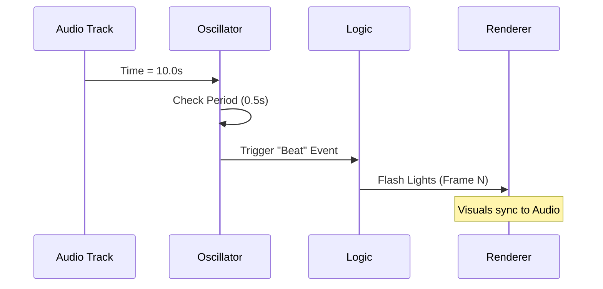

**Trap Table: Timing Pitfalls**
| Mistake | Symptom | Fix |
| :--- | :--- | :--- |
| **Jittery Movement** | VSync fighting Physics | Use `SituationGetFrameTime()` for integration. |
| **Spiral of Death** | Game slows to crawl | Cap `dt` (max 0.1s) to prevent physics explosion. |
| **Drifting Sync** | Audio/Video desync | Re-sync oscillator phase to `SituationGetMusicTime()` periodically. |

#### SituationTimerHasOscillatorUpdated

```c:disable-run
bool SituationTimerHasOscillatorUpdated(int oscillator_id);
```

**Returns:** `true` only on the exact frame that the oscillator completes a cycle. This acts as a "trigger" event.

#### SituationSetTimerOscillatorPeriod

```c:disable-run
SituationError SituationSetTimerOscillatorPeriod(int oscillator_id, double period_seconds);
```

**Usage:** Set oscillator 0 to trigger every 0.5 seconds (120 BPM).

```c:disable-run
SituationSetTimerOscillatorPeriod(0, 0.5);
```

#### SituationTimerGetOscillatorState

```c:disable-run
bool SituationTimerGetOscillatorState(int oscillator_id);
```

**Returns:** The current binary state (true or false). Useful for blinking UI elements.

#### SituationTimerGetPingProgress

```c:disable-run
double SituationTimerGetPingProgress(int oscillator_id);
```

**Returns:** A normalized value (0.0 to 1.0) representing progress through the current cycle. Useful for interpolating animations.

<a id="134-timing-example"></a>
### 1.3.4 Timing Example

```c:disable-run
// Setup: Create a 1-second beat
SituationSetTimerOscillatorPeriod(0, 1.0);

// Bullet-time slowdown: oscillator.frame_time_mult = 0.25;
// (Simulated by scaling delta time)
float time_scale = 0.25f;

while (!SituationWindowShouldClose()) {
    SITUATION_BEGIN_FRAME();

    // 1. Delta Time Movement (Applied Bullet-Time)
    float dt = SituationGetFrameTime() * time_scale;
    player.x += 5.0f * dt;

    // 2. Rhythmic Logic
    if (SituationTimerHasOscillatorUpdated(0)) {
        printf("Tick!\n"); // Prints exactly once per second
        SpawnEnemy();
    }

    // 3. Smooth Pulse Animation
    float alpha = (float)SituationTimerGetPingProgress(0);
    // alpha goes 0.0 -> 1.0 over 1 second
}
```


<a id="14-hardware-awareness"></a>

## 1.4 Hardware Awareness

This section details the library's ability to introspect the host machine. This is critical for auto-detecting performance tiers (e.g., "Low Spec" vs "Ultra") and debugging user issues.

"Situation" provides deep introspection of the host system. Instead of generic queries, it attempts to retrieve precise model names and capacity metrics for the CPU, GPU, RAM, and Storage.

> **The Introspection Guarantee**
> System queries are **Read-Only** and **Non-Locking** (mostly).
> *   **CPU/RAM:** $O(1)$ access to cached OS counters.
> *   **Storage:** Minimal I/O to read partition tables.
> *   **GPU:** Costly. Queries flow through the driver stack (DXGI/Vulkan). **Do not poll this every frame.**

**Trap Table: Hardware Query Pitfalls**
| Mistake | Symptom | Fix |
| :--- | :--- | :--- |
| **Poll VRAM per frame** | Micro-stutter on Windows (DXGI lock) | Query once at startup, or cache for 60s. |
| **Trusting `gpu_name`** | "Basic Render Driver" | User is on RDP or missing drivers. Fallback to safe mode. |
| **Assuming 1 Drive** | Crash on multi-disk install | Iterate `storage_device_count` to find install drive. |

<a id="141-system-snapshot"></a>
### 1.4.1 System Snapshot

The primary interface for hardware info is `SituationGetDeviceInfo`. This function gathers a snapshot of the entire system state.

#### SituationGetDeviceInfo

```c:disable-run
SituationDeviceInfo SituationGetDeviceInfo(void);
```

**Returns:** A `SituationDeviceInfo` struct containing the snapshot.
**Performance:** This function can be expensive (it queries WMI/Registry on Windows or `/proc` on Linux). Call it once at startup, not every frame.

#### SituationDeviceInfo Struct

```c:disable-run
typedef struct {
    // --- Processor ---
    char cpu_name[64];              // e.g., "Intel(R) Core(TM) i9-13900K"
    int cpu_cores;                  // Physical Cores
    float cpu_clock_speed_ghz;      // Base Clock

    // --- Memory ---
    uint64_t total_ram_bytes;       // Total System RAM
    uint64_t available_ram_bytes;   // Currently Free RAM

    // --- Graphics ---
    char gpu_name[128];             // e.g., "NVIDIA GeForce RTX 4090"
    uint64_t gpu_dedicated_memory_bytes; // VRAM (Accurate on Win32/DXGI, Estimated on others)

    // --- Storage ---
    int storage_device_count;
    char storage_device_names[8][128];
    uint64_t storage_capacity_bytes[8];
    uint64_t storage_free_bytes[8];

    // --- Peripherals ---
    int network_adapter_count;
    char network_adapter_names[SITUATION_MAX_NETWORK_ADAPTERS][SITUATION_MAX_DEVICE_NAME_LEN];
    int input_device_count;
    char input_device_names[SITUATION_MAX_INPUT_DEVICES][SITUATION_MAX_DEVICE_NAME_LEN];
} SituationDeviceInfo;
```

#### SituationExecuteCommand (System Control)

Executes a system shell command in a hidden process and captures the output.

```c:disable-run
int SituationExecuteCommand(const char *cmd, char **output);
```

**Returns:** The exit code of the command (0 = Success).
**Output:** The `output` pointer is filled with a heap-allocated string containing stdout/stderr. You must free this string.

<a id="142-specialized-queries"></a>
### 1.4.2 Specialized Queries

For specific runtime checks, lighter helper functions are available.

#### SituationGetCPUThreadCount

```c:disable-run
uint32_t SituationGetCPUThreadCount(void);
```

**Returns:** The number of logical CPU cores available to the OS.
**Usage:** Use this to tune thread pool size (`SituationCreateThreadPool`).

#### SituationGetGPUName

```c:disable-run
const char* SituationGetGPUName(void);
```

**Returns:** The name of the currently active GPU.
**Usage:** Useful for logging or displaying in a "Settings" menu.

#### SituationGetMaxComputeWorkGroups

```c:disable-run
void SituationGetMaxComputeWorkGroups(uint32_t* x, uint32_t* y, uint32_t* z);
```

**Usage:** Query the hardware limits for compute shader dispatch sizes (e.g., [65535, 65535, 65535]).

#### SituationGetVRAMUsage (Graphics Module)

```c:disable-run
uint64_t SituationGetVRAMUsage(void);
```

**Returns:** The number of bytes currently allocated by the application on the GPU.

**Backend Details:**
*   **Vulkan:** Returns exact bytes allocated via VMA.
*   **OpenGL:** Returns estimate based on texture/buffer uploads (driver dependent).

**Perf Note:** Query VRAM once at init; cache for 60s to avoid DXGI stalls.

<a id="143-drive-information-windows-only"></a>
### 1.4.3 Drive Information (Windows Only)

On Windows, you can query specific drive letters to manage save data or installation paths.

#### SituationGetCurrentDriveLetter

```c:disable-run
char SituationGetCurrentDriveLetter(void);
```

**Returns:** The drive letter (e.g., 'C') where the executable is running.

#### SituationGetDriveInfo

```c:disable-run
bool SituationGetDriveInfo(char drive_letter,
                           uint64_t* out_total,
                           uint64_t* out_free,
                           char* out_vol_name,
                           int vol_name_len);
```

**Usage:** Check for available disk space before saving a large file.

<a id="144-usage-example-auto-config"></a>
### 1.4.4 Usage Example: Auto-Config

```c:disable-run
void ConfigureQualitySettings() {
    SituationDeviceInfo info = SituationGetDeviceInfo();

    printf("System: %s with %d cores.\n", info.cpu_name, info.cpu_cores);
    printf("GPU: %s (%llu MB VRAM)\n", info.gpu_name, info.gpu_dedicated_memory_bytes / 1024 / 1024);

    // Simple heuristic for quality settings
    if (info.gpu_dedicated_memory_bytes > 8ULL * 1024 * 1024 * 1024) {
        // > 8GB VRAM
        printf("Setting Quality: ULTRA\n");
        g_texture_quality = HIGH;
        g_shadow_resolution = 4096;
    } else {
        printf("Setting Quality: MEDIUM\n");
        g_texture_quality = MEDIUM;
        g_shadow_resolution = 1024;
    }
}
```

### 1.4.5 Feature Support Queries

To check for specific GPU capabilities (e.g., Ray Tracing, Mesh Shaders) at runtime, use `SituationIsFeatureSupported`.

#### SituationIsFeatureSupported

```c:disable-run
bool SituationIsFeatureSupported(SituationRenderFeature feature);
```

**Feature Flags:**
*   `SIT_FEATURE_RAY_TRACING`: Hardware Ray Tracing support.
*   `SIT_FEATURE_MESH_SHADER`: Mesh Shaders (NV/EXT).
*   `SIT_FEATURE_COMPUTE_SHADER`: Compute Shader support (Standard in Vulkan/GL 4.3+).
*   `SIT_FEATURE_BINDLESS_TEXTURES`: Bindless Texture support.
*   `SIT_FEATURE_FLOAT16`: Half-precision float support in shaders.


<a id="20-windowing--display-subsystem"></a>

---

## 2.0 Windowing & Display Subsystem

Situation provides a windowing abstraction built on top of GLFW. It handles the creation of the OS window, manages its state (fullscreen, minimized, etc.), and provides deep integration with the physical display topology.


<a id="21-window-state-management"></a>

## 2.1 Window State Management

This section covers how to manipulate the application window, covering everything from basic resizing to advanced "borderless" modes and focus handling. The window state is controlled via a set of bit-flags and explicit helper functions.

<a id="211-configuration-flags"></a>
### 2.1.1 Configuration Flags

The `SituationSetWindowState` function accepts a bitmask of flags. These flags are additive.

#### SituationSetWindowState / SituationClearWindowState

```c:disable-run
void SituationSetWindowState(uint32_t flags);
void SituationClearWindowState(uint32_t flags);
```

| Flag | Description |
| :--- | :--- |
| `SITUATION_FLAG_WINDOW_RESIZABLE` | Allows the user to resize the window manually. |
| `SITUATION_FLAG_WINDOW_UNDECORATED` | Removes the title bar and borders. |
| `SITUATION_FLAG_WINDOW_TOPMOST` | Forces the window to stay on top of all other windows. |
| `SITUATION_FLAG_WINDOW_HIDDEN` | Hides the window (it still runs in the background). |
| `SITUATION_FLAG_WINDOW_MINIMIZED` | Minimizes to the taskbar/dock. |
| `SITUATION_FLAG_WINDOW_MAXIMIZED` | Maximizes to fill the screen. |
| `SITUATION_FLAG_FULLSCREEN_MODE` | Switches to exclusive fullscreen mode. |
| `SITUATION_FLAG_VSYNC_HINT` | Requests Vertical Sync (prevents tearing). |

**Example:**

```c:disable-run
// Make window borderless and always on top
SituationSetWindowState(SITUATION_FLAG_WINDOW_UNDECORATED | SITUATION_FLAG_WINDOW_TOPMOST);
```

<a id="212-fullscreen--borderless"></a>
### 2.1.2 Fullscreen & Borderless

#### SituationToggleFullscreen

```c:disable-run
void SituationToggleFullscreen(void);
```

**Behavior:** Toggles between Windowed mode and Exclusive Fullscreen.
**Note:** In Exclusive Fullscreen, the application takes control of the video signal. Alt-Tab may be slower than in Borderless mode.

#### SituationToggleBorderlessWindowed

```c:disable-run
void SituationToggleBorderlessWindowed(void);
```

**Behavior:** Toggles between a standard decorated window and a "Borderless Window" that fills the screen.
**Usage:** Preferred by modern games for fast Alt-Tab support.

<a id="213-size--position"></a>
### 2.1.3 Size & Position

#### SituationSetWindowSize / SituationGetWindowSize

```c:disable-run
void SituationSetWindowSize(int width, int height);
void SituationGetWindowSize(int* width, int* height);
```

**Unit:** Logical Screen Coordinates.
**Note:** On High-DPI displays (Retina/4K), the Logical size might be 1280x720, but the Render size might be 2560x1440. Always use `SituationGetRenderWidth/Height` for OpenGL/Vulkan viewports.

#### SituationSetWindowPosition

```c:disable-run
void SituationSetWindowPosition(int x, int y);
```

**Origin:** Top-Left of the virtual desktop.

#### SituationSetWindowMinSize / SituationSetWindowMaxSize

```c:disable-run
void SituationSetWindowMinSize(int width, int height);
void SituationSetWindowMaxSize(int width, int height);
```

**Usage:** Prevents the user from shrinking the window so small that the UI breaks.

<a id="214-focus--visibility"></a>
### 2.1.4 Focus & Visibility

#### SituationSetWindowFocused

```c:disable-run
void SituationSetWindowFocused(void);
```

**Behavior:** Brings the window to the foreground and requests input focus.

#### SituationSetWindowOpacity

```c:disable-run
void SituationSetWindowOpacity(float opacity);
```

**Range:** 0.0 (Invisible) to 1.0 (Opaque).
**Platform:** Supported on Windows, macOS, and most Linux compositors.

**Trap Table: Window Events**
| Event | Trap | Fix |
| :--- | :--- | :--- |
| **File Drop** | CP-1252 vs UTF-8 | Situation ensures paths are **UTF-8**. |
| **Alt-Tab** | Audio keeps playing | Listen for `SITUATION_EVENT_FOCUS_LOST` to pause. |
| **Minimize** | GPU Crash | `SituationAcquireFrame` returns false. **Stop rendering.** |

<a id="215-icons"></a>
### 2.1.5 Icons

#### SituationSetWindowIcon

```c:disable-run
void SituationSetWindowIcon(SituationImage image);
```

**Input:** A CPU-side `SituationImage` (loaded via `SituationLoadImage`).
**Best Practice:** Provide a square image (e.g., 64x64 or 256x256).

#### SituationSetWindowIcons

```c:disable-run
void SituationSetWindowIcons(SituationImage *images, int count);
```

**Usage:** Provide multiple sizes (16x16, 32x32, 48x48) so the OS can choose the best one for the Taskbar vs Titlebar.

<a id="216-state-queries"></a>
### 2.1.6 State Queries

You can query the current state at any time.

*   `SituationIsWindowFullscreen()`
*   `SituationIsWindowHidden()`
*   `SituationIsWindowMinimized()`
*   `SituationIsWindowMaximized()`
*   `SituationHasWindowFocus()`
*   `SituationIsWindowResized()` (True only on the frame a resize occurred)

<a id="217-advanced-state-profiles"></a>
### 2.1.7 Advanced: State Profiles

You can define different behaviors for when the window is focused vs unfocused.

#### SituationSetWindowStateProfiles

```c:disable-run
SituationError SituationSetWindowStateProfiles(uint32_t active_flags, uint32_t inactive_flags);
```

#### Flags Matrix (Example Profiles)

| Feature | Active (Focused) | Inactive (Background) | Result |
| :--- | :--- | :--- | :--- |
| **Fullscreen** | `SITUATION_FLAG_FULLSCREEN_MODE` | (None) | Minimizes when alt-tabbed. |
| **Borderless** | `SITUATION_FLAG_BORDERLESS` | `SITUATION_FLAG_BORDERLESS` | Stays visible on dual monitors. |
| **FPS Limit** | `SITUATION_FLAG_VSYNC_HINT` | (None) | Uncaps FPS in background (add logic to limit). |
| **Always Run** | `SITUATION_FLAG_WINDOW_ALWAYS_RUN` | `SITUATION_FLAG_WINDOW_ALWAYS_RUN` | Game continues updating while you check email. |

**Example:** Limit FPS when unfocused to save battery.
**Note:** This function sets flags, but FPS limiting logic must be implemented by the user based on `SituationHasWindowFocus()`.


<a id="22-multi-monitor-topology"></a>

## 2.2 Multi-Monitor Topology

This section explains how to detect, query, and utilize multiple physical displays. This is essential for games (to select the correct gaming monitor), presentation software, and multi-window tools.

Situation provides a unified interface for querying the physical display hardware connected to the system. It abstracts the OS-specific concepts (HMONITOR on Windows, RandR on Linux) into a simple list of `SituationDisplayInfo` structs.

**Visual Vault: Topology Graph**
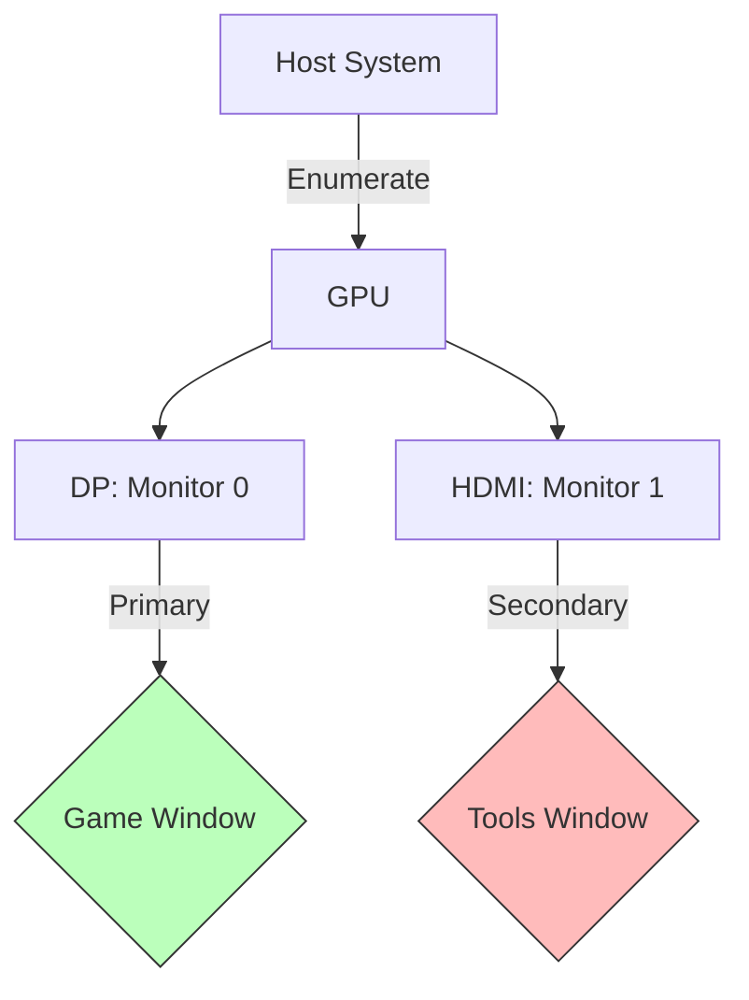

**Table: HiDPI Myths Busted**
| Myth | Reality | Situation Solution |
| :--- | :--- | :--- |
| **"Pixel is a Pixel"** | 1 Logical Pixel could be 1.5, 2.0, or 2.25 Physical Pixels. | Use `SituationGetRenderWidth()` for GL viewports. |
| **"OS handles it"** | OS lies to non-DPI-aware apps (blurry upscaling). | Situation is **Per-Monitor DPI Aware** by default. |
| **"Scale is global"** | Moving window from 4K (150%) to 1080p (100%) changes scale. | Listen for `SITUATION_EVENT_DPI_CHANGED`. |

<a id="221-monitor-enumeration"></a>
### 2.2.1 Monitor Enumeration

To get information about connected screens, you retrieve the list of displays.

#### SituationGetDisplays

```c:disable-run
SituationDisplayInfo* SituationGetDisplays(int* count);
```

**Returns:** A pointer to an array of `SituationDisplayInfo` structs.
**Memory:** The returned array is allocated on the heap. You must free it using `SituationFreeDisplays`.
**Count:** The integer pointed to by `count` is updated with the number of displays found.

#### SituationFreeDisplays

```c:disable-run
void SituationFreeDisplays(SituationDisplayInfo* displays, int count);
```

**Usage:** Call this immediately after you are done processing the display list.

<a id="222-display-information-structure"></a>
### 2.2.2 Display Information Structure

The `SituationDisplayInfo` struct contains comprehensive data about a specific monitor.

```c:disable-run
typedef struct {
    char name[128];                 // e.g., "LG UltraGear", "Generic PnP Monitor"
    int situation_monitor_id;       // Internal ID (0, 1, 2...)
    GLFWmonitor* glfw_monitor_handle; // Raw GLFW monitor handle
    bool is_primary;                // True if this is the OS "Main Display"

    // --- Current Settings ---
    SituationDisplayMode current_mode; // Resolution & Refresh Rate

    // --- Capabilities ---
    SituationDisplayMode* available_modes; // Array of supported modes
    int available_mode_count;
} SituationDisplayInfo;
```

#### SituationDisplayMode

```c:disable-run
typedef struct {
    int width;          // e.g., 1920
    int height;         // e.g., 1080
    int refresh_rate;   // e.g., 144 (Hz)
    int color_depth;    // e.g., 24 (bits)
} SituationDisplayMode;
```

<a id="223-monitor-management-functions"></a>
### 2.2.3 Monitor Management Functions

#### SituationGetMonitorCount

```c:disable-run
int SituationGetMonitorCount(void);
```

**Returns:** The total number of active displays.

#### SituationGetCurrentMonitor

```c:disable-run
int SituationGetCurrentMonitor(void);
```

**Returns:** The ID of the monitor that currently contains the majority of the application window.

#### SituationSetWindowMonitor

```c:disable-run
void SituationSetWindowMonitor(int monitor_id);
```

**Behavior:** Moves the window to the specified monitor. If the window is in Fullscreen mode, it will make it fullscreen on that specific monitor.

#### SituationGetMonitorName

```c:disable-run
const char* SituationGetMonitorName(int monitor_id);
```

**Returns:** The human-readable name of the monitor.

<a id="224-physical-dimensions--positioning"></a>
### 2.2.4 Physical Dimensions & Positioning

For accurate multi-monitor layouts (e.g., a window spanning two screens), you need to know where monitors are relative to each other.

#### SituationGetMonitorPosition

```c:disable-run
Vector2 SituationGetMonitorPosition(int monitor_id);
```

**Returns:** The virtual desktop coordinates (x, y) of the monitor's top-left corner.
**Example:** If Monitor 0 is 1920x1080, Monitor 1 might be at (1920, 0).

#### SituationGetMonitorPhysicalWidth / Height

```c:disable-run
int SituationGetMonitorPhysicalWidth(int monitor_id);
int SituationGetMonitorPhysicalHeight(int monitor_id);
```

**Returns:** The physical size of the screen panel in millimeters.
**Usage:** Useful for calculating accurate DPI or scaling UI elements to real-world sizes (e.g., "Make this button exactly 1 inch wide").

<a id="225-changing-video-modes"></a>
### 2.2.5 Changing Video Modes

You can change the resolution and refresh rate of a specific monitor.

#### SituationSetDisplayMode

```c:disable-run
SituationError SituationSetDisplayMode(int monitor_id, const SituationDisplayMode* mode, bool fullscreen);
```

**Parameters:**
*   `monitor_id`: The monitor to configure.
*   `mode`: Pointer to the desired mode (width, height, refresh rate).
*   `fullscreen`: If true, the application window will also be set to fullscreen on this monitor.

**Note:** Changing display modes is an invasive operation. It may cause the screen to flicker. Use with caution.

<a id="226-usage-example-listing-monitors"></a>
### 2.2.6 Usage Example: Listing Monitors (Topology Dump)

This example demonstrates a full topology dump, useful for generating bug report headers.

```c:disable-run
// Snippet Supreme: Topology Dumper
int count = 0;
SituationDisplayInfo* displays = SituationGetDisplays(&count);

printf("--- Display Topology (%d found) ---\n", count);
for (int i = 0; i < count; i++) {
    SituationDisplayInfo* d = &displays[i];
    printf("Monitor #%d [%s]\n", i, d->name);
    printf("  > ID:       %d\n", d->situation_monitor_id);
    printf("  > Role:     %s\n", d->is_primary ? "PRIMARY" : "Secondary");
    printf("  > Current:  %dx%d @ %dHz (%d bit)\n",
           d->current_mode.width, d->current_mode.height,
           d->current_mode.refresh_rate, d->current_mode.color_depth);
    printf("  > Physical: %dmm x %dmm\n",
           SituationGetMonitorPhysicalWidth(d->situation_monitor_id),
           SituationGetMonitorPhysicalHeight(d->situation_monitor_id));

    Vector2 pos = SituationGetMonitorPosition(d->situation_monitor_id);
    printf("  > Desktop:  (%d, %d)\n", (int)pos.x, (int)pos.y);
    printf("\n");
}

SituationFreeDisplays(displays, count);
```

> **Future Flame (v2.4):** Hot-plug events (`SITUATION_EVENT_MONITOR_CONNECTED`) are coming to eliminate the need for manual re-polling.


<a id="23-cursor--clipboard"></a>

## 2.3 Cursor & Clipboard

This section covers interacting with the mouse pointer (visibility, shapes) and the operating system's clipboard (copy/paste text).

Situation provides direct control over the mouse cursor's appearance and behavior, as well as access to the system-wide clipboard for text operations.

<a id="231-cursor-visibility--locking"></a>
### 2.3.1 Cursor Visibility & Locking

#### SituationShowCursor

```c:disable-run
void SituationShowCursor(void);
```

**Behavior:** Makes the cursor visible and allows it to leave the window boundaries. Standard behavior for desktop apps.

#### SituationHideCursor

```c:disable-run
void SituationHideCursor(void);
```

**Behavior:** Makes the cursor invisible while it is over the window client area. It is still tracked and can leave the window.

#### SituationDisableCursor (FPS Mode)

```c:disable-run
void SituationDisableCursor(void);
```

**Behavior:** Hides the cursor and locks it to the window.
**Usage:** Use this for First-Person games or 3D cameras.
**Input:** When disabled, `SituationGetMouseDelta()` continues to report relative motion even though the cursor position is locked.

<a id="232-cursor-shapes"></a>
### 2.3.2 Cursor Shapes

You can change the system cursor icon to indicate interactivity (e.g., hovering over a button or text field).

#### SituationSetCursor

```c:disable-run
void SituationSetCursor(SituationCursor cursor);
```

| Enum Value | Description |
| :--- | :--- |
| `SIT_CURSOR_DEFAULT` | The standard OS arrow. |
| `SIT_CURSOR_ARROW` | Explicit arrow. |
| `SIT_CURSOR_IBEAM` | The "I" shape for text selection. |
| `SIT_CURSOR_CROSSHAIR` | Precision crosshair. |
| `SIT_CURSOR_HAND` | Pointing hand (for links/buttons). |
| `SIT_CURSOR_HRESIZE` | Horizontal resize arrows (<->). |
| `SIT_CURSOR_VRESIZE` | Vertical resize arrows. |

<a id="233-clipboard-access"></a>
### 2.3.3 Clipboard Access

The library supports getting and setting UTF-8 text to/from the system clipboard.

#### SituationSetClipboardText

```c:disable-run
SituationError SituationSetClipboardText(const char* text);
```

**Behavior:** Copies the provided string to the OS clipboard.

#### SituationGetClipboardText

```c:disable-run
SituationError SituationGetClipboardText(const char** out_text);
```

**Returns:** `SITUATION_SUCCESS` on success. `out_text` is populated with a heap-allocated copy of the clipboard text.
**Memory:** The caller must free the returned string using `SituationFreeString`.

#### Example: Implementing Copy/Paste

```c:disable-run
// Copy (Ctrl+C)
if (SituationIsKeyDown(SIT_KEY_LEFT_CONTROL) && SituationIsKeyPressed(SIT_KEY_C)) {
    SituationSetClipboardText("Copied Text!");
}

// Paste (Ctrl+V)
if (SituationIsKeyDown(SIT_KEY_LEFT_CONTROL) && SituationIsKeyPressed(SIT_KEY_V)) {
    const char* text = NULL;
    if (SituationGetClipboardText(&text) == SITUATION_SUCCESS) {
        printf("Pasted: %s\n", text);
        SituationFreeString((char*)text);
    }
}
```


<a id="30-the-graphics-pipeline"></a>

---

## 3.0 The Graphics Pipeline

The Graphics module is Situation's crown jewel: a **unified command buffer model** that erases the OpenGL/Vulkan divide. Forget backend ifs—write once, render everywhere. It's not a wrapper; it's a **deterministic recorder** that enforces "update-before-draw" and auto-syncs resources.

With v2.3.36, the graphics engine now features:
*   **OpenGL 4.6 Multi-Draw Indirect (MDI):** Automatically batches draw calls to reduce CPU overhead.
*   **Bindless Textures:** Uses 64-bit handles for high-performance texture access on both backends.
*   **Unified Error Handling:** All resource creation and command functions now return `SituationError` for precise failure propagation.

**The Atomic Guarantee**
> Commands are recorded to an emulated buffer (immediate on GL, deferred on VK). Barriers are explicit—miss one, and debug asserts abort with "UB Detected: Compute wrote, Vertex read without sync."

**Perf Mantra**
> 99% of draws are 1-2ms. Bottlenecks? Always descriptors or barriers—profile with `SituationGetGPUMetrics()`.

<a id="31-the-command-buffer-abstraction"></a>

## 3.1 The Command Buffer Abstraction

To support both OpenGL (which is historically state-based and immediate) and Vulkan (which is command-based and deferred), "Situation" adopts the Vulkan model as the primary abstraction.

**Flush Semantics**
| Backend | Execution | When? |
|---------|-----------|-------|
| **OpenGL** | Immediate (emulated) | On `SituationCmd*` call |
| **Vulkan** | Deferred | On `SituationEndFrame()` (submit + present) |

<a id="311-concept-immediate-vs-deferred"></a>
### 3.1.1 Concept: Immediate vs. Deferred

**The API Contract:** You do not call functions that "draw now." Instead, you call functions that record commands into a `SituationCommandBuffer`.

**Trap Table: Buffer Lifetimes**
| Mistake | Symptom | Fix |
|---------|---------|-----|
| **Draw before bind** | Black screen | `SituationCmdBindPipeline` first |
| **No barrier post-compute** | Stale data | `SituationCmdPipelineBarrier(WRITE_COMPUTE, READ_VERTEX)` |
| **Unload mid-frame** | GPU hang | Destroy only in `SituationShutdown` |

**Critical Safety Rule:** Because Vulkan defers execution, you must never modify a resource (like a buffer or texture) after recording a command that uses it, but before the frame ends.

<a id="312-frame-acquisition"></a>
### 3.1.2 Frame Acquisition

Before you can record any rendering commands, you must acquire a target frame from the swapchain.

#### SituationAcquireFrameCommandBuffer

```c:disable-run
bool SituationAcquireFrameCommandBuffer(void);
```

**Returns:** `true` if a frame is ready for rendering. `false` if the window is minimized, resized (swapchain invalid), or the GPU is lost.
**Usage:** You must wrap your entire rendering block in an if statement checking this function. If it returns false, skip rendering for that frame.

<a id="313-the-recording-handle"></a>
### 3.1.3 The Recording Handle

Once a frame is acquired, you retrieve the handle to the current frame's command buffer.

#### SituationGetMainCommandBuffer

```c:disable-run
SituationCommandBuffer SituationGetMainCommandBuffer(void);
```

**Returns:** An opaque pointer (`SituationCommandBuffer`) used as the first argument for all `SituationCmd*` functions.
**Scope:** This handle is valid only for the current frame. Do not store it.

<a id="314-submission--presentation"></a>
### 3.1.4 Submission & Presentation

After recording all commands, you must submit them for execution and present the image to the screen.

#### SituationEndFrame

```c:disable-run
SituationError SituationEndFrame(void);
```

**Behavior:**
*   **Vulkan:** Closes the command buffer, submits it to the Graphics Queue, and queues the swapchain image for presentation.
*   **OpenGL:** Swaps the front and back buffers (`glfwSwapBuffers`).

**Synchronization:** This function may block if VSync is enabled or if the GPU is heavily loaded (backpressure).

**Adaptive Backpressure (Resilience):**
The engine employs a hybrid strategy to handle backpressure (when the CPU produces frames faster than the GPU can consume them):
*   **Steady State (< 3.5ms latency):** Uses `SPIN` waits for maximum responsiveness.
*   **High Load (> 6.9ms latency):** Switches to `SLEEP` to yield CPU resources and prevent thermal throttling.
*   **ARM64:** Utilizes architecture-specific intrinsics (`wfe` / `yield`) for power-efficient waiting.

<a id="315-usage-pattern"></a>
### 3.1.5 Usage Pattern

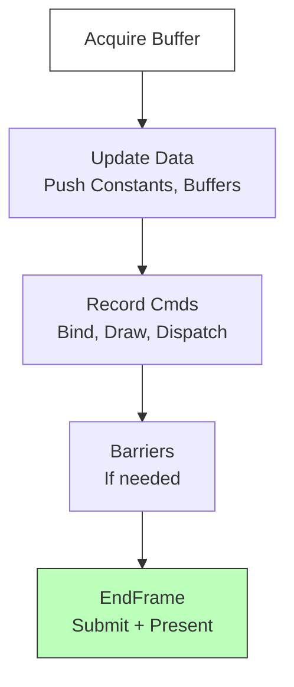

```c:disable-run
// Snippet Supreme: The Atomic Frame
// 1. Attempt to start the frame
if (SituationAcquireFrameCommandBuffer()) {

    // 2. Get the recording handle
    SituationCommandBuffer cmd = SituationGetMainCommandBuffer();
    if (cmd.id == 0) return; // Safety check

    // 3. Record Commands (See Section 3.2 for Render Passes)
    // ... SituationCmdBeginRenderPass(cmd, ...);
    // ... SituationCmdDraw(cmd, ...);
    // ... SituationCmdEndRenderPass(cmd);

    // 4. Submit
    SituationEndFrame(); // VK: Submit. GL: Present.
}
```


<a id="32-render-passes"></a>

## 3.2 Render Passes

This section defines where rendering happens and how the screen is cleared. It enforces the modern "Render Pass" architecture required by Vulkan and Metal, while mapping it gracefully to OpenGL framebuffers.

In modern graphics, you cannot simply "draw." You must perform drawing operations inside a Render Pass. A Render Pass defines the context for a sequence of draw calls:
*   **Target:** Where are we drawing? (Main Window or Virtual Display?)
*   **Load Op:** What do we do with the existing pixels? (Clear them, Keep them, or Don't Care?)
*   **Store Op:** What happens to the result? (Store to memory or Discard?)

<a id="321-pass-configuration"></a>
### 3.2.1 Pass Configuration

The `SituationRenderPassInfo` structure is used to configure a pass.

```c:disable-run
typedef struct {
    // Target ID
    // -1: The Main Window (Swapchain Backbuffer)
    // >=0: A Virtual Display ID
    int display_id;

    // Color Attachment (The RGB image)
    SituationAttachmentInfo color_attachment;

    // Depth Attachment (The Z-buffer)
    SituationAttachmentInfo depth_attachment;
} SituationRenderPassInfo;
```

#### SituationAttachmentInfo

```c:disable-run
typedef struct {
    SituationAttachmentLoadOp  loadOp;  // Start of pass action
    SituationAttachmentStoreOp storeOp; // End of pass action
    SituationClearValue        clear;   // Clear color/depth value
} SituationAttachmentInfo;
```

**Operations (LoadOp / StoreOp)**

| Operation | Description |
| :--- | :--- |
| `SIT_LOAD_OP_CLEAR` | Clears the attachment to the clear value. (Most common for start of frame). |
| `SIT_LOAD_OP_LOAD` | Preserves previous content. Use this for overlay passes (e.g., UI on top of 3D). |
| `SIT_LOAD_OP_DONT_CARE` | Performance optimization. Contents are undefined. Use if you overwrite every pixel anyway. |
| `SIT_STORE_OP_STORE` | Saves the result to memory so it can be displayed or sampled later. |
| `SIT_STORE_OP_DONT_CARE` | Discards result. (e.g., Depth buffer after rendering, if not needed for post-processing). |

<a id="322-beginning--ending-a-pass"></a>
### 3.2.2 Beginning & Ending a Pass

#### SituationCmdBeginRenderPass

```c:disable-run
SituationError SituationCmdBeginRenderPass(SituationCommandBuffer cmd, const SituationRenderPassInfo* info);
```

**Behavior:** Starts the pass. Binds the Framebuffer (FBO) and executes the specified Clear operations.
**Restrictions:** You cannot nest render passes. You must end the current pass before starting a new one.

#### SituationCmdEndRenderPass

```c:disable-run
void SituationCmdEndRenderPass(SituationCommandBuffer cmd);
```

**Behavior:** Finalizes the pass. Performs Store operations and transitions image layouts if necessary (Vulkan).

<a id="323-dynamic-state-viewport--scissor"></a>
### 3.2.3 Dynamic State (Viewport & Scissor)

While the Render Pass defines the target image, the Viewport and Scissor define the active region.

#### SituationCmdSetViewport

```c:disable-run
void SituationCmdSetViewport(SituationCommandBuffer cmd, float x, float y, float width, float height);
```

**Usage:** Maps the normalized device coordinates (-1 to 1) to pixel coordinates.
**Default:** Automatically set to the full size of the target when `BeginRenderPass` is called.

#### SituationCmdSetScissor

```c:disable-run
void SituationCmdSetScissor(SituationCommandBuffer cmd, int x, int y, int width, int height);
```

**Usage:** Discards any pixels generated outside this rectangle. Essential for UI clipping (e.g., scrolling lists).

<a id="324-example-clearing-the-screen"></a>
### 3.2.4 Example: Clearing the Screen

```c:disable-run
// Define a pass that clears the screen to Dark Blue
SituationRenderPassInfo pass = {
    .display_id = -1, // Main Window
    .color_attachment = {
        .loadOp = SIT_LOAD_OP_CLEAR,
        .storeOp = SIT_STORE_OP_STORE,
        .clear = { .color = {20, 30, 100, 255} } // RGBA
    },
    .depth_attachment = {
        .loadOp = SIT_LOAD_OP_CLEAR,
        .storeOp = SIT_STORE_OP_DONT_CARE,
        .clear = { .depth = 1.0f } // Max Depth
    }
};

SituationCmdBeginRenderPass(cmd, &pass);
// ... Draw commands ...
SituationCmdEndRenderPass(cmd);
```


<a id="33-shader-pipelines"></a>

## 3.3 Shader Pipelines

This section explains how to load, bind, and update Shaders. It also introduces the Hot-Reloading capabilities for shaders, which is a key feature of the "Velocity" update.

In Situation, a "Shader" is not just source code; it is a Pipeline State Object (PSO). It encapsulates the Vertex Shader, Fragment Shader, and all associated fixed-function state (Blending, Depth Testing, Layouts).

<a id="331-loading-shaders"></a>
### 3.3.1 Loading Shaders

You can load shaders from disk files or from memory strings.

#### SituationLoadShader

```c:disable-run
SituationError SituationLoadShader(const char* vs_path, const char* fs_path, SituationShader* out_shader);
```

**Arguments:** Paths to the Vertex Shader (.vert) and Fragment Shader (.frag), and a pointer to receive the handle.
**Returns:** `SITUATION_SUCCESS` or a compilation error code.
**Behavior:**
*   **OpenGL:** Compiles GLSL and links a Program.
*   **Vulkan:** Compiles GLSL to SPIR-V (using shaderc), creates Shader Modules, and builds a VkPipeline.

**Hot-Reloading:** Shaders loaded via this function are registered for hot-reloading. If you edit the file on disk and call `SituationReloadShader`, it will rebuild automatically.

**Snippet Supreme: Pipeline Creation**
```c:disable-run
SituationShader shader;
if (SituationLoadShader("assets/basic.vert", "assets/basic.frag", &shader) == SITUATION_SUCCESS) {
    // ...
}
```

#### SituationLoadShaderFromMemory

```c:disable-run
SituationError SituationLoadShaderFromMemory(const char* vs_code, const char* fs_code, SituationShader* out_shader);
```

**Usage:** Useful for embedded tools, single-file examples, or procedurally generated shader code.
**Note:** Cannot be hot-reloaded from disk.

#### SituationUnloadShader

```c:disable-run
void SituationUnloadShader(SituationShader* shader);
```

**Behavior:** Destroys the GPU pipeline and frees resources. Sets the handle ID to 0.

<a id="332-binding-pipelines"></a>
### 3.3.2 Binding Pipelines

To use a shader for drawing, you must bind it to the command buffer.

#### SituationCmdBindPipeline

```c:disable-run
SituationError SituationCmdBindPipeline(SituationCommandBuffer cmd, SituationShader shader);
```

**Scope:** The shader remains bound for all subsequent draw calls until another pipeline is bound or the render pass ends.

<a id="333-uniform-management-data"></a>
### 3.3.3 Uniform Management (Data)

Shaders need data (Matrices, Colors, Time). Situation provides two ways to send data: Push Constants (fast, small) and Uniform Buffers (large, shared).

#### Push Constants (SituationCmdSetPushConstant)

The fastest way to send small data (like a Model Matrix or a Color tint).

```c:disable-run
SituationError SituationCmdSetPushConstant(SituationCommandBuffer cmd, uint32_t contract_id, const void* data, size_t size);
```

**Limit:** Guaranteed 128 bytes (e.g., two mat4 matrices).
**GLSL Mapping:**

```Glsl
layout(push_constant) uniform Constants {
    mat4 model;
    vec4 color;
} pc;
```

#### Uniform Buffers (SituationCmdBindDescriptorSet)

For larger data shared across many objects (Camera View/Proj, Lights).

```c:disable-run
SituationCmdBindDescriptorSet(cmd, set_index, buffer_handle);
```

See Section 3.7 for details on creating buffers.

#### Legacy Uniforms (OpenGL Only)

For quick prototyping on OpenGL, you can set uniforms by name. Not supported on Vulkan.

```c:disable-run
SituationSetShaderUniform(shader, "uTime", &time, SIT_UNIFORM_FLOAT);
```

<a id="334-hot-reloading-shaders"></a>
### 3.3.4 Hot-Reloading Shaders

The "Velocity" feature set allows you to recompile shaders while the app is running.

#### SituationReloadShader

```c:disable-run
SituationError SituationReloadShader(SituationShader* shader);
```

**Process:**
1.  Checks the file paths stored during `SituationLoadShader`.
2.  Re-reads the source code from disk.
3.  Attempts to compile.
    *   **On Success:** Waits for GPU idle, destroys old pipeline, creates new pipeline, updates the handle.
    *   **On Failure:** logs the compiler error to stderr and keeps the old shader active. The app does not crash.

**Usage:** Bind this to a key (e.g., F5) in your development build.

<a id="335-example-basic-shader-workflow"></a>
### 3.3.5 Example: Basic Shader Workflow

```c:disable-run
// 1. Load
SituationShader shader;
SituationLoadShader("assets/basic.vert", "assets/basic.frag", &shader);

// 2. Render Loop
SituationCmdBeginRenderPass(cmd, &pass);

    SituationCmdBindPipeline(cmd, shader);

    // Send Model Matrix via Push Constant
    SituationCmdSetPushConstant(cmd, 0, &modelMatrix, sizeof(mat4));

    SituationCmdDrawMesh(cmd, mesh);

SituationCmdEndRenderPass(cmd);

// 3. Reload (e.g., on F5 key press)
if (SituationIsKeyPressed(SIT_KEY_F5)) {
    printf("Reloading Shader...\n");
    SituationReloadShader(&shader);
}
```

<a id="336-descriptors--bindings-advanced"></a>
### 3.3.6 Descriptors & Bindings (The Silent Killer)

Descriptors are the bridge between your Shaders and your Resources (Textures, Buffers). In Situation, these are managed automatically, but understanding them prevents performance pitfalls.

**Trap Table: Descriptor Bottlenecks**
| Bottleneck | Symptom | MOAR |
| :--- | :--- | :--- |
| **Dynamic Sets** | 2ms/frame spike | Use persistent sets (Velocity). |
| **No Barriers** | Corrupt textures | Explicit `PipelineBarrier(WRITE_COMPUTE, READ_FRAGMENT)`. |
| **Over-binding** | CPU High | Batch draws by material to minimize `CmdBindTextureSet`. |

**Visual Vault: Descriptor Flow**
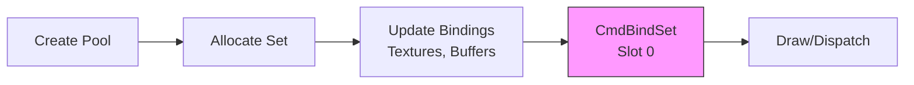


<a id="34-geometry--meshes"></a>

## 3.4 Geometry & Meshes

This section covers how to upload vertex data to the GPU, create reusable Mesh objects, and load standard 3D model files.

A Mesh is a container for geometric data. It consists of a Vertex Buffer (points in space) and an optional Index Buffer (connect-the-dots order). Situation abstracts these buffers into a single `SituationMesh` handle for ease of use.

<a id="341-vertex-data-layout"></a>
### 3.4.1 Vertex Data Layout

The library expects a standard vertex layout for most helper functions (`SituationCreateMesh`, `SituationDrawModel`).

**Standard Vertex Format (PBR):**

```c:disable-run
typedef struct {
    Vector3 position;  // Location (x, y, z)
    Vector3 normal;    // Surface direction (nx, ny, nz)
    Vector4 tangent;   // Tangent vector (.w stores sign of bitangent)
    Vector2 uv;        // Texture coordinates (u, v)
} SituationVertexPBR;
```

**Stride:** `sizeof(float) * 12` (48 bytes).

**Legacy Support:**
The previous 32-byte format (Pos/Norm/UV) is still supported. `SituationCreateMesh` automatically detects if `vertex_stride` is 32 bytes and upgrades the data to the PBR format by calculating default tangent vectors (e.g., `(1, 0, 0, 1)`).

<a id="342-creating-meshes"></a>
### 3.4.2 Creating Meshes

#### SituationCreateMesh

```c:disable-run
SituationError SituationCreateMesh(const void* vertex_data,
                                   int vertex_count,
                                   size_t vertex_stride,
                                   const uint32_t* index_data,
                                   int index_count,
                                   SituationMesh* out_mesh);
```

**Behavior:** Allocates GPU memory (VBO/EBO), uploads the data, and configures the input assembly state (VAO in OpenGL).
**Auto-Padding:** If `vertex_stride` is 32 bytes (Legacy format: Pos/Norm/UV), the function automatically allocates a temporary buffer, inserts default Tangent vectors `(1, 0, 0, 1)`, and uploads the data as the standard 48-byte PBR format.
**Output:** The `out_mesh` pointer is populated with the handle.

#### SituationDestroyMesh

```c:disable-run
void SituationDestroyMesh(SituationMesh* mesh);
```

**Behavior:** Frees the GPU buffers.

<a id="343-drawing-meshes"></a>
### 3.4.3 Drawing Meshes

#### SituationCmdDrawMesh

```c:disable-run
SituationError SituationCmdDrawMesh(SituationCommandBuffer cmd, SituationMesh mesh);
```

**Behavior:** Binds the mesh's vertex and index buffers, then issues an Indexed Draw call.
**Prerequisite:** A pipeline must be bound (`SituationCmdBindPipeline`).

#### SituationCmdDrawQuad (High-Level Helper)

```c:disable-run
SituationError SituationCmdDrawQuad(SituationCommandBuffer cmd, mat4 model, Vector4 color);
```

**Behavior:** Draws a unit square using an internal shared mesh. Useful for UI, particles, or prototyping. No manual mesh creation required.

<a id="344-model-loading-gltf"></a>
### 3.4.4 Model Loading (GLTF)

The library includes a built-in loader for glTF 2.0 (.gltf / .glb) files. This is the industry standard for 3D assets.

#### SituationLoadModel

```c:disable-run
SituationError SituationLoadModel(const char* file_path, SituationModel* out_model);
```

**Features:**
*   Parses the node hierarchy.
*   Loads binary geometry into `SituationMesh` objects.
*   Loads embedded or external textures (Albedo, Normal, Metallic/Roughness).
*   Supports PBR materials.

**Return:** `SITUATION_SUCCESS` or a specific error code. The loaded model is returned via `out_model`.

#### SituationDrawModel

```c:disable-run
void SituationDrawModel(SituationCommandBuffer cmd, SituationModel model, mat4 transform);
```

**Behavior:** Iterates through all sub-meshes in the model. For each mesh:
1.  Binds the material textures (Albedo, etc.).
2.  Updates the Push Constant with the combined matrix (transform * local_node_transform).
3.  Draws the mesh.

#### SituationUnloadModel

```c:disable-run
void SituationUnloadModel(SituationModel* model);
```

**Behavior:** Destroys all meshes and textures associated with the model.

#### SituationReloadModel

```c:disable-run
bool SituationReloadModel(SituationModel* model);
```

**Behavior:**
*   Re-parses the original GLTF/GLB file from disk.
*   Re-loads all referenced textures.
*   Re-creates all mesh geometry on the GPU.
*   Swaps the new resources into the existing `SituationModel` handle.

**Usage:** Essential for previewing 3D asset changes (e.g., from Blender exports) without restarting the application.

<a id="345-readback--exporting"></a>
### 3.4.5 Readback & Exporting

#### SituationGetMeshData

```c:disable-run
void SituationGetMeshData(SituationMesh mesh, void** vertex_data, int* v_count, int* v_stride, void** index_data, int* i_count);
```

**Behavior:** Downloads the data from GPU memory back to CPU memory. Useful for saving modified geometry or collision detection.

#### SituationSaveModelAsGltf

```c:disable-run
bool SituationSaveModelAsGltf(SituationModel model, const char* file_path);
```

**Usage:** Exports a runtime model structure back to a .gltf file. Useful for building in-game level editors.

<a id="346-example-custom-triangle"></a>
### 3.4.6 Example: Custom Triangle

```c:disable-run
// Define Data
float vertices[] = {
    -0.5f, -0.5f, 0.0f,  // Bottom Left
     0.5f, -0.5f, 0.0f,  // Bottom Right
     0.0f,  0.5f, 0.0f   // Top
};
uint32_t indices[] = { 0, 1, 2 };

// Create
SituationMesh triangle;
SituationCreateMesh(
    vertices, 3, 3 * sizeof(float), // Pos only (tightly packed)
    indices, 3,
    &triangle
);

// Draw
SituationCmdBindPipeline(cmd, shader);
SituationCmdDrawMesh(cmd, triangle);
```


<a id="35-textures--images"></a>

## 3.5 Textures & Images

This section distinguishes between CPU-side pixel data and GPU-side texture resources, covering loading, manipulation, and rendering.

Situation separates image data into two distinct types:
*   `SituationImage` (CPU): Raw pixel data in system RAM. You can read/write pixels here.
*   `SituationTexture` (GPU): An optimized resource in Video RAM. You can sample this in shaders, but you cannot read pixels directly.

### Texture Registry & Safety
As of v2.3.31, textures are managed via a **Registry ID System**. A `SituationTexture` handle is not a raw pointer; it is a 64-bit ID containing:
*   **Slot Index:** The location in the internal resource array.
*   **Generation Counter:** A validation ID that increments every time the slot is reused.

This ensures **O(1) Validation** and prevents "Use-After-Free" errors. If you destroy a texture and try to draw with the old handle, the system detects the generation mismatch and safely ignores the command or logs an error, rather than crashing the GPU driver.

<a id="351-image-manipulation-cpu"></a>
### 3.5.1 Image Manipulation (CPU)

Before uploading to the GPU, you can manipulate images using a suite of CPU-side tools.

**Loading & Saving**
*   `SituationLoadImage(path)`: Loads PNG, JPG, BMP, TGA.
*   `SituationLoadImageFromMemory(...)`: Loads from a file embedded in your executable.
*   `SituationExportImage(image, path)`: Saves to disk (PNG/BMP).

**Generation**
*   `SituationGenImageColor(w, h, color)`: Creates a solid color image.
*   `SituationGenImageGradient(...)`: Creates linear/radial gradients.

**Processing**
*   `SituationImageResize(...)`: Rescales the image (Bicubic).
*   `SituationImageCrop(...)`: Trims the image.
*   `SituationImageDraw(...)`: Blits one image onto another (Software composition).
*   `SituationImageAdjustHSV(...)`: Modifies Hue/Saturation/Brightness.

#### Low-Level Generation

For procedural content or font atlas generation, you can create uninitialized images and write raw bytes.

*   `SituationCreateImage(w, h, channels)`: Allocates an empty image buffer (uninitialized).
*   `SituationBlitRawDataToImage(dst, data, ...)`: Copies raw bytes into an image region.
*   `SituationSetPixelColor(img, x, y, color)`: Sets a specific pixel.

<a id="352-texture-creation-gpu"></a>
### 3.5.2 Texture Creation (GPU)

Once your `SituationImage` is ready, you upload it to the GPU.

#### SituationCreateTexture

```c:disable-run
SituationError SituationCreateTexture(SituationImage image, bool generate_mipmaps, SituationTexture* out_texture);
```

**Behavior:** Allocates VRAM, copies pixels, and optionally generates a mipmap chain (for smoother minification).
**Flags:** Automatically adds USAGE_SAMPLED and USAGE_STORAGE flags, making the texture compatible with both Graphics and Compute pipelines.

#### SituationDestroyTexture

```c:disable-run
void SituationDestroyTexture(SituationTexture* texture);
```

**Safety:** Call this to free VRAM. Do not destroy a texture while it is being used by a command buffer in flight (the library handles this synchronization automatically during Shutdown, but during runtime you must be careful).

<a id="353-binding-textures"></a>
### 3.5.3 Binding Textures

To use a texture in a shader, bind it to a descriptor set slot.

#### SituationCmdBindTextureSet

```c:disable-run
SituationError SituationCmdBindTextureSet(SituationCommandBuffer cmd, uint32_t set_index, SituationTexture texture);
```

**Usage:** Binds the texture and a default sampler to the specified Set index (Descriptor Set).
**GLSL Mapping:** `layout(set = 1, binding = 0) uniform sampler2D myTexture;`

#### SituationCmdBindSampledTexture

```c:disable-run
SituationError SituationCmdBindSampledTexture(SituationCommandBuffer cmd, int binding, SituationTexture texture);
```

**Usage:** Binds a texture specifically for sampling (sampler2D), distinct from storage image bindings.
**Why:** Essential for disambiguating between sampled textures and storage images in complex compute shaders.

<a id="354-hot-reloading-textures"></a>
### 3.5.4 Hot-Reloading Textures

#### SituationReloadTexture

```c:disable-run
SituationError SituationReloadTexture(SituationTexture* texture);
```

**Behavior:**
1.  Checks if the texture was loaded from a file path.
2.  Reloads the file from disk into a temporary `SituationImage`.
3.  Uploads the new pixels to the existing GPU handle (or creates a new internal handle and swaps it).

**Usage:** Great for iterating on pixel art or UI assets without restarting.

<a id="355-taking-screenshots"></a>
### 3.5.5 Taking Screenshots

#### SituationLoadImageFromScreen

```c:disable-run
SituationError SituationLoadImageFromScreen(SituationImage* out_image);
```

**Returns:** `SITUATION_SUCCESS` on success. The `out_image` is populated with pixels of the current backbuffer.
**Performance:** This causes a pipeline stall (CPU waits for GPU). Do not use every frame.

#### SituationTakeScreenshot

```c:disable-run
SituationError SituationTakeScreenshot(const char* filename);
```

**Format:** Must end in .png.

<a id="356-bindless-textures-advanced"></a>
### 3.5.6 Bindless Textures (Advanced)

For advanced engines, you can retrieve a 64-bit handle to a texture to pass it directly to shaders via UBOs, bypassing binding slots.

#### SituationGetTextureHandle

```c:disable-run
uint64_t SituationGetTextureHandle(SituationTexture texture);
```

**Returns:** A 64-bit handle (resident) for the texture.
**Support:** OpenGL (via `GL_ARB_bindless_texture`) and Vulkan (via descriptor indexing).

<a id="357-example-loading--using-a-texture"></a>
### 3.5.7 Example: Loading & Using a Texture

```c:disable-run
// Snippet Supreme: Zero-Leak Texture Loader
SituationImage img;
if (SituationLoadImage("assets/wall.png", &img) != SITUATION_SUCCESS) {
    // Error handling
    return SITUATION_ERROR_FILE_NOT_FOUND;
}

// Optional: CPU-side processing
SituationImageAdjustHSV(&img, 10.0f, 1.2f, 1.0f, 1.0f);

// Upload to VRAM
SituationTexture tex;
SituationCreateTexture(img, true, &tex); // +Mipmaps

// CRITICAL: Free CPU RAM immediately
SituationUnloadImage(img);

// Render...
SituationCmdBindTextureSet(cmd, 1, tex);
```


<a id="36-virtual-display-compositor"></a>

## 3.6 Virtual Display Compositor

This section details one of the library's most powerful features: the ability to render to off-screen buffers and composite them with advanced blending and scaling logic.

The Virtual Display system is a high-level abstraction for Off-Screen Rendering. It allows you to render your scene (or parts of it) into a texture, and then draw that texture onto the main screen.

**This is the engine behind:**
*   **Pixel Art Games:** Render at 320x180, scale to 4K with integer scaling.
*   **Split Screen:** Render two views to two virtual displays, position them side-by-side.
*   **UI Layering:** Render the game world in 3D, then render a high-res UI overlay on top.
*   **Post-Processing:** Render the scene, then draw it with a shader effect.

**Trap Table: Virtual Display Pitfalls**
| Issue | Symptom | Fix |
| :--- | :--- | :--- |
| **Z-order flip** | UI over world | Lower Z drawn first (0=Back, 10=Front). |
| **No dirty flag** | Re-render every frame | Set `vd.is_dirty = true` only on change. |
| **Wrong Scale** | Blurry UI | Use `SITUATION_SCALING_INTEGER` for pixel art. |

**Visual Vault: VD Composite Stack**
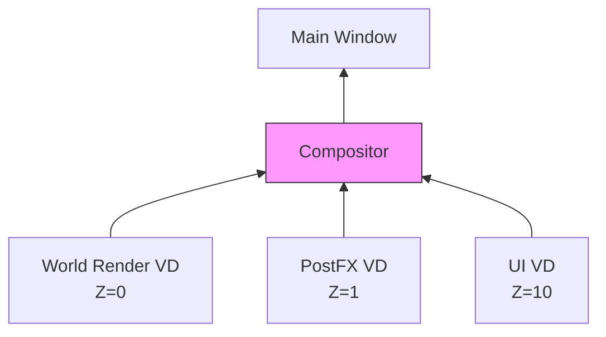

> **Future Flame (v2.4):** Async VDs are coming—queue UI updates on a worker thread without causing frame hitches.

<a id="361-creating-a-virtual-display"></a>
### 3.6.1 Creating a Virtual Display

#### SituationCreateVirtualDisplay

```c:disable-run
SituationError SituationCreateVirtualDisplay(Vector2 resolution,
                                  double frame_time_mult,
                                  int z_order,
                                  SituationScalingMode scaling_mode,
                                  SituationBlendMode blend_mode,
                                  int* out_id);
```

**Resolution:** The internal size (e.g., `{320, 240}`).
**Frame Time Mult:** Controls update frequency. 1.0 = Every Frame. 0.5 = Every other frame (half framerate effect). 0.0 = Manual update only.
**Z-Order:** Determines drawing order. Lower numbers are drawn first (background).
**Returns:** `SITUATION_SUCCESS` on success. `out_id` receives the new virtual display ID.

**Scaling Modes**

| Mode | Description |
| :--- | :--- |
| `SITUATION_SCALING_INTEGER` | Pixel Perfect. Scales by whole numbers (1x, 2x, 3x). Results in sharp pixels but may have black bars. |
| `SITUATION_SCALING_FIT` | Aspect Correct. Scales as large as possible while maintaining aspect ratio. Sharp edges (Nearest Neighbor). |
| `SITUATION_SCALING_STRETCH` | Fill Screen. Disregards aspect ratio to fill the target area. Smooth filtering (Linear). Good for UI. |

**Blend Modes**

| Mode | **Effect** | Usage |
| :--- | :--- | :--- |
| `SITUATION_BLEND_ALPHA` | **Standard transparency.** | UI, Sprites. |
| `SITUATION_BLEND_ADDITIVE` | **Adds colors (Brightens).** | Explosions, Glows. |
| `SITUATION_BLEND_MULTIPLY` | **Multiplies colors (Darkens).** | Shadows, Vignettes. |
| `SITUATION_BLEND_OVERLAY` | **Complex contrast blend.** | Stylized effects. |
| `SITUATION_BLEND_SOFT_LIGHT` | **Gentle lighting blend.** | Atmosphere. |

> **Perf Tip:** In Vulkan, Virtual Displays use **Persistent Descriptor Sets**. This allows compositing 10+ layers with less than **0.1ms** of CPU overhead per frame.

<a id="362-rendering-to-a-virtual-display"></a>
### 3.6.2 Rendering To a Virtual Display

To draw content into the virtual display, simply target its ID in a Render Pass.

```c:disable-run
SituationRenderPassInfo pass = {
    .display_id = my_vd_id, // Target the VD
    .color_attachment = { .loadOp = SIT_LOAD_OP_CLEAR, ... }
};
SituationCmdBeginRenderPass(cmd, &pass);
// ... Draw your game world here ...
SituationCmdEndRenderPass(cmd);
```

<a id="363-rendering-the-virtual-display-compositing"></a>
### 3.6.3 Rendering The Virtual Display (Compositing)

Once you have drawn into your virtual displays, you must composite them onto the main screen (or another target).

#### SituationRenderVirtualDisplays

```c:disable-run
SituationError SituationRenderVirtualDisplays(SituationCommandBuffer cmd);
```

**Behavior:**
1.  Sorts all active, visible Virtual Displays by Z-Order.
2.  Calculates the destination rectangle based on the target size and the VD's ScalingMode.
3.  Draws each VD as a full-screen quad using the specified BlendMode.

**Usage:** Call this inside the Render Pass for the Main Window.

<a id="364-configuration--optimization"></a>
### 3.6.4 Configuration & Optimization

#### SituationConfigureVirtualDisplay

```c:disable-run
SituationError SituationConfigureVirtualDisplay(int display_id,
                                                vec2 offset,
                                                float opacity,
                                                int z_order,
                                                bool visible,
                                                double frame_time_mult,
                                                SituationBlendMode blend_mode);
```

**Usage:** Update properties at runtime. E.g., fade a display out by animating opacity, or move a Picture-in-Picture window by changing offset.

#### SituationSetVirtualDisplayDirty

```c:disable-run
void SituationSetVirtualDisplayDirty(int display_id, bool is_dirty);
```

**Optimization:** If a VD has `frame_time_mult = 0.0`, it will strictly reuse the texture from the last frame. Call this function with `true` to force a single re-render. Useful for static UI panels.

<a id="365-example-pixel-art-setup"></a>
### 3.6.5 Example: Pixel Art Setup

```c:disable-run
// 1. Setup: Create a 320x180 buffer
int game_vd;
SituationCreateVirtualDisplay(
    (Vector2){320, 180},
    1.0,
    0,
    SITUATION_SCALING_INTEGER,
    SITUATION_BLEND_ALPHA,
    &game_vd
);

// 2. Render Loop
if (SituationAcquireFrameCommandBuffer()) {

    // Pass A: Draw Game to VD
    SituationRenderPassInfo game_pass = { .display_id = game_vd, ... };
    SituationCmdBeginRenderPass(cmd, &game_pass);
        // ... Draw Sprites ...
    SituationCmdEndRenderPass(cmd);

    // Pass B: Draw VD to Screen
    SituationRenderPassInfo screen_pass = { .display_id = -1, ... };
    SituationCmdBeginRenderPass(cmd, &screen_pass);
        SituationRenderVirtualDisplays(cmd); // Composites the 320x180 image to 4K
    SituationCmdEndRenderPass(cmd);

    SituationEndFrame();
}
```

<a id="37-compute--gpgpu"></a>

## 3.7 Compute & GPGPU

Situation provides a unified, high-level interface for General-Purpose GPU (GPGPU) computing. This allows you to run arbitrary code on the GPU for tasks like physics simulation, particle systems, or image post-processing, independent of the graphics pipeline.

### Compute Pipelines

A Compute Pipeline encapsulates a single Compute Shader. Unlike graphics pipelines, it has no fixed-function state (like blending or depth testing).

#### SituationCreateComputePipeline

Creates a compute pipeline from a GLSL shader file.

```c:disable-run
SituationError SituationCreateComputePipeline(const char* compute_shader_path, SituationComputeLayoutType layout_type, SituationComputePipeline* out_pipeline);
```

**Parameters:**
*   `compute_shader_path`: Path to the `.comp` shader file.
*   `layout_type`: Defines the resource bindings the shader expects.
*   `out_pipeline`: Pointer to receive the handle.

#### SituationCmdBindComputePipeline

Binds the pipeline for subsequent dispatch commands.

```c:disable-run
SituationError SituationCmdBindComputePipeline(SituationCommandBuffer cmd, SituationComputePipeline pipeline);
```

#### SituationReloadComputePipeline

```c:disable-run
SituationError SituationReloadComputePipeline(SituationComputePipeline* pipeline);
```

**Behavior:**
*   Recompiles the compute shader from the original source file.
*   Rebuilds the pipeline object.
*   Updates the handle in-place, preserving the original `layout_type`.

**Usage:** Allows iterative tuning of compute kernels (e.g., physics constants, procedural generation algorithms) at runtime.

### Storage Buffers (SSBOs)

Shader Storage Buffer Objects (SSBOs) are large, writable data buffers. They are the primary way to exchange data between the CPU and Compute Shaders.

#### Creating an SSBO

```c:disable-run
// Create a buffer for 1024 particles
size_t size = 1024 * sizeof(Particle);
SituationBuffer buffer;
SituationCreateBuffer(
    size,
    initial_data,
    SITUATION_BUFFER_USAGE_STORAGE_BUFFER | SITUATION_BUFFER_USAGE_TRANSFER_DST,
    &buffer
);
```

#### Binding an SSBO

To make the buffer available to the shader:

```c:disable-run
// Bind to binding point 0 (set = 0, binding = 0 in GLSL)
SituationCmdBindComputeBuffer(cmd, 0, buffer);
```

### Presentation (Compute-Only)

For pipelines that generate an image without a rasterization pass (e.g., Ray Tracing, Simulation), you can present a texture directly to the swapchain.

#### SituationCmdPresent

```c:disable-run
SituationError SituationCmdPresent(SituationCommandBuffer cmd, SituationTexture texture);
```

**Behavior:** Blits the given texture to the backbuffer and prepares it for presentation.
**Usage:** Call this instead of a Render Pass if your "rendering" happened in a Compute Shader.

### Bindless Buffers (Advanced)

For massive data arrays (e.g., GPU-driven rendering), you can bypass descriptors entirely.

#### SituationGetBufferDeviceAddress

```c:disable-run
uint64_t SituationGetBufferDeviceAddress(SituationBuffer buffer);
```

**Returns:** A 64-bit GPU pointer to the buffer.
**Usage:** Pass this address to a shader via a UBO. Access it in GLSL using `GL_EXT_buffer_reference`.

### Dispatch & Synchronization Barriers

#### SituationCmdDispatch

Executes the compute shader. You must specify the number of **Work Groups** to launch.

```c:disable-run
SituationError SituationCmdDispatch(SituationCommandBuffer cmd, uint32_t group_count_x, uint32_t group_count_y, uint32_t group_count_z);
```

**Usage:**

```c:disable-run
// Dispatch 1024 threads (assuming local_size_x = 64 in shader)
// 1024 / 64 = 16 work groups
SituationCmdDispatch(cmd, 16, 1, 1);
```

#### SituationCmdPipelineBarrier

Compute shaders run asynchronously. If you write to a buffer in a compute shader and then want to read it in a vertex shader (or another compute shader), you **must** insert a memory barrier.

```c:disable-run
// Snippet Supreme: The Particle Dispatch
// 1. Bind Pipeline
SituationCmdBindComputePipeline(cmd, particle_pipeline);

// 2. Bind SSBO (Particles)
SituationCmdBindComputeBuffer(cmd, 0, particle_buffer);

// 3. Update Simulation Time
SituationCmdSetPushConstant(cmd, 0, &dt, sizeof(float));

// 4. Dispatch (1024 threads)
SituationCmdDispatch(cmd, 16, 1, 1);

// 5. BARRIER: Wait for writes before rendering!
SituationCmdPipelineBarrier(
    cmd,
    SITUATION_BARRIER_COMPUTE_SHADER_WRITE, // Source
    SITUATION_BARRIER_VERTEX_SHADER_READ    // Destination
);
```

<a id="374-barriers-the-sync-enforcer"></a>
### 3.7.4 Barriers (The Sync Enforcer)

Miss a barrier? Debug aborts with "Memory Hazard: Compute wrote SSBO, Vertex read without VK_MEMORY_BARRIER."

**Barrier Guide: Quick Reference**
| From → To | Use Case | Code |
| :--- | :--- | :--- |
| **Compute Write → Vertex Read** | Particle sim → Render | `SituationCmdPipelineBarrier(cmd, SITUATION_BARRIER_COMPUTE_SHADER_WRITE, SITUATION_BARRIER_VERTEX_SHADER_READ)` |
| **Transfer Write → Fragment Read** | Texture upload → Draw | `SituationCmdPipelineBarrier(cmd, SITUATION_BARRIER_TRANSFER_WRITE, SITUATION_BARRIER_FRAGMENT_SHADER_READ)` |
| **Compute Write → Compute Read** | Multi-pass physics | `SituationCmdPipelineBarrier(cmd, SITUATION_BARRIER_COMPUTE_SHADER_WRITE, SITUATION_BARRIER_COMPUTE_SHADER_READ)` |

> **Titanium Tip:** OpenGL emulates barriers as `glMemoryBarrier`—costs cycles. Vulkan barriers are often free (execution dependency only).

**Multi-Queue Synchronization (v2.3.23):**
On systems where Compute and Graphics run on different Queue Families (e.g., AMD async compute), `SituationCmdPipelineBarrier` automatically handles the **Queue Family Ownership Transfer**. It injects the required release barrier on the source queue and acquire barrier on the destination queue, ensuring the memory is visible and available to the target engine.

<a id="38-debugging--profiling"></a>

## 3.8 Debugging & Profiling

Profiling is not optional. Situation provides built-in tools to visualize performance metrics directly within your application, bypassing the need for external overlays (like RTSS) during development.

### 3.8.1 The Metrics Overlay

#### SituationDrawMetricsOverlay

```c:disable-run
void SituationDrawMetricsOverlay(SituationCommandBuffer cmd, Vector2 position, ColorRGBA color);
```

**Behavior:**
Renders a compact, semi-transparent HUD at the specified screen coordinates using the provided color tint. It displays real-time statistics gathered by the internal profiler. It utilizes the internal text batcher for zero-allocation rendering, ensuring no performance impact on the frame.

**Metrics Displayed:**
*   **FPS:** Current Frames Per Second.
*   **Frame Time:** CPU wall-clock time per frame (ms).
*   **Queue:** Render Queue Depth (Backpressure indicator). e.g., "0/2" is good, "2/2" means CPU is waiting for GPU.
*   **Latency:** Average and Maximum input-to-present latency (ms). Drift-proof via `CLOCK_MONOTONIC`.
*   **Draws:** Number of draw calls issued this frame.
*   **Tris:** Number of triangles submitted.
*   **VRAM:** Current GPU memory usage.

**Usage:**

```c:disable-run
SituationCmdBeginRenderPass(cmd, &screen_pass);
    // Draw Game...

    // Draw HUD on top (White text at 10,10)
    if (show_debug_stats) {
        SituationDrawMetricsOverlay(cmd, (Vector2){10.0f, 10.0f}, (ColorRGBA){255, 255, 255, 255});
    }
SituationCmdEndRenderPass(cmd);
```

### 3.8.2 Programmatic Metrics

For custom logging or telemetry, you can access the raw profiling data.

#### SituationGetRenderLatencyStats

```c:disable-run
void SituationGetRenderLatencyStats(double* out_avg_ms, double* out_max_ms);
```

**Returns:** The average and maximum Input-to-Present latency over the last second.
**Precision:** Uses monotonic timestamps (`CLOCK_MONOTONIC`) to prevent drift.

#### SituationGetRenderQueueDepth

```c:disable-run
int SituationGetRenderQueueDepth(void);
```

**Returns:** The number of frames currently queued for the Render Thread.
**Usage:** Use this to detect CPU/GPU bottlenecks. A consistently full queue indicates the GPU cannot keep up with the CPU.

<a id="39-text-rendering"></a>

## 3.9 Text Rendering

Situation provides a high-performance, GPU-accelerated text rendering system suitable for real-time UIs, debug displays, and game text. Unlike the CPU-side `SituationImageDrawText` (which modifies pixel data), this system uses a **Font Atlas** and batched quad rendering to draw text directly to the command buffer with zero per-frame allocation.

### 3.9.1 The Font Workflow

To render text, you must first prepare a font atlas. This converts vector glyphs (TTF/OTF) into a GPU-compatible texture.

1.  **Load:** Load the font file into memory.
2.  **Bake:** Rasterize the glyphs into a texture atlas.
3.  **Draw:** Record draw commands using the atlas.

**Snippet Supreme: Text Setup**
```c:disable-run
// 1. Load Font
SituationFont font;
SituationLoadFont("assets/fonts/Inter-Regular.ttf", &font);

// 2. Bake Atlas (e.g., 24px height)
// This creates the GPU texture and calculates UVs
if (!SituationBakeFontAtlas(&font, 24.0f)) {
    printf("Failed to bake font atlas.\n");
}

// ... Main Loop ...
if (SituationAcquireFrameCommandBuffer()) {
    SituationCmdBeginRenderPass(cmd, &pass);
        // 3. Draw
        SituationCmdDrawText(cmd, font, "Hello World", (Vector2){10, 10}, WHITE);
    SituationCmdEndRenderPass(cmd);
    SituationEndFrame();
}

// 4. Cleanup
SituationUnloadFont(font); // Destroys texture and CPU data
```

### 3.9.2 Drawing Text

#### SituationCmdDrawText

```c:disable-run
void SituationCmdDrawText(SituationCommandBuffer cmd, SituationFont font, const char* text, Vector2 pos, ColorRGBA color);
```

**Behavior:** Draws a string using the font's baked size and standard spacing.
**Performance:** Commands are batched. You can call this hundreds of times per frame with minimal overhead.

#### SituationCmdDrawTextEx (Advanced)

```c:disable-run
void SituationCmdDrawTextEx(SituationCommandBuffer cmd, SituationFont font, const char* text, Vector2 pos, float fontSize, float spacing, ColorRGBA color);
```

**Features:**
*   **Scaling:** `fontSize` allows you to scale the text. Note that since this uses a baked bitmap atlas, scaling up significantly beyond the baked size will look pixelated (linear filtering) or blocky (nearest). Scaling down works well.
*   **Spacing:** Adjust the tracking (horizontal space) between characters.

**Example:**
```c:disable-run
// Draw text at 2x size with wide spacing
SituationCmdDrawTextEx(cmd, font, "BIG TEXT", (Vector2){100, 100}, 48.0f, 2.0f, RED);
```

### 3.9.3 The Default Font

If you need quick debug text without loading assets, the library provides a built-in 8x8 pixel-art font (Code Page 437).

**Usage:** Simply pass a zeroed `SituationFont` struct to the draw commands.

```c:disable-run
SituationFont defaultFont = {0}; // Triggers default font fallback
SituationCmdDrawText(cmd, defaultFont, "Debug Info", (Vector2){10, 10}, GREEN);
```

<a id="40-audio-engine"></a>

---

## 4.0 Audio Engine

The Audio module in "Situation" is a high-performance, multithreaded mixing engine built directly on top of the OS audio HAL (WASAPI on Windows, CoreAudio on macOS, ALSA/Pulse on Linux) via the internal miniaudio backend.

> **The Audio Guarantee**
> *   **Thread Safety:** The mixing thread uses a "Snapshot" strategy. It briefly locks to copy the list of active sound pointers to a local stack array, then unlocks immediately to perform mixing. This ensures that main-thread actions (like loading or unloading sounds) never stall the audio thread, preventing dropouts.
> *   **Latency:** Default buffer is 10ms (480 frames @ 48kHz).
> *   **Format:** Everything is float32. No integer clipping until the final DAC stage.

**Trap Table: Audio Pitfalls**
| Mistake | Symptom | Fix |
| :--- | :--- | :--- |
| **Blocking the callback** | Glitches/Pops | Never use `malloc`, `printf`, or `lock` in a custom processor. |
| **Too many voices** | Oldest sound cuts out | Increase `SITUATION_MAX_VOICES` or prioritize channels. |
| **Wrong Sample Rate** | Pitch drift / Resample cost | Match `SituationSetAudioDevice` to your source assets (usually 48kHz). |

### Architectural Constraints & Guarantees

*   **Thread Isolation:** The audio mixing graph runs on a dedicated, high-priority thread. All SITAPI audio functions are thread-safe wrappers that post atomic commands or lock-free messages to the mixer thread. You generally do not need to manage mutexes when calling these functions from the main thread.
*   **32-bit Float Pipeline:** The internal mixing pipeline operates exclusively in 32-bit floating point, typically at 48kHz (unless overridden). All source data is resampled and converted to this format upon load or stream-read.
*   **Strict Handle Semantics:** The `SituationSound` structure acts as a handle to a voice in the mixer graph. Unlike fire-and-forget engines, a `SituationSound` persists until explicitly unloaded, allowing for complex state manipulation (pitch bending, filter sweeps) during playback.

<a id="41-audio-context"></a>

## 4.1 Audio Context & Device Management

While `SituationInit` brings the audio subsystem online using the OS default device, professional applications often require explicit device selection and precise sample rate control.

#### Quick Start

```c:disable-run
// 1. Init Core (starts default audio device automatically)
SituationInit(argc, argv, &config);

// 2. (Optional) Select specific hardware if needed
int count;
SituationAudioDeviceInfo* devs = SituationGetAudioDevices(&count);
if (count > 0) {
    // Use the first available device
    SituationSetAudioDevice(devs[0].situation_internal_id, NULL);
}
free(devs);
```

<a id="411-device-enumeration"></a>
### 4.1.1 Device Enumeration

To enumerate available playback hardware, use `SituationGetAudioDevices`. This allocates a snapshot of the system's topology.

#### SituationGetAudioDevices

```c:disable-run
SituationAudioDeviceInfo* SituationGetAudioDevices(int* count);
```

**Returns:** A heap-allocated array of `SituationAudioDeviceInfo` structs. The caller must free this memory using standard `free()` (or the library's allocator if overridden).

**Struct Definition:**

```c:disable-run
typedef struct {
    char name[SITUATION_MAX_DEVICE_NAME_LEN]; // OS Device Name (UTF-8)
    ma_device_id id;                            // Opaque Driver ID
    int situation_internal_id;                  // ID used for SituationSetAudioDevice
    bool is_default_playback;                   // True if this is the OS default
    bool is_default_capture;                    // True if this is the default Mic
} SituationAudioDeviceInfo;
```

<a id="412-device-configuration"></a>
### 4.1.2 Device Configuration

#### SituationSetAudioDevice

```c:disable-run
SituationError SituationSetAudioDevice(int internal_id, const SituationAudioFormat* format);
```

**Behavior:**
*   Suspends the audio thread.
*   Tears down the current backend connection.
*   Initializes a new connection to the specified hardware `internal_id`.
*   Restores the mixing graph.

**Note:** This operation causes a brief audio dropout (typically < 100ms).

**Format:** Pass `NULL` to use the device's native format (lowest latency). Pass a `SituationAudioFormat` struct to force specific settings (e.g., strict 44100Hz).

| Rate | Use Case | Trade-off |
| :--- | :--- | :--- |
| **48,000 Hz** | **Standard (Cinema/Games)** | Native for most modern HW. Lowest latency. |
| **44,100 Hz** | **Legacy / Music** | Standard for CD audio. May incur OS resampling cost. |
| **96,000 Hz** | **Audiophile** | High CPU usage. Diminishing returns for games. |


<a id="413-master-control"></a>
### 4.1.3 Master Control

These functions control the final output stage (the Master Bus) before data is sent to the DAC.

*   `SituationSetAudioMasterVolume(float volume)`: Applies a linear gain. 1.0 is unity gain. Values > 1.0 are allowed but may cause digital clipping if the mix is hot.
*   `SituationPauseAudioDevice()`: Returns `SituationError`. Stops the callback request from the OS. CPU usage for audio drops to near zero. Use this when the application loses focus.
*   `SituationResumeAudioDevice()`: Returns `SituationError`. Restarts the callback.

<a id="42-resource-management"></a>

## 4.2 Resource Management & Data Manipulation

The library distinguishes between Static Audio (fully resident in RAM) and Streamed Audio (buffered from disk).

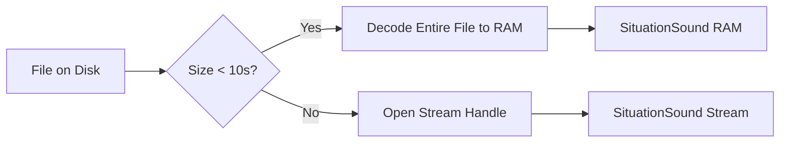

<a id="421-loading-strategies"></a>
### 4.2.1 Loading Strategies

When calling `SituationLoadSoundFromFile`, the `SituationAudioLoadMode` enum dictates the memory/latency trade-off.

| Mode | Behavior | Best For |
| :--- | :--- | :--- |
| `SITUATION_AUDIO_LOAD_FULL` | Decodes the entire file to raw PCM (float32) in RAM immediately. | SFX: Gunshots, UI, Footsteps. Guarantees zero disk I/O during gameplay. |
| `SITUATION_AUDIO_LOAD_STREAM` | Opens a file handle. Decodes small chunks into a ring buffer on the audio thread. | Music/Ambience: Large files (> 1 min). Keeps RAM usage low. |
| `SITUATION_AUDIO_LOAD_AUTO` | Checks file duration. If < 10s, uses FULL. If > 10s, uses STREAM. | General usage. |

#### SituationLoadSoundFromFile

```c:disable-run
SituationError SituationLoadSoundFromFile(const char* file_path,
                                          SituationAudioLoadMode mode,
                                          bool looping,
                                          SituationSound* out_sound);
```

**Return:** `SITUATION_SUCCESS` or `SITUATION_ERROR_FILE_NOT_FOUND` / `SITUATION_ERROR_AUDIO_DECODING`.

<a id="422-custom-streaming"></a>
### 4.2.2 Custom Streaming (Procedural / Virtual Files)

For engines that pack audio into custom archives (WAD/PAK) or generate audio procedurally, use the generic stream interface.

#### SituationLoadSoundFromStream

```c:disable-run
SituationError SituationLoadSoundFromStream(SituationStreamReadCallback on_read,
                                            SituationStreamSeekCallback on_seek,
                                            void* user_data,
                                            const SituationAudioFormat* format,
                                            bool looping,
                                            SituationSound* out_sound);
```

**Callbacks:**
*   `on_read`: Called by the audio thread when it needs more PCM data. You must fill `pBufferOut` with `bytesToRead`.
*   `on_seek`: Called when the engine needs to rewind (e.g., looping).

**Example: Procedural Sine Wave**

```c:disable-run
// Snippet Supreme: Procedural Sine Generator
// Generates a 440Hz Sine Wave on the fly
ma_uint64 MySineCallback(void* userData, void* pBufferOut, ma_uint64 bytesToRead) {
    float* output = (float*)pBufferOut;
    int* phase = (int*)userData;
    uint32_t frames = bytesToRead / sizeof(float); // Mono stream

    for(uint32_t i=0; i<frames; i++) {
        output[i] = sinf(*phase * 0.05f); // Simplified math
        (*phase)++;
    }
    return bytesToRead;
}
```

<a id="423-waveform-manipulation"></a>
### 4.2.3 Waveform Manipulation

The library provides utilities to manipulate raw PCM data for loaded sounds. These functions only work on sounds loaded with `SITUATION_AUDIO_LOAD_FULL`.

*   `SituationSoundCopy(source, dest)`: Deep copies the PCM buffer. Useful for creating variations of a sound (e.g., pitch-shifting one instance without affecting the original).
*   `SituationSoundCrop(sound, startFrame, endFrame)`: Destructively trims the PCM buffer in RAM.
*   `SituationSoundExportAsWav(sound, path)`: Dumps the current buffer to a standard WAV file. Useful for debugging procedural audio generation.

<a id="43-voice-management"></a>

## 4.3 Voice Management

A `SituationSound` is not a "fire-and-forget" event; it is a persistent voice.

> **Warning:** The engine has a default hard limit of **32 concurrent voices**. Playing more sounds will either fail or steal the oldest voice, depending on internal priority logic.

<a id="431-playback-control"></a>
### 4.3.1 Playback Control

*   `SituationPlayLoadedSound(sound)`: Adds the sound to the mixer. If already playing, it restarts from the beginning (re-trigger).
*   `SituationStopLoadedSound(sound)`: Removes the sound from the mixer and resets the cursor to 0.
*   `SituationStopAllLoadedSounds()`: Immediate "panic button" to silence the application.

<a id="432-voice-properties"></a>
### 4.3.2 Voice Properties

These functions can be called every frame to modulate audio based on game state.

*   `SituationSetSoundVolume(sound, vol)`: Per-voice gain.
*   `SituationSetSoundPan(sound, pan)`: Stereo panning. -1.0f (Left) to 1.0f (Right). Uses a constant-power panning law.
*   `SituationSetSoundPitch(sound, pitch)`: Resamples the audio.

**Example: Doppler Effect**

```c:disable-run
// Simple Doppler shift based on relative speed
float rel_speed = player_velocity - source_velocity;
float shift = 1.0f + (rel_speed / 343.0f); // Speed of sound ~343m/s
SituationSetSoundPitch(sfx_car_engine, shift);
```

<a id="44-dsp-chain"></a>

## 4.4 DSP Chain (Effects)

Every `SituationSound` instance owns a private effects chain. The signal path is fixed to ensure stability:

**Table: DSP Latency Ladder**
| Effect | Cost (CPU) | Latency Added |
| :--- | :--- | :--- |
| **Filter (Low/High Pass)** | Low (SIMD) | 0.0ms (Phase shift only) |
| **Echo / Delay** | Low (Ring Buffer) | Configurable (10ms - 1000ms) |
| **Reverb (Schroeder)** | High (Many taps) | ~5ms (Pre-delay) |
| **Custom Processor** | User Dependent | 0.0ms (if optimized) |

**Visual Vault: Signal Flow**


<a id="441-filters"></a>
### 4.4.1 Filters

The Biquad filter stage allows for standard subtractive synthesis effects.

#### SituationSetSoundFilter

```c:disable-run
SituationError SituationSetSoundFilter(SituationSound* sound,
                                       SituationFilterType type,
                                       float cutoff_hz,
                                       float q_factor);
```

| Q-Factor | Effect |
| :--- | :--- |
| **0.707** | **Butterworth (Neutral).** No resonance. Smooth roll-off. |
| **> 1.0** | **Resonant.** Boosts frequencies near the cutoff. "Wah-wah" sound. |
| **< 0.5** | **Damped.** Gentle, wide slope. Very subtle. |

<a id="442-environmental-effects"></a>
### 4.4.2 Environmental Effects

*   **SituationSetSoundEcho:** A feedback delay line.
    *   `delay_sec`: Time between repeats (0.01s to 1.0s).
    *   `feedback`: Decay rate (0.0 to 0.99).
*   **SituationSetSoundReverb:** A Schroeder/Moorer algorithmic reverb.
    *   `room_size`: 0.0 (Closet) to 1.0 (Cathedral).
    *   `damping`: Absorbs high frequencies in the tail.

<a id="443-custom-processors"></a>
### 4.4.3 Custom Processors (The "Pro" Feature)

For functionality not provided by the built-in chain (e.g., Bitcrushing, Ring Modulation, FFT Analysis), you can inject custom code into the mixing pipeline.

#### SituationAttachAudioProcessor

```c:disable-run
SituationError SituationAttachAudioProcessor(SituationSound* sound,
                                             SituationAudioProcessorCallback processor,
                                             void* user_data);
```

**Callback Signature:**

```c:disable-run
typedef void (*SituationAudioProcessorCallback)(
    float*       buffer,         // Interleaved float samples (L, R, L, R...)
    uint32_t     frames,         // Number of frames to process
    uint32_t     channels,       // Usually 2 (Stereo)
    uint32_t     sampleRate,     // e.g., 48000
    void*        user_data
);
```

**Implementation Rules:**
*   **In-Place Processing:** You write your output directly back into `buffer`.
*   **Performance:** You have a budget of roughly 1-2ms per callback. Exceeding this causes audio glitches (pops/clicks).
*   **Floating Point:** Data is normalized -1.0f to +1.0f.

<a id="45-audio-capture"></a>

## 4.5 Audio Capture

The library provides low-level access to the system default recording device (Microphone/Line-In).

<a id="451-microphone-initialization"></a>
### 4.5.1 Microphone Initialization

#### SituationStartAudioCapture

```c:disable-run
SituationError SituationStartAudioCapture(SituationAudioCaptureCallback callback, void* user_data);
```

<a id="452-buffer-access"></a>
### 4.5.2 Buffer Access

When the microphone has captured a chunk of audio, it invokes your callback to deliver the raw PCM data.

**Callback Signature:**

```c:disable-run
typedef void (*SituationAudioCaptureCallback)(
    const float* input_buffer,   // Read-Only samples
    uint32_t     frame_count,
    void*        user_data
);
```

#### Threading Implications

By default, the capture callback runs on the **Audio Thread**. This is efficient but dangerous if you try to access main-thread data structures without locking.

**Safe Mode:**
If you initialized the library with the flag `SITUATION_INIT_AUDIO_CAPTURE_MAIN_THREAD` in `SituationInitInfo`, the library automatically buffers the captured audio and invokes your callback safely on the main thread during `SituationPollInputEvents()`.

| Mode | Latency | Threading |
| :--- | :--- | :--- |
| **Direct (Default)** | **Lowest (~10ms)** | Runs on Audio Thread. **DANGEROUS.** No malloc/locks. |
| **Main Thread** | **+1 Frame (~16ms)** | Runs on Main Thread. Safe. Easy to use. |

#### Example: Voice Chat Buffer

```c:disable-run
// Simple Ring Buffer Accumulator (Main Thread Safe Mode)
void MyCaptureCallback(const float* input, uint32_t frames, void* user) {
    RingBufferPush(user->voice_chat_buffer, input, frames);
}
```

<a id="453-stopping-capture"></a>
### 4.5.3 Stopping Capture

When you are finished recording, you must explicitly stop the capture device to release hardware resources and stop the callback from firing.

#### SituationStopAudioCapture

```c:disable-run
SituationError SituationStopAudioCapture(void);
```

**Behavior:**
*   Halts the input stream immediately.
*   Releases the microphone device handle.
*   Ensures no further calls to your `SituationAudioCaptureCallback` will occur.

**Safety:** It is safe to call this function even if capture is not currently active (it will simply do nothing).

> **Forward Look:** Full 3D Audio (HRTF) is not currently built-in. For 3D effects, calculate volume and pan manually based on distance and angle to the listener.
>
> **Ship Tease:** A lock-free Job System for massive audio concurrency is planned for v2.4.

<a id="50-input--haptics"></a>

---

## 5.0 Input & Haptics

The Input module of "Situation" is not merely a wrapper around OS events; it is a Frame-Synchronized State Machine.

Unlike standard event-driven architectures (like Qt or Win32) where input callbacks fire asynchronously during the frame—potentially causing "ghost inputs" or race conditions in physics logic—Situation captures a discrete snapshot of the entire input hardware state at the exact moment `SituationPollInputEvents()` is called.

> **The Atomic Guarantee**
> Once `SituationPollInputEvents()` returns, the input state is **immutable** for the remainder of the frame. A key cannot change from "Pressed" to "Released" halfway through your update loop, guaranteeing deterministic logic execution.

**Trap Table: Input Pitfalls**
| Mistake | Symptom | Fix |
| :--- | :--- | :--- |
| **Double Poll** | Missed presses | Call `SituationPollInputEvents` exactly **once** per frame. |
| **Raw Deadzone** | Stick Drift | Apply `SITUATION_JOYSTICK_DEADZONE` (> 0.1). |
| **QWERTY assumption** | AZERTY chaos | Use `SituationGetCharPressed` for text, Scan Codes for game actions. |

<a id="51-architecture-ring-buffers--polling"></a>
## 5.1 Architecture: Ring Buffers & Polling

The input system utilizes a dual-layer architecture to handle the disparity between High-Frequency OS interrupts and the discrete Frame Rate of the application.

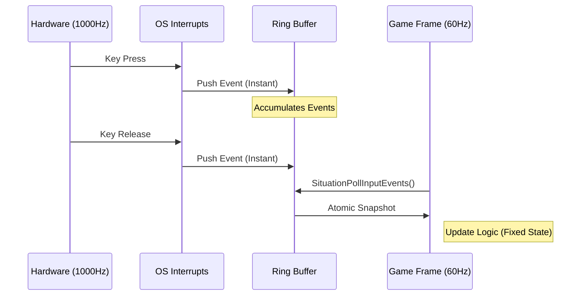

**Visual Vault: Ring Overflow Simulator**


**The Interrupt Layer (Hidden):**
As the OS receives hardware interrupts (USB polling rates of 1000Hz+), it fires internal callbacks. Situation catches these and pushes raw events into fixed-size Ring Buffers (`SITUATION_KEY_QUEUE_MAX` size). This happens silently in the background.

**The Polling Layer (API Visible):**
When you call `SituationPollInputEvents()`, the library:
1. Flushes the OS event queue.
2. Processes the internal Ring Buffers to detect "Press" and "Release" edges.
3. Updates the "Current Frame" state arrays (`bool keys[512]`).
4. Copies "Current" to "Previous" to calculate deltas.

**Missed Tap Math: Why this matters**
Consider a rhythm game running at 60 FPS (16.6ms per frame). A pro gamer taps a key for only 10ms.
*   **Without Ring Buffers:** The poll might happen *after* the key was released. Result: The game sees nothing.
*   **With Situation:** The "Press" and "Release" events are stored in the queue. Even if the frame is late, `SituationGetKeyPressed()` will report the hit.

**Edge Detection Logic**
The library distinguishes between three distinct states for every button (Keyboard, Mouse, Gamepad):

| Function Type | Logic | Use Case |
| :--- | :--- | :--- |
| **IsDown** | `current_state == 1` | Continuous movement (Walking, Throttle). |
| **IsPressed** | `current_state == 1 && prev_state == 0` | Triggers (Jump, Shoot, Toggle Menu). |
| **IsReleased** | `current_state == 0 && prev_state == 1` | Drag-and-drop release, Charging mechanics. |

> **Titanium Tip:** Because `IsPressed` relies on comparing Current vs. Previous frames, you must call `SituationPollInputEvents()` exactly once per frame. Calling it multiple times will overwrite the "Previous" state, causing you to miss press events.

<a id="52-keyboard"></a>
## 5.2 Keyboard

The keyboard API is split into two distinct pipelines: Physical Keys (for game control) and Character Input (for text entry).

### 5.2.1 Physical Keys (Scan Codes)

These functions query the physical location of a key on the board, mapped to a standard US QWERTY layout constant (`SIT_KEY_W`, `SIT_KEY_SPACE`, etc.).

#### SituationIsKeyDown / SituationIsKeyUp

```c:disable-run
bool SituationIsKeyDown(int key);
bool SituationIsKeyUp(int key);
```

**Complexity:** $O(1)$ array lookup.
**Behavior:** Returns true if the key is physically held down during this frame snapshot.

#### SituationIsKeyPressed

```c:disable-run
bool SituationIsKeyPressed(int key);
```

**Behavior:** Returns true only on the single frame the key transition occurred.
**Buffering:** If the frame rate drops to 1 FPS, and the user taps 'Space' 5 times quickly, the internal Ring Buffer captures all 5 taps. `SituationIsKeyPressed` will return true, but standard polling might miss rapid taps. For absolute precision in rhythm games, use `SituationGetKeyPressed()` (queue access).

#### SituationGetKeyPressed (Queue Access)

```c:disable-run
int SituationGetKeyPressed(void);
```

**Returns:** The next key code in the FIFO buffer, or 0 if empty.
**Usage:** Use this when you need to process every key stroke order-independently, rather than checking specific keys.

**Snippet Supreme: Draining the FIFO Queue**
This is essential for handling burst inputs (like a barcode scanner or button mashing) without missing a single event.

```c:disable-run
// Best Practice: Combo Input Buffer
int key;
while ((key = SituationGetKeyPressed()) != 0) {
    // Add to combo buffer
    combo_buffer[combo_index++] = key;

    if (CheckHadouken(combo_buffer)) {
        PlayerFireball();
        combo_index = 0; // Reset
    }

    if (key == SIT_KEY_ENTER) SubmitForm();
}
```

### 5.2.2 Text Input (Unicode)

**CRITICAL WARNING:** Never use `SIT_KEY_` codes for text input.

**The Layout Nightmare:**
Physical keys do not match characters across regions.

| Key Constant | QWERTY Physical | AZERTY Physical | Result |
| :--- | :--- | :--- | :--- |
| `SIT_KEY_Q` | 'Q' Key (Top Left) | 'A' Key (Top Left) | `IsKeyDown(SIT_KEY_Q)` is true |
| `SIT_KEY_SLASH` | '/' Key | ':' Key | `IsKeyDown(SIT_KEY_SLASH)` is true |

*   If Shift is held, the user expects '?'. The Key API still reports `SIT_KEY_SLASH`.
*   On a French keyboard, `SIT_KEY_Q` is physically located where 'A' is on QWERTY.

#### SituationGetCharPressed

```c:disable-run
unsigned int SituationGetCharPressed(void);
```

**Returns:** A UTF-32 Codepoint (e.g., 0x0041 for 'A', 0x00E9 for 'é').
**Behavior:**
* Handles Shift, Caps Lock, and Alt Gr states automatically.
* Respects the OS Keyboard Layout (AZERTY, QWERTZ, Dvorak).
* Returns 0 when the queue is empty.

**Example: Robust Text Entry**

```c:disable-run
unsigned int char_code;
while ((char_code = SituationGetCharPressed()) != 0) {
    // Filter out non-printable control characters
    if (char_code >= 32) {
        MyStringAppendCodepoint(&input_field, char_code);
    }
}

// Handle Backspace separately (it's a control key, not a char)
if (SituationIsKeyPressed(SIT_KEY_BACKSPACE) || SituationIsKeyPressed(SIT_KEY_REPEAT)) {
    MyStringRemoveLast(&input_field);
}
```

<a id="53-mouse"></a>
## 5.3 Mouse

The Mouse module provides normalized screen coordinates and relative motion vectors.

### 5.3.1 Position, Delta, and Wheel

#### SituationGetMousePosition

```c:disable-run
Vector2 SituationGetMousePosition(void);
```

**Returns:** The absolute position (x, y) relative to the top-left of the window client area.
**Range:** (0, 0) to (WindowWidth, WindowHeight). Values can be negative or exceed window size if the mouse is dragged outside.

#### SituationGetMouseDelta

```c:disable-run
Vector2 SituationGetMouseDelta(void);
```

**Returns:** The vector (x, y) representing movement since the last frame.
**Calculation:** CurrentPos - PreviousPos.
**Usage:** Essential for 3D Camera controllers (Yaw/Pitch).

#### SituationSetMousePosition

```c:disable-run
void SituationSetMousePosition(Vector2 pos);
```

**Behavior:** Warps the mouse cursor to the specified (x, y) coordinates within the window.
**Usage:** Useful for re-centering the mouse in FPS cameras or snapping to UI elements.
**Note:** The provided coordinates are automatically reverse-transformed by the current Mouse Scale and Offset, ensuring `SituationGetMousePosition()` returns the value you set.

#### SituationSetMouseScale & Offset

```c:disable-run
void SituationSetMouseScale(vec2 scale);
void SituationSetMouseOffset(vec2 offset);
```

**The Problem:** You render a pixel-art game at 320x180 to a VirtualDisplay, but the window is fullscreen at 1920x1080. `GetMousePosition` returns 1920x1080 coordinates, breaking your UI hit-testing.
**The Solution:** Set the scale to (320.0/1920.0, 180.0/1080.0). The library now automatically transforms all mouse inputs into your game's virtual coordinate space.

> **HiDPI Gotcha:** On a 4K monitor, `GetMousePosition` returns (3840, 2160). If your game logic assumes 1080p, your UI clicks will fail. Always use `SituationSetMouseScale` or normalized coordinates.

**Example: Clamping Mouse for Dragging**
Since the mouse can leave the window, coordinates can be negative.

```c:disable-run
Vector2 pos = SituationGetMousePosition();
// Clamp to window bounds
if (pos.x < 0) pos.x = 0;
if (pos.x > window_width) pos.x = window_width;
if (pos.y < 0) pos.y = 0;
if (pos.y > window_height) pos.y = window_height;
```

### 5.3.2 Buttons

Supported buttons map to standard indices:
* `SIT_MOUSE_BUTTON_LEFT` (0)
* `SIT_MOUSE_BUTTON_RIGHT` (1)
* `SIT_MOUSE_BUTTON_MIDDLE` (2)
* `SIT_MOUSE_BUTTON_SIDE` (3, 4 - Gaming mouse side buttons)

<a id="54-gamepad"></a>
## 5.4 Gamepad

Situation implements the SDL_GameControllerDB mapping standard. This means generic DirectInput (Windows) or HID (Linux) devices are automatically remapped to a standard "Xbox 360" layout.

### 5.4.1 Connection Handling

The system supports up to `SITUATION_MAX_JOYSTICKS` (2) active devices.

#### SituationIsJoystickPresent

```c:disable-run
bool SituationIsJoystickPresent(int jid);
```

**Returns:** `true` if a device is plugged into slot `jid` (0 or 1).

#### Hot-Plugging Callback

To handle controllers being unplugged mid-game (and pausing the game automatically):

```c:disable-run
void OnJoystickChange(int jid, int event, void* user) {
    if (event == GLFW_CONNECTED) {
        printf("Controller %d connected: %s\n", jid, SituationGetJoystickName(jid));
    } else if (event == GLFW_DISCONNECTED) {
        printf("Controller %d disconnected.\n", jid);
        MyGamePause();
    }
}
SituationSetJoystickCallback(OnJoystickChange, NULL);
```

### 5.4.2 Axis & Button Mapping

The library normalizes all controller types (PS5, Switch Pro, Xbox) to this standard:

**Axes (SituationGetGamepadAxisValue)**

Returns a float between -1.0 and 1.0.

| Index | Name | Range |
| :--- | :--- | :--- |
| 0 | **Left Stick X** | -1.0 (Left) to 1.0 (Right) |
| 1 | **Left Stick Y** | -1.0 (Up) to 1.0 (Down) |
| 2 | **Right Stick X** | -1.0 (Left) to 1.0 (Right) |
| 3 | **Right Stick Y** | -1.0 (Up) to 1.0 (Down) |
| 4 | **Left Trigger (L2)** | -1.0 (Released) to 1.0 (Pressed) |
| 5 | **Right Trigger (R2)** | -1.0 (Released) to 1.0 (Pressed) |

**Deadzone Note:** The library defines `SITUATION_JOYSTICK_DEADZONE_L` (0.10f) but does not apply it automatically. You must implement deadzone logic to prevent "stick drift".

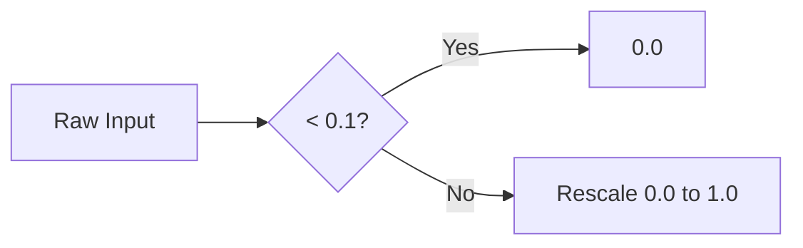

```c:disable-run
float x = SituationGetGamepadAxisValue(0, 0);
// Simple Deadzone
if (fabs(x) < SITUATION_JOYSTICK_DEADZONE_L) x = 0.0f;
// Advanced: Rescaled Radial Deadzone prevents "jump" at 0.1
```

**Buttons (SituationIsGamepadButtonDown)**

| ID | Xbox | PlayStation | Switch |
| :--- | :--- | :--- | :--- |
| 0 | **A** | **Cross** | **B** |
| 1 | **B** | **Circle** | **A** |
| 2 | **X** | **Square** | **Y** |
| 3 | **Y** | **Triangle** | **X** |
| 4 | **LB** | **L1** | **L** |
| 5 | **RB** | **R1** | **R** |
| 6 | **Back** | **Select/Share** | **-** |
| 7 | **Start** | **Start/Options** | **+** |
| 8 | **Guide** | **PS** | **Home** |
| 9 | **L3** | **L3** | **Stick Click** |
| 10 | **R3** | **R3** | **Stick Click** |
| 11-14 | **D-Pad** | **D-Pad** | **D-Pad** |

**Switch Note:** On Nintendo Switch controllers, the A/B and X/Y physical positions are swapped compared to Xbox. The library exposes the **Physical Location**, not the label. Pressing the bottom face button triggers ID 0 (Xbox A), even if the Switch label says "B".

### 5.4.3 Haptic Feedback (Rumble)

Situation provides dual-motor force feedback control.

#### SituationSetGamepadVibration

```c:disable-run
bool SituationSetGamepadVibration(int jid, float left_motor, float right_motor);
```

**Parameters:**
* `left_motor`: Low-frequency (Heavy) rumble. 0.0 to 1.0. Good for explosions/impacts.
* `right_motor`: High-frequency (Light) buzz. 0.0 to 1.0. Good for engine revs/sliding.

**Platform Support:**
* **Windows:** Uses XInput. Works flawlessly with Xbox controllers.
* **Linux/macOS:** Dependent on driver support. Function returns `false` if haptics are unavailable on the device.

**Usage:** The vibration continues indefinitely until you call the function again with 0.0f, 0.0f. You must manage the duration yourself using a timer.

**Trap Table: Haptic Hardware**
| Hardware | Left Motor | Right Motor | Note |
| :--- | :--- | :--- | :--- |
| **Xbox** | Heavy (Rotary) | Light (Buzz) | Classic feel. |
| **Switch** | HD Low Freq | HD High Freq | Linear Actuator. Very precise. |
| **PS5** | Haptic L | Haptic R | Speaker-coil based. Supports audio-to-haptic. |

```c:disable-run
// Impact!
SituationSetGamepadVibration(0, 1.0f, 1.0f);
player.rumble_timer = 0.5f; // Rumble for half a second

// Update Loop
if (player.rumble_timer > 0) {
    player.rumble_timer -= dt;
    if (player.rumble_timer <= 0) {
        SituationSetGamepadVibration(0, 0.0f, 0.0f); // Stop
    }
}
```

<a id="60-filesystem--io"></a>

---

## 6.0 Filesystem & I/O

The Filesystem module acts as the bridge between your application's memory space and the OS's persistent storage. This section treats the filesystem not as a simple storage bucket, but as a Hostile External Environment. Disk I/O is slow, permissions are volatile, and path separators are inconsistent. Situation abstracts this chaos into a deterministic, transactional API.

### The Three Commandments of Situation I/O:

1.  **UTF-8 Everywhere:** All paths, filenames, and text content are strictly UTF-8. Windows `wchar_t` (UTF-16) paths are handled internally and transparently converted. (See [1.0 Core System Architecture](#10-core-system-architecture)).
2.  **Heap Ownership Transfer:** Functions that return data (`char*`, `void*`) allocate memory on the heap. You own this memory. You must free it.
3.  **Sandboxing:** The API aggressively encourages relative paths. Absolute paths are supported but discouraged, as they break portability between development machines and end-user installations.

> **The I/O Guarantee**
> *   **Atomicity:** Writes to `SituationSaveFileData` are atomic (write-to-temp then rename) where supported to prevent corruption on crash.
> *   **Alignment:** `LoadFileData` returns 16-byte aligned memory for SIMD.
> *   **Null-Term:** `LoadFileText` always appends `\0`.

**Table: Path Carnage**
| Scenario | The Code | The Result | Why? |
| :--- | :--- | :--- | :--- |
| **Hardcoded Slash** | `"assets\\data.bin"` | **Crash on Linux** | Backslash is an escape char, not a separator on POSIX. |
| **UNC Paths** | `\\Server\Share\Art` | **Lag / Freeze** | Network timeout blocks the main thread. |
| **Case Sensitivity** | `Load("Texture.PNG")` | **File Not Found** | Linux is case-sensitive; file is `Texture.png`. |
| **Absolute Path** | `C:/Dev/Game/Art/` | **Deploy Fail** | User installed to `D:/Games/`. |

**Table: I/O Throughput Benchmarks**
| Method | Speed | Use Case |
| :--- | :--- | :--- |
| **`LoadFileData`** | 2GB/s (SSD) | Small assets (< 100MB). RAM resident. |
| **`LoadFileText`** | 500MB/s | Configs, Scripts, Shaders. |
| **`AudioStream`** | 10MB/s | Music. Low RAM usage. |

<a id="61-path-management"></a>
## 6.1 Path Management

Paths are the most fragile part of cross-platform development. A path valid on your Dev PC (`D:\Dev\Assets\`) will crash on a user's laptop (`C:\Program Files\`) or a Linux server (`/opt/game/`).

### 6.1.1 The Base Path Anchor

To ensure asset portability, Situation calculates a "Base Path" at initialization.

**Path Hell: Why this exists**

| Platform | Typical Path for `assets/level1.dat` |
| :--- | :--- |
| **Windows** | `C:\Users\Dev\Project\assets\level1.dat` |
| **Linux (Installed)** | `/usr/share/games/mygame/assets/level1.dat` |
| **Linux (Portable)** | `/home/user/Downloads/mygame/assets/level1.dat` |
| **macOS (Bundle)** | `/Applications/MyGame.app/Contents/Resources/assets/level1.dat` |

#### Path Carnage: Real-World Failures

| Scenario | The Code | The Result | Why? |
| :--- | :--- | :--- | :--- |
| **Hardcoded Slash** | `"assets\\data.bin"` | **Crash on Linux** | Backslash is an escape char, not a separator on POSIX. |
| **UNC Paths** | `\\Server\Share\Art` | **Lag / Freeze** | Network timeout blocks the main thread. |
| **Case Sensitivity** | `Load("Texture.PNG")` | **File Not Found** | Linux is case-sensitive; file is `Texture.png`. |
| **Absolute Path** | `C:/Dev/Game/Art/` | **Deploy Fail** | User installed to `D:/Games/`. |

#### SituationGetBasePath

```c:disable-run
char* SituationGetBasePath(void);
```

**Resolution Logic:**
*   **Windows:** Calls `GetModuleFileNameW`, strips the executable name (`game.exe`), and normalizes backslashes to forward slashes.
*   **Linux:** Reads `/proc/self/exe` to resolve symlinks (critical if your game is installed via a package manager).
*   **macOS:** Resolves into the `Contents/Resources` folder of the App Bundle.

**Return:** A heap-allocated string ending with a trailing slash (e.g., `C:/Games/Doom/`).

**Visualizing Resolution:**

```text
Project Root (The "Situation")
├── bin/
│   └── game.exe  <-- Execution Start
├── assets/       <-- Target
│   ├── shaders/
│   └── textures/
└── ...
```

*   `SituationGetBasePath()` -> `.../Project/bin/`
*   `SituationJoinPath(base, "../assets/")` -> `.../Project/assets/`

**Usage:** Combine this with relative asset paths to load resources reliably.

### 6.1.2 Path Composition

Never manually concatenate strings with `strcat` and hardcoded `/` or `\` separators.

#### SituationJoinPath

```c:disable-run
char* SituationJoinPath(const char* base_path, const char* file_or_dir_name);
```

**Behavior:**
*   Detects the OS separator (Windows `\` vs POSIX `/`).
*   Handles edge cases (missing trailing slash in base, leading slash in child).
*   Allocates a new buffer for the result.

```c:disable-run
char* base = SituationGetBasePath();
char* full_path = SituationJoinPath(base, "assets/textures/wall.png");
// Result Win32: "C:/Games/Doom/assets/textures/wall.png" (Internal normalization)
// Result Linux: "/usr/bin/doom/assets/textures/wall.png"
```

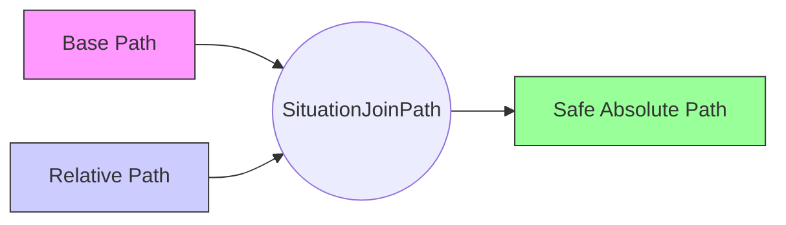

### 6.1.3 The "User Data" Sandbox

Modern operating systems forbid writing to the application directory (`Program Files` / `/usr/bin`). Attempting to save `config.ini` next to your `.exe` will fail with `SITUATION_ERROR_ACCESS_DENIED` on end-user machines.

You must use the User Data directory.

#### SituationGetAppSavePath

```c:disable-run
char* SituationGetAppSavePath(const char* app_name);
```

**Resolution Logic:**
*   **Windows:** `SHGetKnownFolderPath(FOLDERID_RoamingAppData)` + app_name.
    *   Result: `C:\Users\Jacques\AppData\Roaming\MyGame\`
*   **Linux:** `$XDG_DATA_HOME` or `~/.local/share/` + app_name.
*   **macOS:** `~/Library/Application Support/` + app_name.

**Side Effect:** If the directory does not exist, this function creates it recursively.
**Error Handling:** Returns `NULL` if parameters are invalid or the OS API fails (check `SituationGetLastErrorMsg()` for `SITUATION_ERROR_DEVICE_QUERY` or `SITUATION_ERROR_MEMORY_ALLOCATION`).

<a id="62-file-operations"></a>
## 6.2 File Operations

These functions are atomic wrappers around standard C I/O (`stdio`), hardened against common failures.

### 6.2.1 Reading Binary Data (The Asset Loader)

#### SituationLoadFileData

```c:disable-run
SituationError SituationLoadFileData(const char* file_path, unsigned int* out_bytes_read, unsigned char** out_data);
```

**The "Nuclear" Details:**
*   **Allocation:** Uses `malloc`. The returned pointer is 16-byte aligned (on most platforms) to allow for SIMD operations on the loaded data.
*   **Concurrency:** Opens the file in "Read-Shared" mode. This allows other processes (like your Text Editor) to keep the file open while the game reads it—essential for Hot-Reloading.
*   **Limits:** Intended for assets that fit in RAM. Do not use this for 4GB video files; use the Streaming Audio/Video APIs instead.
*   **Failure:** Returns an error code if the file doesn't exist or is locked exclusively. `*out_bytes_read` is set to 0.

**Usage Pattern:**

```c:disable-run
unsigned int size = 0;
unsigned char* buffer = NULL;
if (SituationLoadFileData("mesh.bin", &size, &buffer) == SITUATION_SUCCESS) {
    // Process raw bytes...
    UploadGeometryToGPU(buffer, size);

    SIT_FREE(buffer); // CRITICAL: You own this memory.
}
```

**Common I/O Errors & Solutions**

| Error Code | Meaning | Actionable Fix |
| :--- | :--- | :--- |
| `SITUATION_ERROR_FILE_NOT_FOUND` | Path does not exist. | Check `SituationGetBasePath()` + relative path construction. |
| `SITUATION_ERROR_FILE_LOCKED` | Used by another process. | Close your external Text Editor or Hex Viewer. |
| `SITUATION_ERROR_ACCESS_DENIED` | Permissions error. | Are you trying to write to `Program Files`? Use `SituationGetAppSavePath`. |
| `SITUATION_ERROR_DISK_FULL` | No space left. | Catch this and show a UI warning before autosaving. |

> **Hostile Tip:** If `SITUATION_ERROR_FILE_LOCKED` persists during development, it's usually VS Code or Explorer holding a handle. Force flush or kill the external process.

> **SIMD Load Tip:** `SituationLoadFileData` guarantees 16-byte alignment. You can immediately cast the returned pointer to `__m128*` for vectorized parsing without an intermediate copy.

### 6.2.2 Reading Text (The Null-Terminator Trap)

Standard `fread` does not append a null-terminator (`\0`). If you load a shader or JSON file using generic binary loaders and pass it to a parser, you will trigger a Buffer Overread Segfault.

#### SituationLoadFileText

```c:disable-run
char* SituationLoadFileText(const char* file_path);
```

**Guarantees:**
*   **Null Termination:** Allocates `filesize + 1` bytes and sets the last byte to `\0`. Safe to pass directly to `glShaderSource` or `json_parse`.
*   **Line Endings:** Does not normalize CRLF to LF. The buffer contains exactly what was on disk.
*   **BOM Stripping:** If the file has a UTF-8 Byte Order Mark (0xEF, 0xBB, 0xBF), the returned pointer is advanced past it.

**Async Option:** See `SituationLoadFileTextAsync` in Section 7.2 to load text files without blocking the main thread.

### 6.2.3 Atomic Writes

#### SituationSaveFileData / SituationSaveFileText

```c:disable-run
SituationError SituationSaveFileData(const char* path, const void* data, unsigned int bytes);
SituationError SituationSaveFileText(const char* path, const char* text);
```

**Behavior:**
*   Opens with `wb` (write binary) or `w` (write text).
*   Truncates the existing file immediately.
*   Returns `false` (via error code) if disk is full or path is read-only.

**Async Option:** See `SituationSaveFileTextAsync` in Section 7.2.

**Pro Tip:** For critical save data, do not overwrite `save.dat` directly. Write to `save.tmp`, then use `SituationMoveFile` to swap them. This prevents data corruption if the game crashes during the write.

<a id="63-advanced-directory-operations"></a>
## 6.3 Advanced Directory Operations

### 6.3.1 Recursive Creation

#### SituationCreateDirectory

```c:disable-run
SituationError SituationCreateDirectory(const char* dir_path, bool create_parents);
```

**Parameter `create_parents`:**
*   `true`: Acts like `mkdir -p`. If you ask for `A/B/C` and A doesn't exist, it creates A, then B, then C.
*   `false`: Fails if the parent directory does not exist.

### 6.3.2 The "Delete" Cannon

#### SituationDeleteDirectory

```c:disable-run
SituationError SituationDeleteDirectory(const char* dir_path, bool recursive);
```

**Parameter `recursive`:**
*   `true`: **DANGER.** Acts like `rm -rf`. It iterates the directory tree, unlinks every file, deletes every subdirectory, and then removes the root. This operation is irreversible.
*   `false`: Fails if the directory is not empty.

### 6.3.3 Directory Listing (Scanning)

#### SituationListDirectoryFiles

```c:disable-run
SituationError SituationListDirectoryFiles(const char* dir_path, char*** out_files, int* out_count);
```

**Returns:** `SITUATION_SUCCESS` on success. `out_files` points to an array of strings.

**Filtering:**
*   Automatically skips `.` and `..`
*   Returns only the file names (e.g., `level1.map`), not full paths.

**Memory Management:**
This function allocates a block for the array and blocks for each string. You must use the specific helper to free it, or you will leak memory.

```c:disable-run
int count = 0;
char** files = NULL;
if (SituationListDirectoryFiles("saves/", &files, &count) == SITUATION_SUCCESS) {
    for (int i=0; i<count; i++) {
        printf("Found save: %s\n", files[i]);
    }
    SituationFreeDirectoryFileList(files, count); // Required cleanup
}
```

> **Scale Tip:** For directories with 10,000+ files, avoid `SituationListDirectoryFiles` every frame. Use the recursive wildcard scan (e.g., `*.glb`) to filter noise at the OS level before allocation occurs.

<a id="64-hot-reloading-implications"></a>
## 6.4 Hot-Reloading & File Watching

The "Velocity" module's Hot-Reloading capability relies on the Filesystem module.

**Mechanism:**
*   When you call `SituationLoadShader`, `SituationLoadTexture`, `SituationLoadModel`, or `SituationCreateComputePipeline`, the library internally registers the absolute path with a file watcher (using `inotify` on Linux or `ReadDirectoryChangesW` on Windows).

**The "Debounce" Factor:**
*   Text editors (VS Code, Vim) often save files by writing to a temp file and renaming it, or writing in chunks. This generates multiple OS events for a single "Save".
*   `SituationCheckHotReloads()` includes a Debounce Timer (typically 100ms). It waits for the filesystem events to settle before triggering the expensive GPU reload process.

**Visual Vault: Debounce Logic**
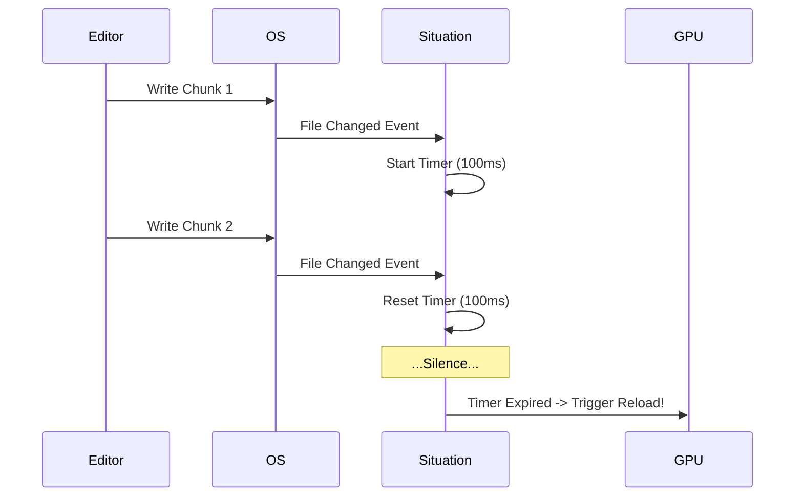

#### False Alarms: What the Debounce Eats

| Trigger | Description | Result |
| :--- | :--- | :--- |
| **Editor Auto-Save** | Writes a `.tmp` file, then renames. | **Ignored.** (Extension mismatch). |
| **Virus Scanner** | Opens file for reading immediately after write. | **Absorbed.** (Debounce waits). |
| **Git Pull** | Rapidly updates 50 files. | **Batched.** (Single reload trigger). |

#### SituationCheckHotReloads

```c:disable-run
void SituationCheckHotReloads(void);
```

**Behavior:**
Checks for any pending file modification events. If the debounce timer has expired for a modified asset, it triggers the appropriate reload function (e.g., `SituationReloadShader`).

**Usage:**
Call this once per frame in your update loop (Phase 2), or less frequently (e.g., every 10 frames) if you want to minimize overhead in development builds.

**Usage Warning:**
If you delete a file that is currently being watched by the Hot-Reloader, the library will deregister the watch silently. If you restore the file, you must manually trigger a reload or restart the app to re-establish the link.

> **Forward Look:** Need to mount a ZIP file as a virtual drive? **Virtual Mounts (PAK support)** are coming in v2.5. For video streaming, see Section 8.0.
>
> **Ship Tease:** v2.4 will introduce **Async I/O Queues**, allowing for stutter-free background loading of massive assets (1GB+) without blocking the main thread.

<a id="70-threading--async"></a>

---

## 7.0 Threading & Async

The Threading module provides a hardened, high-performance **Generational Task System** to offload work from the main thread. This is critical for tasks like loading large audio files, decompressing assets, or baking physics, which would otherwise cause frame-rate stutters.

<a id="71-generational-task-system"></a>
### 7.1 Generational Task System

The `SituationThreadPool` uses a dual-priority ring buffer architecture with O(1) generational validation. The system is designed to prevent "Head-of-Line Blocking," where a slow background task (like loading a 4K texture) delays a critical foreground task (like physics integration).

**Key Features:**
*   **Dedicated IO Thread:** (Since v2.3.34A "Trinity Threads") A separate, dedicated thread services the Low Priority queue exclusively. This ensures that asset loading and file I/O never contend with gameplay logic or physics workers, effectively decoupling the simulation from the disk.
*   **Zero Allocation:** The job queue is a fixed-size ring buffer (configurable via `io_queue_capacity`). Submitting a job involves no `malloc` calls (unless the payload > 64 bytes).
*   **O(1) Validation:** Handle IDs contain a "Generation Counter". If a slot is reused, the generation increments. This makes `SituationWaitForJob` instantaneous and safe against ABA problems.
*   **Dual Priority Queues:**
    *   **High Priority (Index 1):** Serviced by the general Worker Pool. Used for frame-critical tasks like Physics steps, Animation updates, or Audio DSP. Workers always drain this queue before checking low priority items.
    *   **Low Priority (Index 0):** Serviced by the Dedicated I/O Thread. Used for bulk operations like Asset Loading, Decompression, and Autosaving.

**Thread Safety:**
*   **Main Thread Only:** You must create and destroy the pool from the main thread.
*   **Any Thread:** You can submit jobs from any thread.
*   **Safety Assertions:** The library uses `SIT_ASSERT_MAIN_THREAD()` in debug builds to catch API violations.

<a id="72-job-submission--control"></a>
### 7.2 Job Submission & Control

#### SituationSubmitJobEx (The Power User API)

This is the primary entry point for the task system.

```c:disable-run
SituationJobId SituationSubmitJobEx(
    SituationThreadPool* pool,
    void (*func)(void* data, void* reserved),
    const void* data,
    size_t data_size,
    SituationJobFlags flags
);
```

**Parameters:**
*   `data`: Pointer to your payload.
    *   **Small Object Optimization (SOO):** If `data_size <= 64`, the data is **copied** directly into the job slot. No allocation, no pointer management. Perfect for matrices or config structs.
    *   **Large Data:** If `data_size > 64`, the data is copied to the heap by default for safety (Copy-By-Value).
*   `flags`:
    *   `SIT_SUBMIT_HIGH_PRIORITY`: Push to the high-priority queue.
    *   `SIT_SUBMIT_BLOCK_IF_FULL`: Spin-wait if the queue is full.
    *   `SIT_SUBMIT_RUN_IF_FULL`: Execute immediately on the calling thread if queue is full.
    *   `SIT_SUBMIT_POINTER_ONLY`: For large data (>64B), store only the pointer without copying. User guarantees lifetime.

**Return Value (SituationJobId):**
A 32-bit integer handle that uniquely identifies the job instance.

#### SituationSubmitJob (Legacy Wrapper)

A macro for simple pointer passing. Equivalent to `SituationSubmitJobEx` with default priority and `SIT_SUBMIT_POINTER_ONLY`.

```c:disable-run
SituationSubmitJob(pool, MyCallback, my_ptr);
```

#### SituationWaitForJob

```c:disable-run
bool SituationWaitForJob(SituationThreadPool* pool, SituationJobId id);
```

**Behavior:**
*   Checks the generation counter in the handle against the slot.
*   If they match, the job is pending/running -> Blocks (yields/sleeps) until the `is_completed` flag is set.
*   If they differ, the job (and likely several others) is already finished -> Returns `true` immediately.

#### Async Asset Loading

These convenience helpers offload I/O operations to the **Dedicated I/O Thread** (Low Priority Queue). They handle the complexity of allocating temporary buffers, duplicating paths for thread safety, and managing callbacks.

**Audio (Decodes to RAM)**
Loads and decodes an audio file entirely into memory. This is critical for preventing disk I/O stalls on the audio mixing thread.
```c:disable-run
SituationJobId SituationLoadSoundFromFileAsync(SituationThreadPool* pool,
                                               const char* file_path,
                                               bool looping,
                                               SituationSound* out_sound);
```

**Text File (Loads to string)**
Loads a text file and null-terminates it. Useful for shaders, JSON configs, or scripts.
```c:disable-run
SituationJobId SituationLoadFileTextAsync(SituationThreadPool* pool,
                                          const char* file_path,
                                          SituationFileTextLoadCallback callback,
                                          void* user_data);
```

**Binary File (Raw Data)**
Loads raw binary data. Useful for custom mesh formats, textures, or save games.
```c:disable-run
SituationJobId SituationLoadFileAsync(SituationThreadPool* pool,
                                      const char* file_path,
                                      SituationFileLoadCallback callback,
                                      void* user_data);
```

**Atomic Writes (Save Async)**
Writes data to a temporary file and performs an atomic rename, ensuring data integrity even if the app crashes during the write.
```c:disable-run
SituationJobId SituationSaveFileAsync(SituationThreadPool* pool,
                                      const char* file_path,
                                      const void* data,
                                      size_t size,
                                      SituationFileSaveCallback callback,
                                      void* user_data);
```

**Safety:** The input strings (`file_path`, etc.) and data buffers (for writes) are **duplicated internally** or copied to the job's payload area. You can safeley free your local copies immediately after the function returns; the job system owns its own copy.

<a id="73-dependency-graph"></a>
### 7.3 Dependency Graph

The Task System allows you to express dependencies between jobs, ensuring that a "Consumer" job does not start until its "Producer" job has completed.

#### SituationAddJobDependency

```c:disable-run
bool SituationAddJobDependency(SituationThreadPool* pool, SituationJobId prerequisite_job, SituationJobId dependent_job);
```

**Constraints:**
*   **1:1 Continuation:** A prerequisite can trigger only *one* direct continuation (using lock-free CAS). For Fan-Out (one job triggering many), use a "Dispatcher" job that submits the children.
*   **Cycle Detection:** The system performs a depth-limited check (max 32) and will return `false` (and set error `SITUATION_ERROR_THREAD_CYCLE` code `-82`) if adding the link would create a loop.

#### SituationAddJobDependencies (Fan-In)

```c:disable-run
bool SituationAddJobDependencies(SituationThreadPool* pool, SituationJobId* prerequisites, int count, SituationJobId dependent_job);
```

**Usage:** Use this when one job (e.g., "Finalize Frame") must wait for multiple parallel tasks (e.g., "Physics", "AI", "Animation") to finish.

#### SituationDumpTaskGraph

```c:disable-run
void SituationDumpTaskGraph(bool json_format);
```

**Usage:** Prints a snapshot of the current job graph (active jobs, dependencies, priorities) to `stderr`.
**Debug:** Useful for diagnosing deadlocks or visualizing complex dependency chains.

**Visual Vault: Dependency Flow**
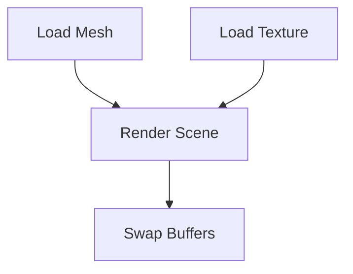

<a id="74-parallel-dispatch"></a>
### 7.4 Parallel Dispatch

For data-parallel tasks (e.g., processing 10,000 particles), use the Fork-Join dispatcher.

#### SituationDispatchParallel

```c:disable-run
void SituationDispatchParallel(
    SituationThreadPool* pool,
    int count,
    int min_batch_size,
    void (*func)(int index, void* user_data),
    void* user_data
);
```

**"Helping" Strategy:**
While waiting for the workers to finish the batches, the calling thread does not sleep. It actively "helps" by stealing jobs from the High Priority queue. This ensures maximum CPU utilization and prevents the main thread from idling during heavy workloads.

<a id="75-render-lists-momentum-bridge"></a>
### 7.5 Render Lists (Momentum Bridge)

With the introduction of the Render Thread, splitting command recording from submission becomes powerful. The "Momentum" architecture allows you to record commands into a `SituationRenderList` on any thread, and then submit them atomically.

#### Batched Overlap Architecture (v2.3.24b)

The updated replay logic intelligently batches compute and graphics commands to maximize GPU overlap using Vulkan semaphores.

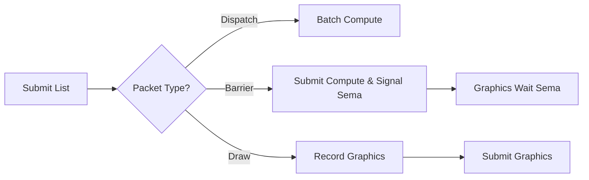

#### SituationBeginList / SituationEndList

```c:disable-run
void SituationBeginList(SituationRenderList list);
void SituationEndList(SituationRenderList list);
```

**Usage:** Marks the start and end of command recording for a render list. The `list` handle acts as a `SituationCommandBuffer` during this block.

#### SituationSubmitRenderList

```c:disable-run
void SituationSubmitRenderList(SituationRenderList list);
```

**Usage:**
1.  **Record:** Create a `SituationRenderList` and record `SituationCmd*` calls into it (using the list as the command buffer handle).
2.  **Submit:** Call `SituationSubmitRenderList(list)` on the Main Thread.
3.  **Execute:** The engine takes ownership, replays the commands into the active frame buffer (Immediate Mode) or queues them for the Render Thread (Threaded Mode), and then resets the list for reuse.

```c:disable-run
// Example: Multi-threaded recording
// Thread A:
SituationBeginList(my_list);
SituationCmdDrawMesh(my_list, ...);
SituationEndList(my_list);

// Main Thread:
SituationSubmitRenderList(my_list);
```

<a id="appendix-a-error-omniscience"></a>

---

## Appendix A: Error Omniscience

When things go wrong, they go wrong with a specific code.

**Table: Top 10 Errors by Pillar**
| Code | Constant | Meaning | The Fix |
| :--- | :--- | :--- | :--- |
| **-4** | `SITUATION_ERROR_ALREADY_INITIALIZED` | Init called twice. | Check your entry point. |
| **-310** | `SITUATION_ERROR_FILE_NOT_FOUND` | Asset missing. | Check `SituationGetBasePath()` and case sensitivity. |
| **-500** | `SITUATION_ERROR_RESOURCE_INVALID` | Handle is 0 or dead. | Did you `SituationDestroy...()` it already? |
| **-550** | `SITUATION_ERROR_BACKEND_MISMATCH` | GL call on Vulkan. | Stick to the `SituationCmd*` API. |
| **-81**  | `SITUATION_ERROR_THREAD_VIOLATION` | Main thread rule broken. | Move window/graphics calls to Main. |
| **-80**  | `SITUATION_ERROR_THREAD_QUEUE_FULL` | Job queue full. | Increase queue size or wait for jobs. |
| **-401** | `SITUATION_ERROR_AUDIO_DEVICE` | WASAPI/ALSA error. | Unplugged USB headset? Retry init. |
| **-752** | `SITUATION_ERROR_SHADER_COMPILATION_FAILED` | Syntax error in GLSL. | Check `SituationGetLastErrorMsg()`. |
| **-552** | `SITUATION_ERROR_PIPELINE_BIND_FAIL` | Incompatible layout. | Ensure Vertex Layout matches Shader inputs. |
| **-8** | `SITUATION_ERROR_MEMORY_ALLOCATION` | RAM/VRAM full. | Check for texture leaks. |
| **-749** | `SITUATION_ERROR_VULKAN_DESCRIPTOR_POOL_EXHAUSTED` | Descriptor pool full. | Internal pool auto-growth failed. |
| **-750** | `SITUATION_ERROR_VULKAN_MEMORY_ALLOCATION_FAILED` | VRAM/RAM full. | VMA allocation failed. Check usage. |
| **-999** | `SITUATION_ERROR_UNKNOWN_ERROR` | Cosmic rays. | Report this bug. |

<a id="appendix-b-perf-codex"></a>

---

## Appendix B: Perf Codex

Baseline performance targets for a "Titanium" grade application (Core i7 / GTX 1080 equivalent).

**Table: Benchmark Baselines**
| Operation | Budget | Target Speed | Note |
| :--- | :--- | :--- | :--- |
| **Frame Time (60 FPS)** | **16.6ms** | **< 16ms** | Total budget. |
| **Frame Time (144 FPS)** | **6.9ms** | **< 6ms** | Hardcore mode. |
| **Input Poll** | **< 0.1ms** | **0.05ms** | Should be instant. |
| **Audio Mix (32 voices)** | **< 1.0ms** | **0.2ms** | Runs on separate thread. |
| **Draw Call Submission** | **N/A** | **~2μs / call** | 5,000 draws = 10ms (Heavy). |
| **Texture Upload (4K)** | **N/A** | **~20ms** | Do this during load screens or async. |
| **Shader Compile** | **N/A** | **~100ms** | Per shader. Cache your pipelines! |
| **Hot-Reload Trigger** | **< 200ms** | **150ms** | Includes debounce and re-compile. |

## Compatibility & Portability

The Situation SDK is designed to be cross-platform, targeting Windows, Linux, and macOS. However, due to the header-only nature and bundled dependencies, there are specific considerations for each platform.

### Linux Support
*   **Compilation:** The library compiles cleanly on Linux with GCC/Clang.
*   **Dependencies:** The repository includes a pre-compiled `libglfw3.a` in `ext/glfw/lib`, but this is a **Windows PE/COFF** binary. It will **not** link on Linux.
*   **Resolution:** Linux users must link against their system's GLFW library.
    *   **Debian/Ubuntu:** `sudo apt install libglfw3-dev`
    *   **Build Flag:** Use `-lglfw` or `-lglfw3` instead of linking the bundled static library.
    *   **Headers:** The bundled headers in `ext/glfw/include` are cross-platform and safe to use.

### ARM64 Support (ARM Resilience)
The library provides verified support for ARM64 architectures (e.g., Apple Silicon, Raspberry Pi 4/5, Linux ARM servers).

*   **Spinlocks:** The internal backpressure mechanisms utilize architecture-specific intrinsics for power-efficient waiting:
    *   **x86_64:** `_mm_pause()`
    *   **ARM64:** `__builtin_arm_wfe()` (Wait For Event) where supported, falling back to `__asm__ __volatile__("yield")`.
*   **Vectorization:** The library relies on the compiler's auto-vectorization. `Vector` types are union-based and do not force specific SIMD alignment, ensuring compatibility with standard AAPCS64 calling conventions.

### Compiler Support
*   **C Standard:** Requires **C11** (`-std=c11`) for `threads.h` and anonymous unions.
*   **Verified Compilers:**
    *   **GCC:** 9.0+
    *   **Clang:** 10.0+
    *   **MSVC:** VS2019+ (C11 mode)

### Graphics Backends
*   **OpenGL:** Requires **OpenGL 4.6 Core Profile**.
    *   *Note:* macOS does not support OpenGL 4.6 natively. macOS users must use the Vulkan backend (via MoltenVK) or remain on older versions of the library if OpenGL is strictly required.
*   **Vulkan:** Requires **Vulkan 1.4+**.
    *   Supports `bufferDeviceAddress` and descriptor indexing.
    *   Requires `shaderc` for runtime shader compilation (optional if pre-compiled SPIR-V is used).
