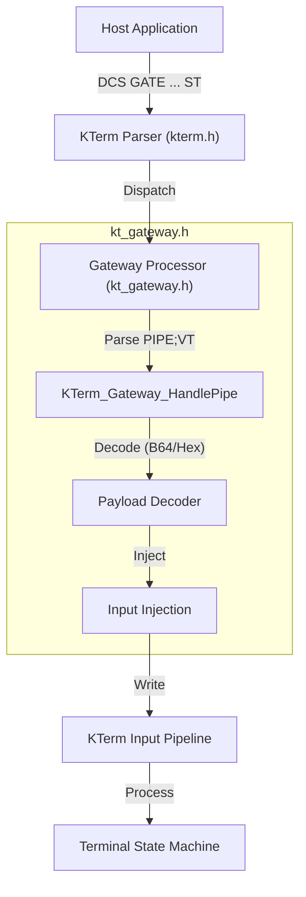

# VT Pipe via Gateway Protocol
## Comprehensive Implementation Plan & Architecture Specification

**Document Version:** 1.2 (Actionable)
**Target Component:** `kt_gateway.h` integration
**Status:** Approved for Implementation

---

## 1. Executive Summary

The **VT Pipe** feature is a strategic enhancement to the K-Term Gateway Protocol, enabling the secure tunneling of arbitrary Virtual Terminal (VT) sequences through the structured Gateway control channel. By encapsulating raw terminal data (ANSI escape codes, text, control characters) within a `DCS GATE` command, we decouple the control plane (Gateway) from the data plane (Terminal Input), allowing for:

*   **Robust Automated Testing:** Inject complex test cases without relying on OS-level PTY injection.
*   **Remote Terminal Control:** Drive the terminal state from a separate process or thread via the Gateway API.
*   **Safe Encapsulation:** Transport problematic characters (like `;`, `ESC`, or `C0` controls) safely using Base64 encoding.

This document outlines the architecture, protocol specification, and implementation strategy for integrating this logic directly into `kt_gateway.h`.

---

## 2. Architectural Overview

The implementation follows a consolidated design pattern. The Gateway Protocol's core logic and the new VT Pipe extension will reside within the single `kt_gateway.h` module. This ensures all Gateway-related functionality is centralized, simplifying build integration and maintenance.

### 2.1 Component Interaction Diagram



### 2.2 Design Decision: Consolidated Source
All logic will be implemented in `kt_gateway.h`. No additional headers (e.g., `vt_gateway.h`) will be created. This aligns with the single-header philosophy for the main library components and keeps the Gateway subsystem self-contained.

---

## 3. Protocol Specification

The feature extends the existing `PIPE` command with a `VT` subcommand.

### 3.1 Command Syntax

```text
DCS GATE KTERM ; <ID> ; PIPE ; VT ; <Encoding> ; <Payload> ST
```

| Parameter | Value | Description |
| :--- | :--- | :--- |
| **Class** | `KTERM` | Fixed class identifier. |
| **ID** | `String` | Request ID (e.g., `req_123`) or Stream ID (`0`). |
| **Command** | `PIPE` | The Gateway command for data transfer. |
| **Subcommand** | `VT` | Specifies the pipe target is the Virtual Terminal input. |
| **Encoding** | `Enum` | `B64` (Base64), `HEX` (Hexadecimal), or `RAW` (Raw Text). |
| **Payload** | `String` | The encoded data to inject. |

### 3.2 Supported Encodings

#### **A. Base64 (`B64`) - Recommended**
*   **Description:** Standard MIME Base64 encoding.
*   **Use Case:** Sending binary data, extended ASCII, or sequences containing protocol delimiters (`;`, `ST`).
*   **Safety:** High. Completely isolates payload from the outer Gateway protocol.
*   **Example:** Injecting `ESC [ 31 m Red`
    *   Raw: `\x1B[31mRed`
    *   Base64: `G1szMW1SZWQ=`
    *   Command: `DCS GATE KTERM;0;PIPE;VT;B64;G1szMW1SZWQ= ST`

#### **B. Hexadecimal (`HEX`)**
*   **Description:** Hex string (2 characters per byte).
*   **Use Case:** Debugging or simple binary injection where Base64 overhead is acceptable.
*   **Safety:** High.
*   **Example:** `DCS GATE KTERM;0;PIPE;VT;HEX;1B5B33316D526564 ST`

#### **C. Raw Text (`RAW`)**
*   **Description:** Direct text injection.
*   **Use Case:** Simple ASCII commands without special characters.
*   **Safety:** Low. **Must not** contain `;` or the String Terminator (`ST`).
*   **Example:** `DCS GATE KTERM;0;PIPE;VT;RAW;Hello World ST`

---

## 4. Implementation Strategy

The implementation will be delivered by modifying `kt_gateway.h`.

### 4.1 Header Modifications (`kt_gateway.h`)

We will add internal helper functions within the `KTERM_GATEWAY_IMPLEMENTATION` block to handle the decoding and injection.

**New Internal Functions:**

- [ ] Implement `static int KTerm_Base64Value(char c)`: Helper to map char to 6-bit value.
- [ ] Implement `static size_t KTerm_Base64Decode(const char* in, unsigned char* out, size_t out_cap)`: Decodes Base64 string to buffer.
- [ ] Implement `static size_t KTerm_HexDecode(const char* in, unsigned char* out, size_t out_cap)`: Decodes Hex string to buffer.
- [ ] Implement `static bool KTerm_Gateway_HandlePipe(KTerm* term, KTermSession* session, const char* id, const char* params)`: The main logic handler for `PIPE` commands.

### 4.2 Integration Logic

The `KTerm_GatewayProcess` function (already in `kt_gateway.h`) will be updated to route `PIPE` commands to the new handler.

- [ ] Update `KTerm_GatewayProcess` to check for `VT` Pipe:
    ```c
    // Inside KTerm_GatewayProcess...
    if (strcmp(command, "PIPE") == 0) {
        // 1. Check for VT Pipe
        if (KTerm_Gateway_HandlePipe(term, session, id, params)) {
            return;
        }

        // 2. Fallback to existing Banner Logic (legacy PIPE;BANNER)
        if (strncmp(params, "BANNER;", 7) == 0) {
            BannerOptions options;
            KTerm_ProcessBannerOptions(params + 7, &options);
            KTerm_GenerateBanner(term, session, &options);
            return;
        }

        // 3. Unknown PIPE target
        KTerm_LogUnsupportedSequence(term, "Unknown PIPE Target");
    }
    ```

### 4.3 Data Flow & Buffer Management

- [ ] **Parsing:** Implement `VT;` prefix check in `KTerm_Gateway_HandlePipe`.
- [ ] **Allocation:** Implement temporary buffer allocation for decoding.
    *   *Optimization:* For `HEX`, size is `strlen(payload) / 2`.
    *   *Optimization:* For `B64`, size is `strlen(payload) * 3 / 4`.
- [ ] **Decoding:** Call decoding helpers based on encoding type.
- [ ] **Injection:** Feed raw bytes into the session using `KTerm_WriteCharToSession`.
- [ ] **Cleanup:** Free temporary buffers.

---

## 5. Security & Robustness

- [ ] **Memory Safety:** Ensure decoder handles malformed input (e.g., odd-length Hex, invalid Base64 chars) safely.
- [ ] **OOM Check:** Validate output buffer allocation.
- [ ] **Pipeline Protection:** Verify thread-safe injection into `KTerm` pipeline.

## 6. Verification Plan

- [ ] **Unit Test (B64):** Create test to inject `SGVsbG8=` and verify `Hello` in buffer.
- [ ] **Unit Test (Hex):** Create test to inject `41` and verify `A` in buffer.
- [ ] **Integration Test:** Inject `ESC [ 31 m` via `PIPE;VT` and verify color change in terminal state.

---

*This document serves as the authoritative guide for the VT Pipe implementation within `kt_gateway.h`. All code changes will strictly adhere to this specification.*
